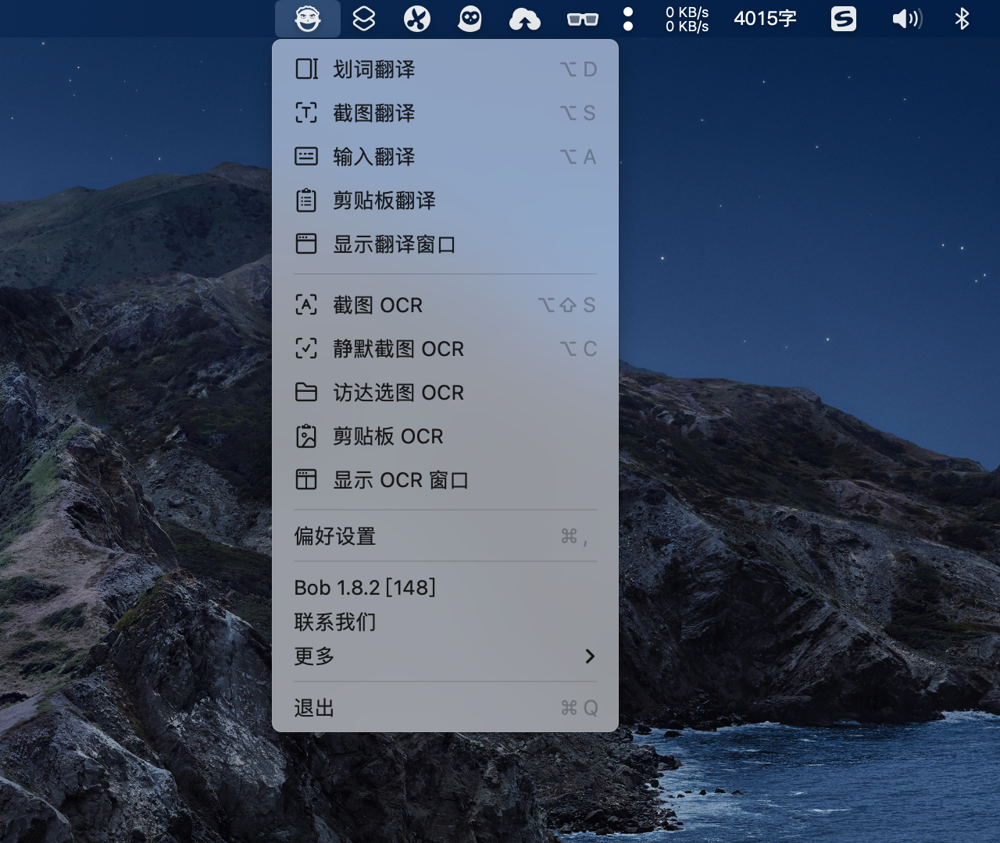
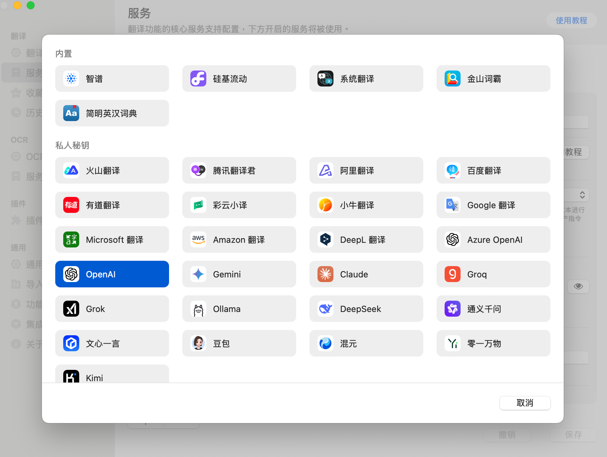
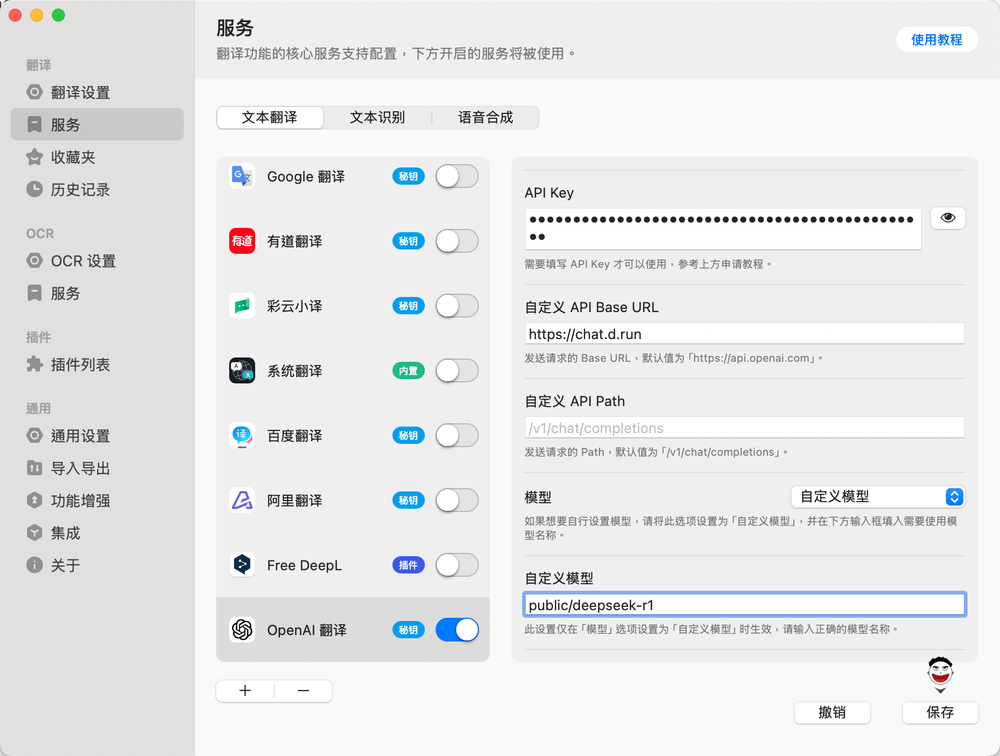
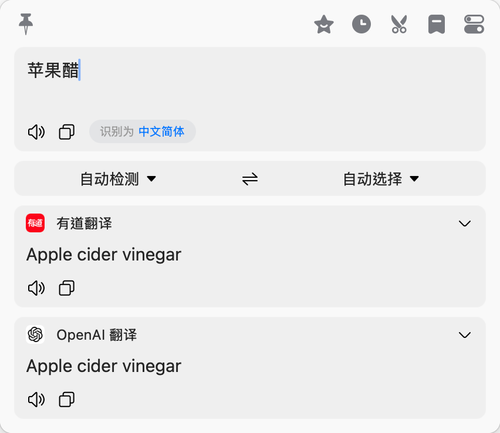

# 在 Bob Translate 中使用 Hydra

*[Hydra]: 大模型服务平台的开发代号

本文说明如何在 Bob Translate 中调用 Hydra 中的模型服务。

[Bob](https://bobtranslate.com/) 是一款 macOS 平台的翻译和 OCR 软件，
您可以在任何应用程序中使用 Bob 进行翻译和 OCR，即用即走，简单、快捷、高效！

## 安装 Bob Translate

您可以在 [Mac App Store](https://apps.apple.com/cn/app/bob-%E7%BF%BB%E8%AF%91%E5%92%8C-ocr-%E5%B7%A5%E5%85%B7/id1630034110)
下载安装 Bob Translate。

## 配置 Bob Translate

打开 Bob Translate 的配置页面，添加翻译服务，选择服务类型为 `OpenAI`。

添加您从 Hydra 获取的 API Key 和 API Host。

- API Key：输入您的 API Key
- API Host：
    - MaaS 输入使用 `https://chat.d.run`
    - 独立部署的模型服务，查看模型实例详情，一般是 `https://<region>.d.run`
- 配置自定义模型：如 `public/deepseek-r1`

## Bob Translate 使用演示

