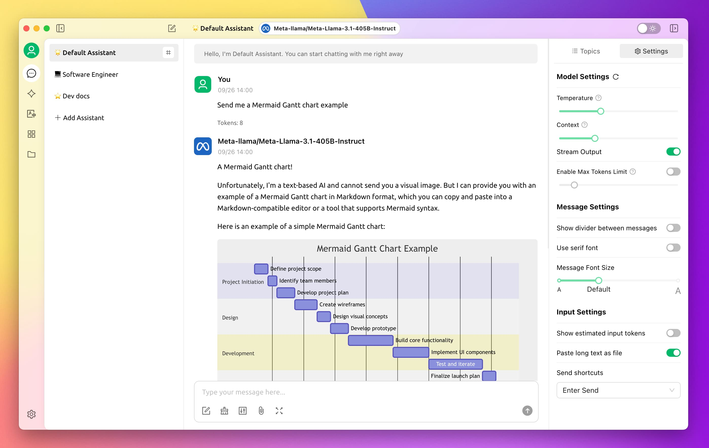
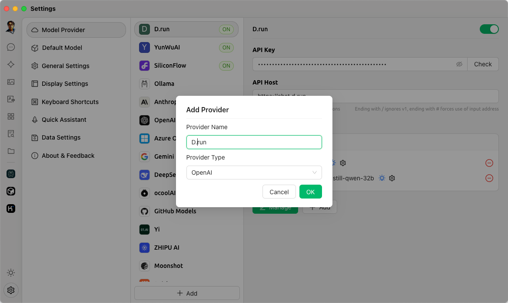
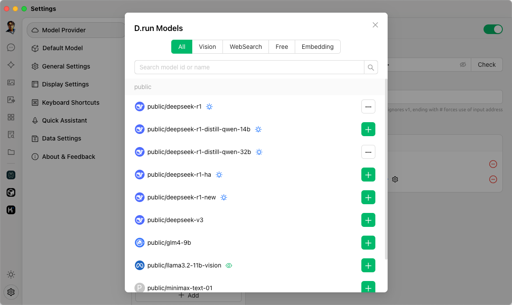
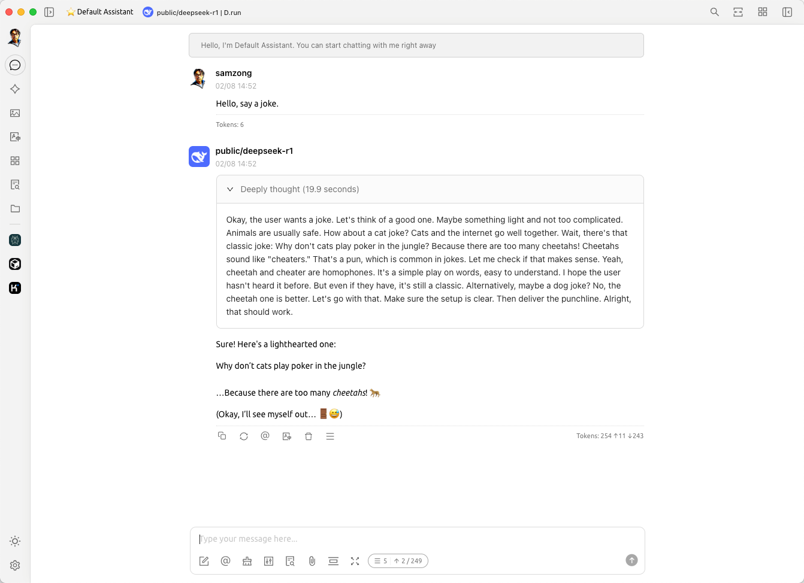

# 在 Cherry Studio 中使用 Hydra

*[Hydra]: 大模型服务平台的开发代号

[🍒 Cherry Studio](https://cherry-ai.com/) 是一个 LLM 桌面客户端，
支持多 LLM 服务商集成，包括 OpenAI、GPT-3、Hydra 等。

## 安装 Cherry Studio

您可以访问 [Cherry Studio 官网](https://cherry-ai.com/)下载安装包。

支持 MacOS、Windows、Linux 三种客户端版本。

## 配置 Cherry Studio

打开 Cherry Studio 的配置页面，添加模型服务商，例如命名为 `d.run`，服务商类型为 `OpenAI`。

添加您从 d.run 获取的 API Key 和 API Host。

- API Key：输入您的 API Key
- API Host：
    - MaaS 输入使用 `https://chat.d.run`
    - 独立部署的模型服务，查看模型实例详情，一般是 `https://<region>.d.run`

### 管理可用的模型

在 Cherry Studio 中，会自动检测模型列表，您可以在模型列表中启用所需要的模型。

## Cherry Studio 使用演示

