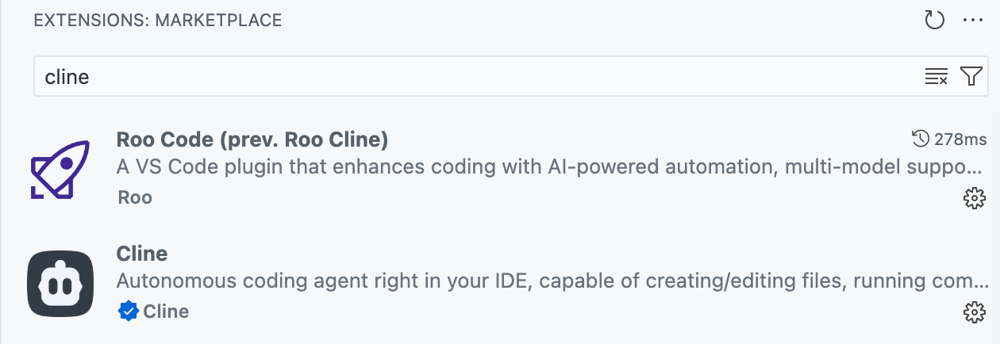
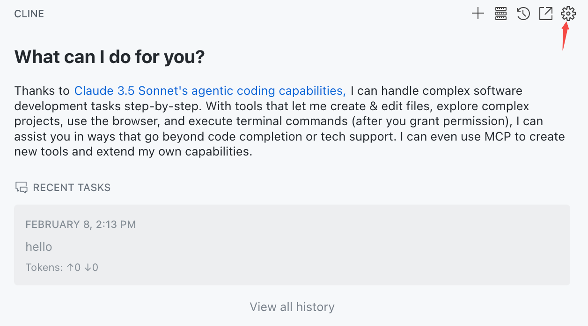
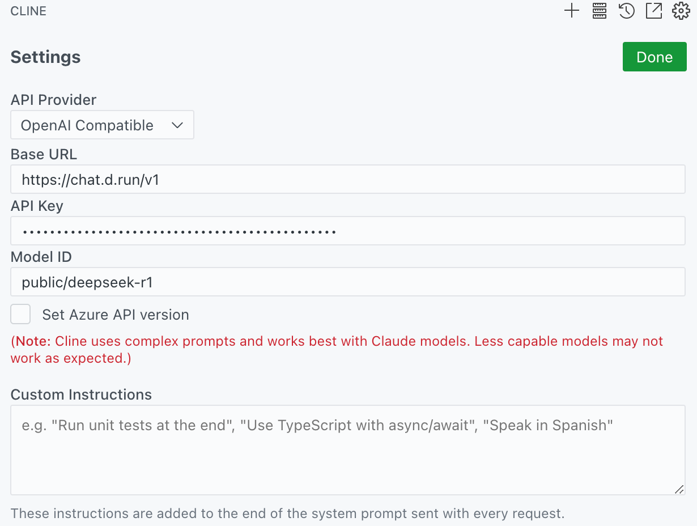
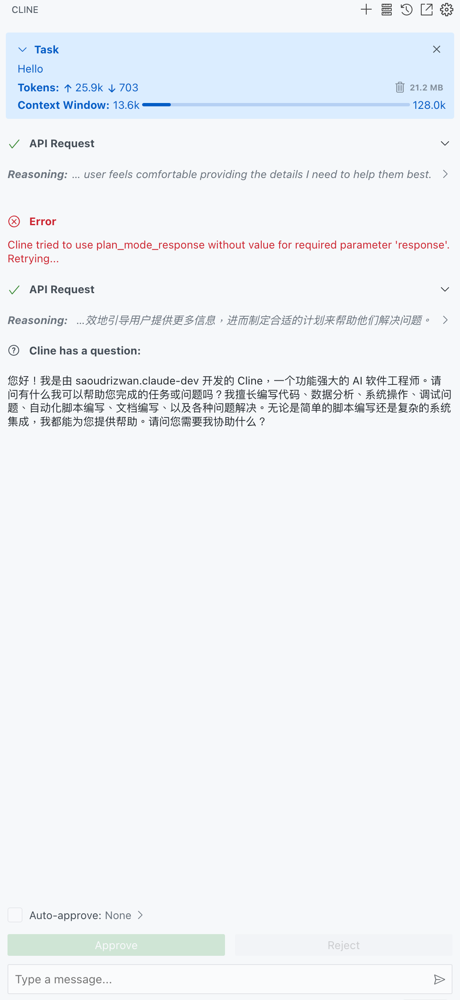

# 在 VSCode 和 Cline 中使用 d.run

[Cline](https://cline.bot/) 是一个 VSCode 插件，
它可以帮助您在 VSCode 中使用 d.run 的模型服务。

## 安装 Cline

在 VSCode 中搜索 Cline 插件并安装。

在这里也可以下载使用 RooCode 插件，它是 Cline 的一个分支。

> Cline 的前身是 Claude Dev, RooCode(RooCline) 是基于 Cline 的分支。

如果您的网络无法直接下载插件，可以考虑去 VSCode 插件市场下载插件的 `.vsix` 文件，
然后在 VSCode 中选择 `Install from VSIX` 安装。

- [Cline](https://marketplace.visualstudio.com/items?itemName=saoudrizwan.claude-dev)
- [RooCode](https://marketplace.visualstudio.com/items?itemName=RooVeterinaryInc.roo-cline)：这是 Cline 的一个分支

## 配置 Cline

打开 Cline 的配置页面：

- API Provider：选择 OpenAI Compatible
- Base URL：输入 `https://chat.d.run`
- API Key：输入您的 API Key
- Model ID：输入您的 Model ID
    - 可以从 d.run 的模型广场获取，MaaS 模型开头为 public/deeepseek-r1
    - 独立部署的模型服务，可以从模型服务列表获取

## Cline 使用演示

