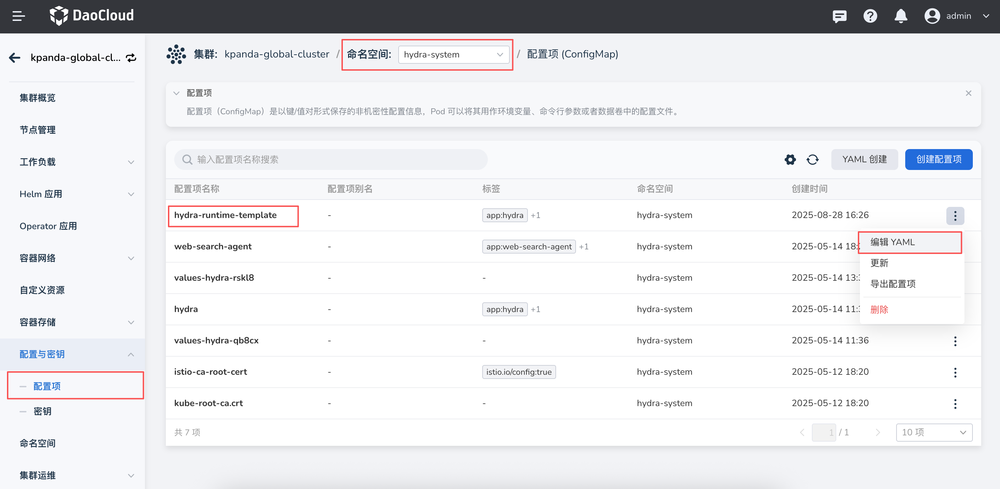
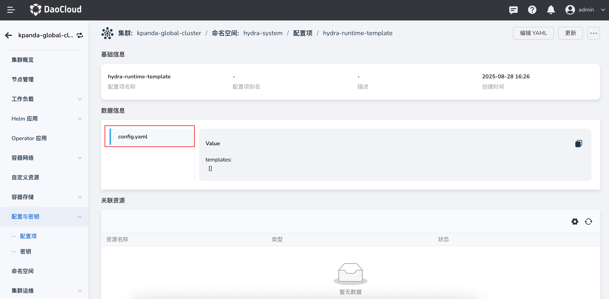
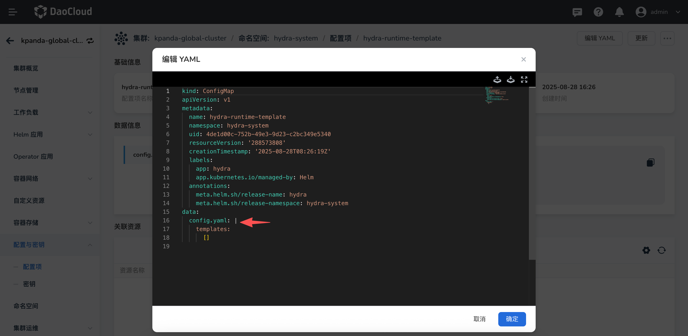
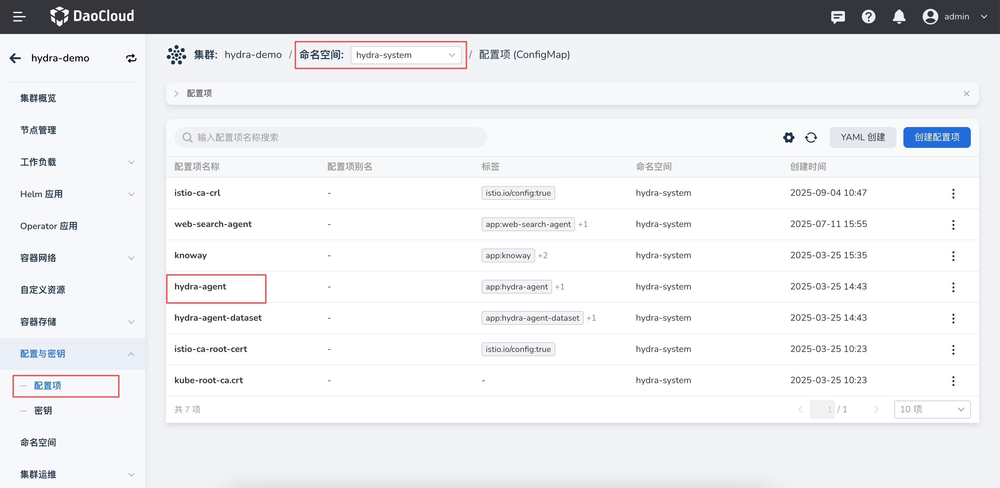
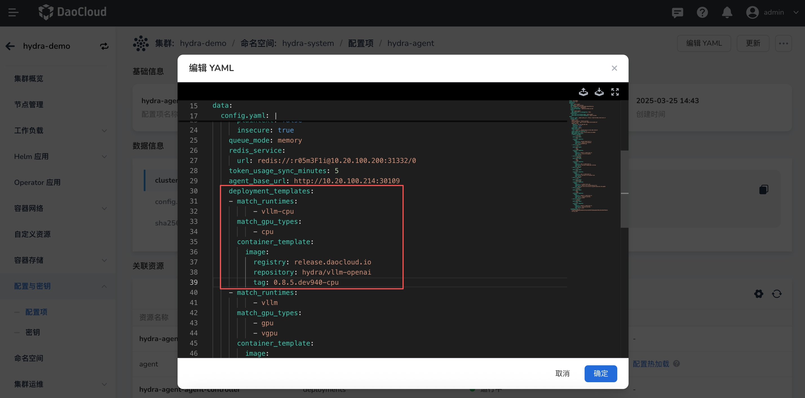
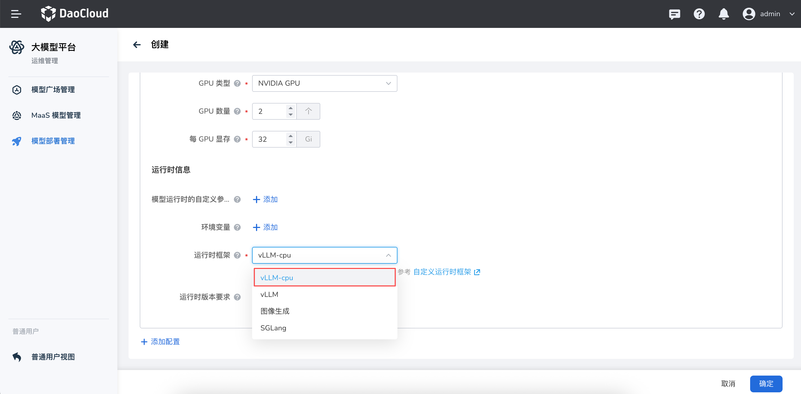

# 自定义大模型推理运行时

*[Hydra]: 大模型服务平台的开发代号

当前平台大模型推理服务支持 vLLM、SGLang 以及图像生成三种内置运行时。为了满足更多场景需求，提供自定义运行时的能力，用户可以根据自身业务需求，自由定义新的运行时类型，并配置其启动脚本、运行参数等相关信息，从而实现更灵活的推理服务部署。

您可以参考下列操作步骤来配置并使用 Hydra 提供的自定义运行时功能。

## 全局服务集群中添加自定义运行时

1. 进入全局服务集群，点击 **配置与密钥** -> **配置项**，搜索并查找`hydra-runtime-template`，其中`config.yaml`文件用于定义运行时模板。

    
    

1. 点击 **编辑YAML**，修改`config.yaml`文件，添加自定义运行时。

    

    config.yaml 对应的结构如下：

    ```yaml
    templates:
      - runtime: string            # 运行时类型英文 (如: vllm)，必填
        runtimeZH: string          # 运行时类型中文
        podTemplate:               # Pod 模板定义
          initContainers: []       # 初始化容器，同 k8s 资源定义
          podSecurityContext: {}   # Pod 安全上下文，同 k8s 资源定义
          volumes: []              # 卷定义，同 k8s 资源定义
          containerTemplate:       # 容器模板
            commandTemplate:       # 启动命令模板，数组，使用 go template 语法
              - ""
            argsTemplate:          # 启动参数模板，数组，使用 go template 语法
              - ""
            volumeMounts: []       # 卷挂载，同 k8s 资源定义
            ports: []              # 端口，同 k8s 资源定义
            securityContext: {}    # 容器安全上下文，同 k8s 资源定义
    ```
    **添加 vllm-cpu 运行时模版示例**

    ```yaml
    templates:
      - runtime: vllm-cpu
        runtimeZH: vLLM
        podTemplate:
          containerTemplate:
            commandTemplate:
              - "/bin/bash"
              - "-c"
            argsTemplate:
              - |-
                {{- if .IS_DISTRIBUTED -}}
                  {{- if .IS_LEADER -}}
                    ray start --head --port={{ .RAY_PORT }} && vllm serve {{ .MODEL_PATH }} --served-model-name {{ .MODEL_NAME }} --trust-remote-code --tensor-parallel-size={{ .TP_SIZE }} --pipeline-parallel-size={{ .PP_SIZE }}
                  {{- else -}}
                    ray start --block --address=$(LWS_LEADER_ADDRESS):{{ .RAY_PORT }}
                  {{- end -}}
                {{- else -}}
                  vllm serve {{ .MODEL_PATH }} --served-model-name {{ .MODEL_NAME }} --trust-remote-code {{- if gt .TP_SIZE 1 }} --tensor-parallel-size {{ .TP_SIZE }} {{- end -}}
                {{- end -}}
                {{- if .CUSTOM_ARGS -}} {{ range .CUSTOM_ARGS }} {{ . }} {{- end -}} {{- end -}}
    ```

    **可用变量说明**

    模板中的变量请根据实际情况设置，可用变量包括:
    
    - RUN_TIME : 运行时类型，如 vllm, image-gen, sglang, mindie 等
    - MODEL_NAME: 模型名称，比如 vllm 的 --served-model-name 参数
    - IS_DISTRIBUTED: 是否分布式部署
    - MODEL_PATH: 模型路径, 目前是固定的 /data/serving-model
    - IS_LEADER: 是否是分布式的 leader 节点
    - TP_SIZE: 张量并行数
    - PP_SIZE： 流水线并行数
    - MODEL_ID：模型ID
    - CLUSTER：部署集群 
    - NAMESPACE：部署的命名空间
    - MODEL_HOST：模型部署的服务地址，目前是固定的 0.0.0.0
    - MODEL_PORT：模型部署的服务端口，目前是固定的 8000
    
    **CUSTOM_ARGS 参数说明**
    
    为了减少配置复杂度,目前会将部署模版中配置的参数和 `hydra-agent` 中配置的参数，单独作为一个 `CUSTOM_ARGS` 的变量传入模板中，建议使用下面的方式：
    
    - 在 commandTemplate 中只定义启动命令，例如 "/bin/bash -c"，它会被渲染成 container 的 command。 在 argsTemplate 的最后添加 `{{- if .CUSTOM_ARGS -}} {{ range .CUSTOM_ARGS }} {{ . }} {{- end -}} {{- end -}}`，以此来保证自定义的参数也可以被正确渲染。
    - 如果不定义 template，则使用 model_deployment 和 hydra-agent 中配置的参数做为 container 的参数。
    - 如果没有定义 commandTemplate，则需要注意 argsTemplate 中应该是多行，而不是单行的 args, 并且 args 之间使用 **等号** 连接，如 `--model={{ .MODEL_PATH }}`。
    - command 采用了 /bin/bash -c 的方式，因为这种方式要求 args 是单行的字符串，因此需要将 CUSTOM_ARGS 添加到模版中。
    - 没有指定 command，args 是多行的数组，这种方式不需要将 CUSTOM_ARGS 添加到模版中，我们会自动将 CUSTOM_ARGS 添加到最终渲染出的 args 中，避免解析 args 出错。

## 工作集群中添加镜像信息

1. 进入工作集群，点击 **配置与密钥** -> **配置项**，搜索并查找`hydra-agent`，在`configmap/deployment_templates`中添加自定义运行时的镜像信息和算力匹配信息。

    

1. 点击**编辑YAML**，修改`configmap`文件，添加自定义运行时的镜像信息。

  **YAML 示例**

  ```yaml
  deployment_templates:
    - match_runtimes: [vllm-cpu] # 自定义运行时名称
      match_gpu_types: [cpu] # 运行环境算力
      container_template: 
        image: # 自定义运行时镜像
          registry: swr.cn-south-1.myhuaweicloud.com
          repository: ascendhub/mindie
          tag: 2.1.RC1
  ```

  

## 开始使用

完成以上操作后，运维管理员可以在部署配置中选择自定义运行时，并配置模型部署信息。

