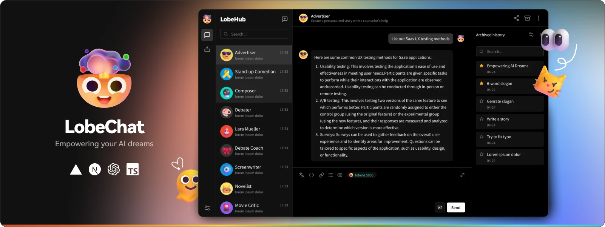
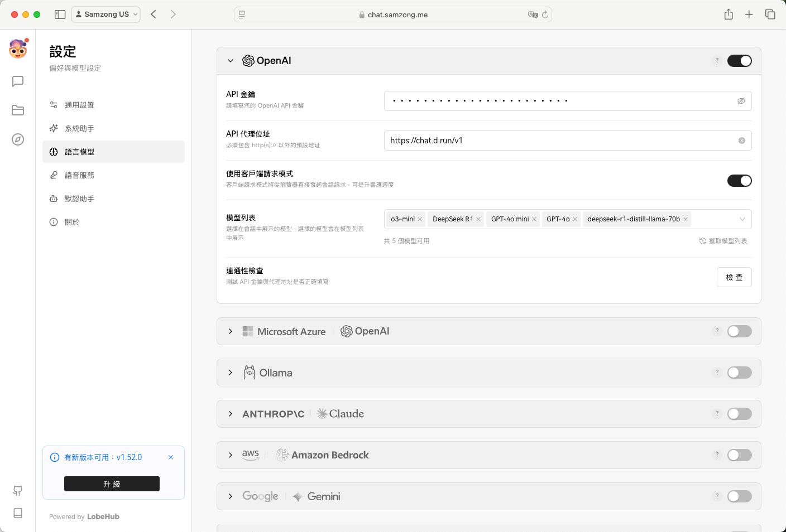
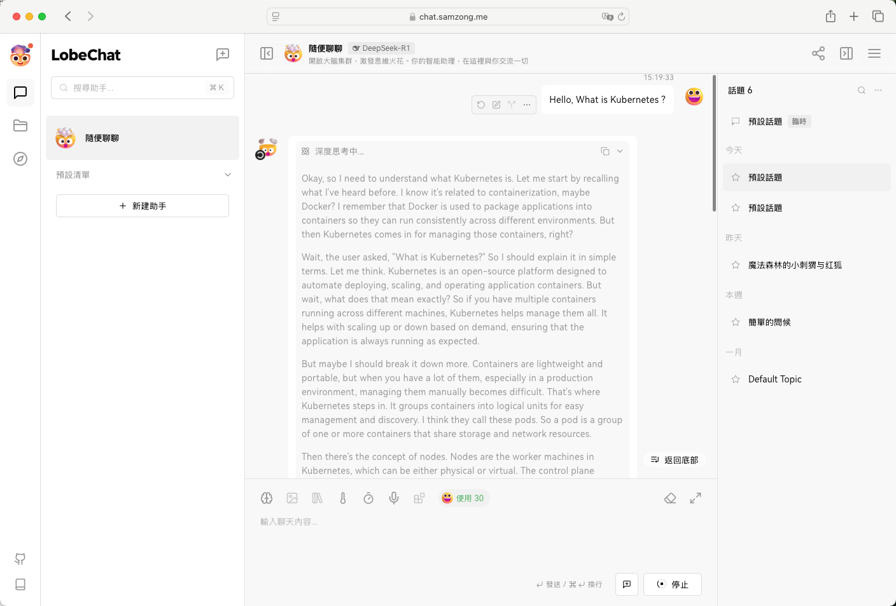

# 在 LobeChat 中使用 Hydra

*[Hydra]: 大模型服务平台的开发代号

[Lobe Chat](https://lobehub.com/zh) 是一个开源的现代设计 AI 聊天框架。
支持多 AI 提供商（OpenAI/Claude 3/Gemini/Ollama/Qwen/DeepSeek）、知识库（文件上传/知识管理/RAG）、多模态（视觉/TTS/插件/艺术品）。一键免费部署您的私有 ChatGPT/Claude 应用。



## 安装 Lobe Chat

您可以参考
[Lobe Chat 官方文档](https://lobehub.com/zh/docs/self-hosting/start)下载并安装，
Lobe Chat 提供了多种部署安装方式。

本文以 Docker 为例，主要介绍如何使用 Hydra 的模型服务。

```bash
# lobechat 支持在部署时直接配置 API Key 和 API Host
$ docker run -d -p 3210:3210 \
    -e OPENAI_API_KEY=sk-xxxx \  # 输入您的 API Key
    -e OPENAI_PROXY_URL=https://chat.d.run/v1 \  # 输入您的 API Host
    -e ENABLED_OLLAMA=0 \
    -e ACCESS_CODE=drun \
    --name lobe-chat \
    lobehub/lobe-chat:latest
```

## 配置 Lobe Chat

Lobe Chat 也支持在部署后，用户自行去添加模型服务商配置。



添加您从 Hydra 获取的 API Key 和 API Host。

- API Key：输入您的 API Key
- API Host：
    - MaaS 输入使用 `https://chat.d.run`
    - 独立部署的模型服务，查看模型实例详情，一般是 `https://<region>.d.run`
- 配置自定义模型：如 `public/deepseek-r1`

## Lobe Chat 使用演示


