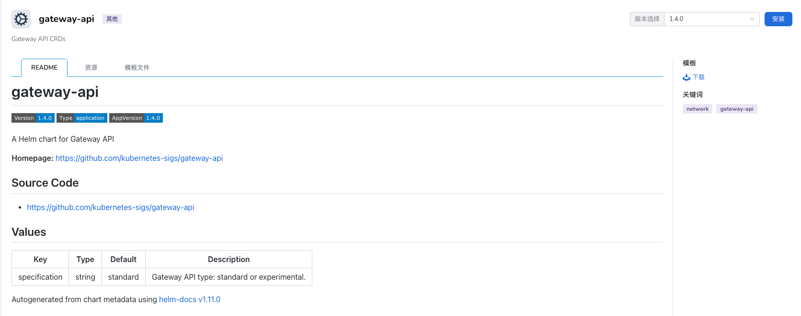
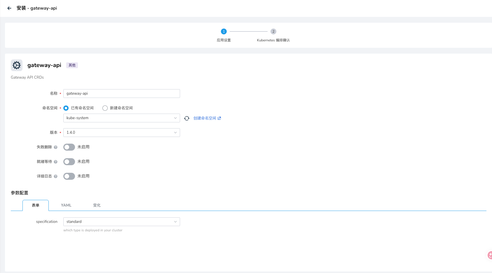

# FAQ

## 安装问题

### 安装 Gateway API

#### 通过 kpanda Helm 模版





#### 通过在线安装

```bash
GATEWAY_API_VERSION=v1.5.0
kubectl apply --server-side -f https://github.com/kubernetes-sigs/gateway-api/releases/download/${GATEWAY_API_VERSION}/standard-install.yaml
```

### 安装 agent-gateway

```bash
AGW_VERSION=v1.0.0-alpha.4
helm upgrade -i --create-namespace --namespace agentgateway-system --version $AGW_VERSION agentgateway-crds oci://cr.agentgateway.dev/charts/agentgateway-crds
helm upgrade -i --namespace agentgateway-system --version $AGW_VERSION agentgateway oci://cr.agentgateway.dev/charts/agentgateway --set inferenceExtension.enabled=true
```

### 安装 LWS

```bash
VERSION=v0.8.0
helm install lws https://github.com/kubernetes-sigs/lws/releases/download/$VERSION/lws-chart-$VERSION.tgz --namespace lws-system --create-namespace
```

### 安装时 inferencepools CRD 冲突

可以通过添加 `--skip-crds` 参数来跳过 inferencepools CRD 安装
```bash
export INFERX_CHART_VERSION=0.1.0-xxx
helm -n public upgrade --install qwen3-06b inferx/inferx --version $INFERX_CHART_VERSION --skip-crds -f manifests/examples/inference-scheduling/values-single-vgpu.yaml
```

## 服务不可用

### 使用 HAMI & PD 分离情况下，Decode Pod 因 SidecarContainers 功能未开启导致无法调度

具体报错信息如下：

```bash
Warning  FailedScheduling  2m56s                hami-scheduler  0/1 nodes are available: 1 Pod has a restartable init container and the SidecarContainers feature is disabled. preemption: 0/1 nodes are available: 1 Preemption is not helpful for scheduling..
```

当前集群的 `nvidia-vgpu-hami-scheduler` Pod 中 `kube-scheduler` 镜像版本过低，不支持 `SidecarContainers` 特性，升级镜像版本至 `1.29` 或更高版本即可

### HTTPRoute 报错不支持 group `inference.networking.k8s.io` 或 `inference.networking.x-k8s.io`

具体报错信息如下：

```bash
message: 'referencing unsupported backendRef: group "inference.networking.k8s.io"  kind "InferencePool"'
reason: InvalidKind
```

1. 确认 `gatewayClass` 支持的 GAIE（Gateway API Inference Extension）版本：

    - `inference.networking.k8s.io`
    - `inference.networking.x-k8s.io`

2. 启用 GAIE 特性：

    - 通过 `mspider` 安装 istio，请参考文档 [启用集群的 Istio GAIE 特性](enable-istio-gaie-with-mspider.md) 进行配置
    - 通过其他方式安装的 istio 或者 agent-gateway 可以参考社区文档启用 GAIE 特性
