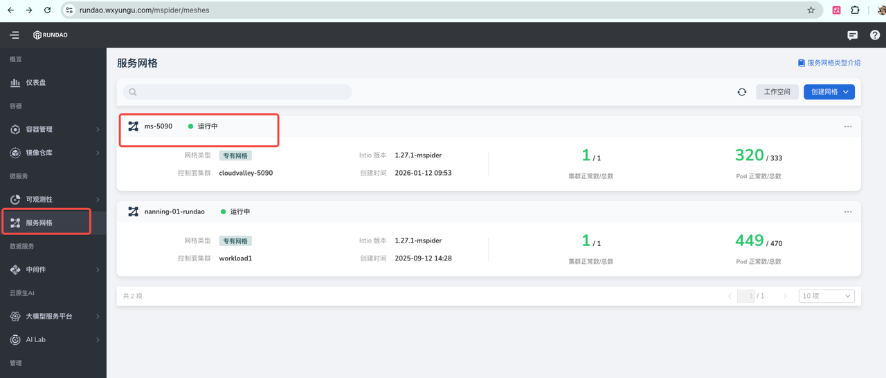
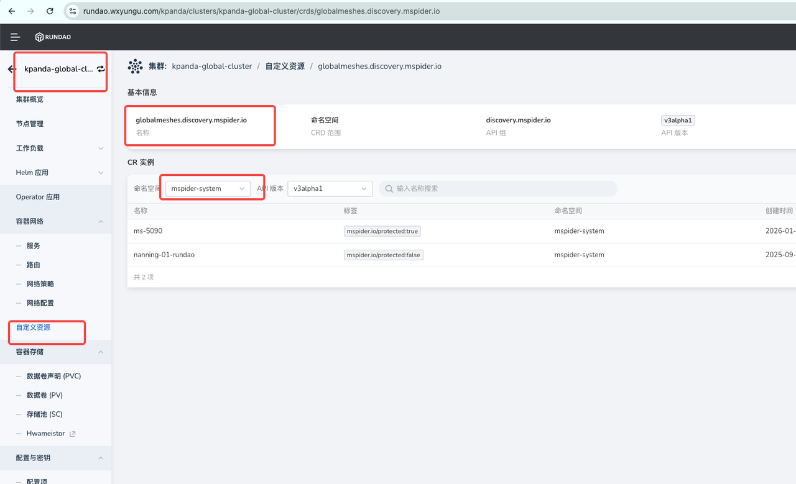
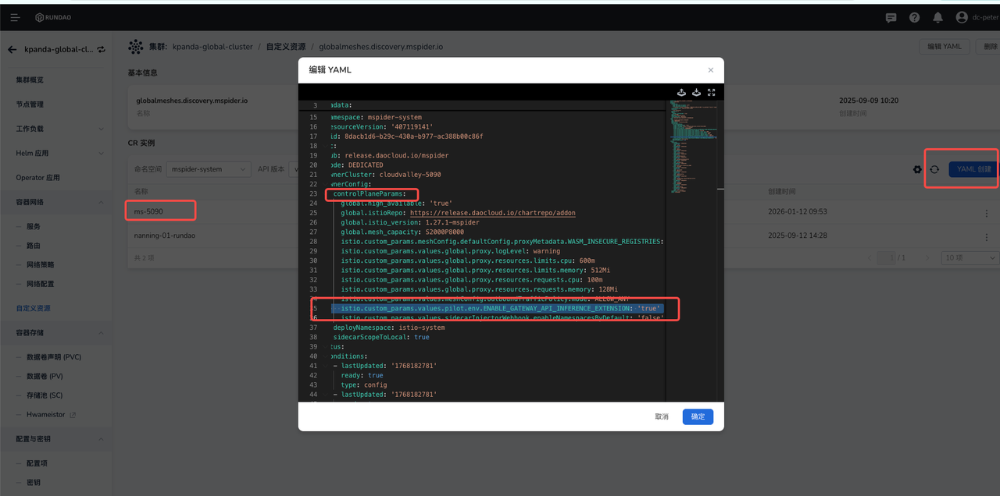

# 启用集群的 Istio GAIE 特性

本文档介绍如何在集群中启用 Istio GAIE（Gateway API Inference Extension）特性，通过配置 `mspider` 和 `kpanda` 平台完成相关资源设置。

## 前置条件

- 已具备 `mspider` 和 `kpanda` 管理平台的访问管理权限

## 操作步骤

### 1. 获取子集群网格名称

登录 `mspider` 管理平台，在集群列表页面定位目标子集群，记录其对应的网格名称。



### 2. 定位 GlobalMesh 资源

1. 登录 `kpanda` 管理平台
2. 切换至 **Global 集群** 视图
3. 在资源搜索框中输入自定义资源类型 `globalmeshes.discovery.mspider.io`
4. 将命名空间筛选条件设置为 `mspider-system`
5. 在资源列表中找到目标子集群对应的网格实例（如 `ms-5090`）
6. 点击操作列的 **编辑 YAML** 按钮



### 3. 配置 GAIE 特性参数

在 YAML 编辑页面中，定位到 `controlPlaneParams` 配置节点，在其下添加以下配置项：

```yaml
istio.custom_params.values.pilot.env.ENABLE_GATEWAY_API_INFERENCE_EXTENSION: 'true'
```



### 4. 提交配置变更

确认配置无误后，点击 **确认** 按钮提交变更。

## 验证

配置生效后，建议通过以下方式验证：

| 验证项  | 说明 |
|------|-----|
| 资源状态 | 检查 `globalmeshes.discovery.mspider.io` 资源状态是否为 `SUCCEEDED` |
| 配置生效 | 确认 `ENABLE_GATEWAY_API_INFERENCE_EXTENSION` 参数已正确应用，验证目标集群 `istiod` Pod 是否包含以下环境变量：ENABLE_GATEWAY_API_INFERENCE_EXTENSION 且 value 为 'true'` |
| 功能测试 | 验证 Gateway API Inference Extension 相关功能是否正常工作 |

!!! note

    - 配置变更可能需要数分钟生效，请耐心等待
    - 修改前建议备份原有 YAML 配置
    - 如遇问题，请查看相关组件日志进行排查
