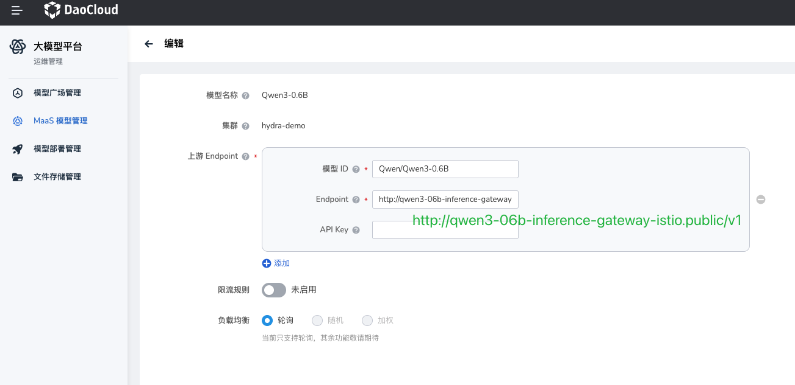
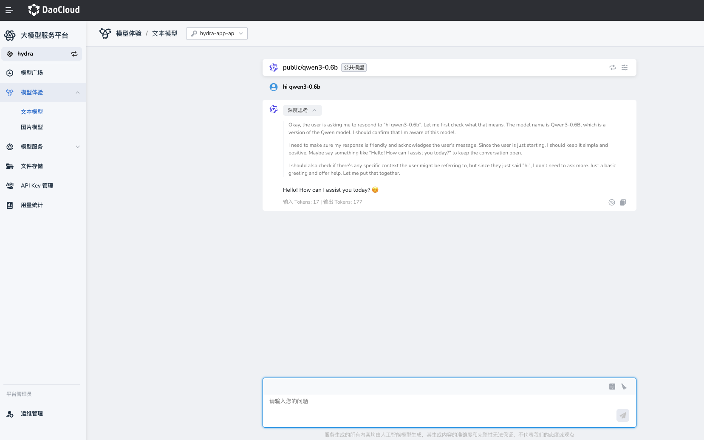

# 模型服务对外暴露（Hydra / Knoway）

InferX 模型部署成功后，可以通过以下两种方式对外暴露并访问：

- 在 Hydra 的 MaaS 模型管理页面中配置模型服务（推荐）
- 在 Knoway 中通过 `LLMBackend` CRD 手动注册模型服务

## 前置条件

- 已完成 InferX 模型部署，并确认模型成功部署
- 已知 Helm Release 名称与部署命名空间（例如 `qwen3-06b`、`public`）
- 已确认模型名（例如 `Qwen/Qwen3-0.6B`）

## 关键参数映射

| 配置项 | 说明 | InferX 对应参数 |
|---|---|---|
| 模型 ID | 业务侧展示/调用时使用的模型标识 | `llm-d-modelservice.llm-d-modelservice.modelArtifacts.name` |
| Endpoint | 模型服务访问地址，需包含协议与 `/v1` 路径 | `http://<gateway-service>.<namespace>/v1` |

## 方式一：在 Hydra 配置 MaaS 模型

在 MaaS 运维管理页面，为目标模型填写以下核心信息：

1. **模型 ID**
   建议与 InferX 模型名保持一致，例如：`Qwen/Qwen3-0.6B`

2. **Endpoint**
   InferX 模型统一通过 Gateway 暴露，可通过以下命令获取网关地址：

    ```bash
    NAMESPACE=public
    RELEASE_NAME=qwen3-06b
    kubectl -n ${NAMESPACE} get gateway/${RELEASE_NAME}-inference-gateway -o jsonpath='{.status.addresses[0].value}'
    ```

    示例输出：

    ```text
    qwen3-06b-inference-gateway-istio.public.svc.cluster.local
    ```

    组装 Endpoint：

    ```text
    http://qwen3-06b-inference-gateway-istio.public.svc.cluster.local/v1
    ```

> Endpoint 必须包含协议（`http://`）和路径前缀（`/v1`）。



### 验证方式

通过 Hydra 模型体验界面验证。



## 方式二：手动在 Knoway 注册模型服务

Knoway 网关支持通过 `LLMBackend` CRD 注册模型服务：

```yaml
apiVersion: llm.knoway.dev/v1alpha1
kind: LLMBackend
metadata:
  name: custom-qwen3-06b
  namespace: default
spec:
  modelName: public/Qwen3-0.6B # 模型名必须唯一
  provider: vLLM
  upstream:
    baseUrl: http://qwen3-06b-inference-gateway-istio.public.svc.cluster.local/v1
    overrideParams:
      openai:
        model: Qwen/Qwen3-0.6B
```

参数说明：

- `spec.modelName`：对外暴露的模型名（业务调用时使用）, 必须唯一
- `spec.upstream.baseUrl`：InferX Gateway 地址，必须包含 `/v1`
- `spec.upstream.overrideParams.openai.model`：透传到推理服务的实际模型名

### 验证

先获取 Knoway 网关的可访问地址（按集群暴露方式选择 Istio、LoadBalancer 或 NodePort），再通过命令行发起推理请求进行验证。


```bash
KNOWAY_ADDR=http://10.20.100.240:30633
MODEL_NAME="custom/Qwen3-0.6B"
API_KEY=<Your API Key here> # Knoway 需要授权 API Key

curl "$KNOWAY_ADDR/v1/chat/completions" \
  -H "Content-Type: application/json" \
  -H "Authorization: Bearer $API_KEY" \
  -d @- <<EOF | jq .
{
  "model": "$MODEL_NAME",
  "messages": [
    {
      "role": "user",
      "content": "Say this is a test!"
    }
  ],
  "temperature": 0.7
}
EOF
```

返回结果中包含 `choices` 且无错误信息（例如 `error` 字段）即表示模型服务可正常访问。
