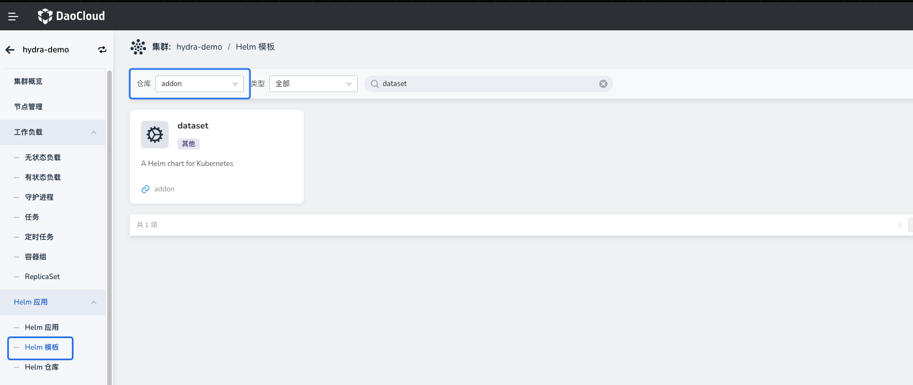
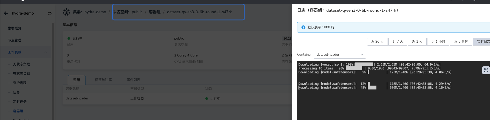

# 模型权重下载与配置

在部署大模型推理服务之前，需要先将模型权重文件下载到可被推理服务访问的存储位置。

推荐优先使用 **Dataset** 管理模型权重，它可以自动完成模型下载、PVC 创建和跨命名空间共享，避免重复下载并简化模型管理流程。

如果当前环境暂时无法使用 Dataset，也可以通过 **PVC、共享存储 CSI 或宿主机目录挂载** 等方式，将已有模型权重目录挂载到推理服务 Pod 中。

## 模型权重管理方式

InferX 支持以下两种模型权重管理方式：

| 方式     | 说明                                       | 推荐程度 |
| -------- | ------------------------------------------ | -------- |
| Dataset  | 自动下载模型并管理 PVC，支持跨命名空间共享 | 推荐     |
| 其他挂载 | 使用已有存储（PVC / NFS / HostPath）       | 可选     |

## 使用 Dataset 管理模型权重（推荐）

### 什么是 Dataset

[BaizeAI/Dataset](https://github.com/BaizeAI/dataset) 是基于 Kubernetes Volume 的数据管理抽象，它简化了 PersistentVolume (PV) 和 PersistentVolumeClaim (PVC) 的创建和维护过程，支持多种数据来源类型。通过 Dataset，您可以轻松地从不同源获取数据并自动创建 PVC 挂载到工作负载中。

| Type         | 说明                                     |
| ------------ | ---------------------------------------- |
| GIT          | 通过 Git 协议下载代码仓库                |
| S3           | 从 S3 或兼容 S3 协议的对象存储中读取数据 |
| PVC          | 引用已有的 PVC 来访问其中的数据          |
| NFS          | 通过 NFS 协议挂载远程目录                |
| HTTP         | 通过 HTTP 协议下载文件                   |
| CONDA        | 使用 Conda 下载 Python 包                |
| REFERENCE    | 引用其他 Dataset 来访问对应的数据        |
| HUGGING_FACE | 从 HuggingFace 下载模型文件              |
| MODEL_SCOPE  | 从 ModelScope 下载模型文件               |

更多详细示例请参考相关文档：

- [飞书文档: 使用 Dataset 管理模型文件](https://daocloud.feishu.cn/wiki/Bx1PwXtTEi36gOklOv1cQH4Znne?from=from_copylink)
- [GitHub: Cascading Deletion of Reference Datasets](https://github.com/BaizeAI/dataset/blob/main/docs/cascading-deletion-example.md)

### Dataset 安装

#### 方案一：通过 DCE Hydra 内置 Dataset 能力

如果您的 DCE 环境中已安装 **Hydra**，则可以直接使用 Hydra 的模型权重下载功能。Hydra 基于 **Dataset** 实现模型权重的管理，无需额外安装。

#### 方案二：在 DCE 界面通过 Helm 安装 Dataset Addon

DCE 的 Addon 仓库已内置 Dataset Helm Chart，您可以通过界面一键安装。安装完成后，即可根据需求创建 Dataset 资源。



#### 方案三：手动 Helm 安装 Dataset

```bash
helm repo add baizeai https://baizeai.github.io/charts
helm repo update
helm install dataset baizeai/dataset \
  -n dataset-system \
  --create-namespace
```

### 模型权重下载

#### 创建 Dataset 下载模型权重

以下示例创建一个 Dataset，从 ModelScope 下载 Qwen3-0.6B 模型权重，并允许其他命名空间引用该数据集。

```yaml
apiVersion: dataset.baizeai.io/v1alpha1
kind: Dataset
metadata:
  name: qwen3-0-6b
  namespace: public
spec:
  share: true                     # 允许其他命名空间通过 REFERENCE 引用
  source:
    options:
      repoType: MODEL
    type: MODEL_SCOPE             # 数据源类型为 ModelScope
    uri: modelscope://Qwen/Qwen3-0.6B
    # 若使用 HuggingFace，可将 type 和 uri 改为：
    # type: HUGGING_FACE
    # uri: huggingface://Qwen/Qwen3-0.6B
  # 如需自定义存储类或容量，可配置 volumeClaimTemplate：
  # volumeClaimTemplate:
  #   metadata: {}
  #   spec:
  #     resources:
  #       requests:
  #         storage: 100Gi
  #     storageClassName: juicefs-no-share-sc
```

创建 Dataset 后，系统会自动启动一个 Job 下载模型权重至对应的 PVC 中。可通过查看 Job 日志了解下载进度。



#### 跨命名空间共享现有 Dataset

在 Hydra 模型广场中，模型权重通常保存在 `public` 命名空间下。为了避免重复下载，您可以在目标命名空间中创建一个引用型 Dataset，指向已有的权重数据。

> **注意**：被引用的 Dataset 必须设置 `spec.share: true`，并且（如果设置了 `shareToNamespaceSelector`）需要确保目标命名空间被包含在内。

```yaml
apiVersion: dataset.baizeai.io/v1alpha1
kind: Dataset
metadata:
  name: inferx-modelcache-qwen3-0-6b
  namespace: default
spec:
  source:
    type: REFERENCE
    uri: dataset://public/qwen3-0-6b   # 格式为 dataset://[命名空间]/[Dataset 名称]
```

### Dataset 与 PVC 对应关系

默认情况下，Dataset 创建的 PVC 名称与 Dataset 名称相同，除非目标命名空间中已存在同名 PVC。您可以通过 PVC 的标签和所有者信息确认其所属的 Dataset：

```yaml
kind: PersistentVolumeClaim
apiVersion: v1
metadata:
  name: inferx-modelcache-qwen3-0-6b
  namespace: default
  labels:
    baize.io/dataset-name: inferx-modelcache-qwen3-0-6b   # 关联的 Dataset 名称
  ownerReferences:
    - apiVersion: dataset.baizeai.io/v1alpha1
      kind: Dataset
      name: inferx-modelcache-qwen3-0-6b                 # 所属 Dataset
spec:
  accessModes:
    - ReadWriteMany
  resources:
    requests:
      storage: 100Ti
  volumeName: dataset-default-inferx-modelcache-qwen3-0-6b-34403596-d94
  storageClassName: nfs-hdd-csi
  volumeMode: Filesystem
```

### 在 InferX 中使用 Dataset 模型

在部署 InferX 推理服务时，可以通过 Helm Values 指定模型权重的 PVC 挂载路径。以下是一个示例片段：

```yaml
llm-d-modelservice:
  enabled: true
  llm-d-modelservice:
    modelArtifacts:
      name: "Qwen/Qwen3-0.6B"               # 模型名称，用于标识 served-model-name
      uri: "pvc://inferx-modelcache-qwen3-0-6b/"   # 注意：必须使用 pvc://<PVC 名称>/<模型在 PVC 中的子路径> 格式
      mountPath: /model-cache               # 模型权重在容器内的挂载路径，通常保持默认
      labels:
        app: qwen3-0.6b                       # 模型服务 Pod 的标签，需与 inferencepool 的 matchLabels 一致
        llm-d.ai/inference-serving: "true"
```

**URI 格式说明**：`pvc://<PVC 名称>/<模型在 PVC 中的子路径>`.

- 如果模型文件放在 PVC 的某个子目录下，例如 `/model-cache/Qwen/Qwen3-0.6B`，则 `uri` 可写为：`pvc://inferx-modelcache-qwen3-0-6b/Qwen/Qwen3-0.6B`  
- 如果模型文件直接位于 PVC 根目录，也必须保留末尾的 `/`，例如：`pvc://inferx-modelcache-qwen3-0-6b/`

## 其他挂载方式

如果集群未安装 Dataset，或者模型权重已经存在于外部存储中，也可以直接通过挂载方式使用模型。

常见方式包括以下两种。

### 方式一：通过 PVC 挂载共享存储

先在共享存储（例如 NFS / JuiceFS）中准备好模型文件，然后创建 PVC 并在 InferX 中引用。

示例配置：

```yaml
llm-d-modelservice:
  enabled: true
  llm-d-modelservice:
    modelArtifacts:
      name: "Qwen/Qwen3-0.6B"
      uri: "pvc://custom-share-models/qwen06b"   # pvc://[共享目录 PVC 名称][模型路径]
      mountPath: /model-cache
      labels:
        app: qwen3-0.6b
        llm-d.ai/inference-serving: "true"
```

### 方式二：通过自定义容器挂载模型目录

在某些场景中，模型权重可能存储在 非 CSI 管理的目录 中，例如：

- 宿主机本地目录
- 特殊对象存储挂载点
- 自定义文件系统

此时可以通过 自定义推理容器配置 的方式，将宿主机目录直接挂载到 Pod 中，并通过自定义启动命令指定模型路径。

示例配置：

```yaml
llm-d-modelservice:
  enabled: true
  llm-d-modelservice:
    decode:
      create: true
      parallelism:
        tensor: 1
        data: 1
      replicas: 1
      containers:
        - name: "vllm"
          image:
            registry: docker.m.daocloud.io
            repository: vllm/vllm-openai
            tag: v0.18.0
          # ---------------------------------------------
          # 使用自定义命令行，直接从挂载到 /custom-path 的宿主机模型目录中加载权重
          modelCommand: custom
          command:
            - /bin/bash
            - '-c'
          args:
            - |
              vllm serve /custom-path/Qwen3-0.6B \
              --port 8000 \
              --served-model-name Qwen/Qwen3-0.6B
          # ---------------------------------------------
          ports:
            - containerPort: 8000
              name: metrics
              protocol: TCP
          resources:
            limits:
              nvidia.com/gpumem: 10k
              nvidia.com/vgpu: '1'
            requests:
              nvidia.com/gpumem: 10k
              nvidia.com/vgpu: '1'
          volumeMounts:
            - name: metrics-volume
              mountPath: /.config
            - name: shm
              mountPath: /dev/shm
            - name: torch-compile-cache
              mountPath: /.cache
            - name: host-models                        # 将宿主机上的模型目录挂载到容器内
              mountPath: /custom-path                  # 与上面自定义命令中使用的 /custom-path 保持一致
          startupProbe:
            httpGet:
              path: /health
              port: 8000
            initialDelaySeconds: 15
            periodSeconds: 30
            timeoutSeconds: 5
            failureThreshold: 60
          livenessProbe:
            httpGet:
              path: /health
              port: 8000
            periodSeconds: 10
            timeoutSeconds: 5
            failureThreshold: 3
      volumes:
        - name: metrics-volume
          emptyDir: { }
        - name: shm
          emptyDir:
            medium: Memory
            sizeLimit: "16Gi"
        - name: torch-compile-cache
          emptyDir: { }
        - name: host-models
          hostPath:
            path: /data/models/qwen3-0.6b             # 宿主机上已准备好的模型权重目录示例路径（实际路径请按需调整）
            type: Directory
```
