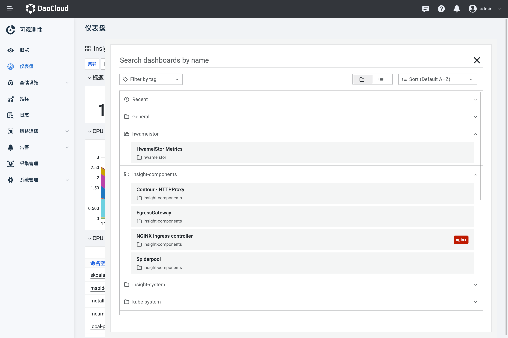
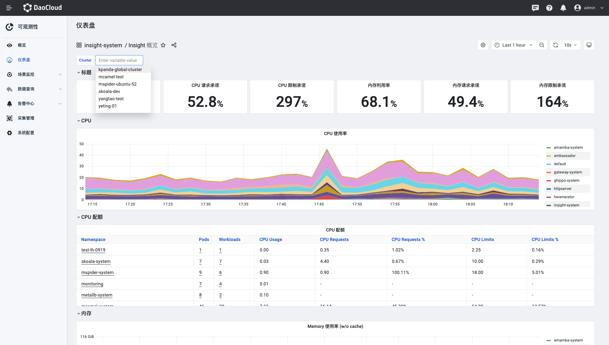
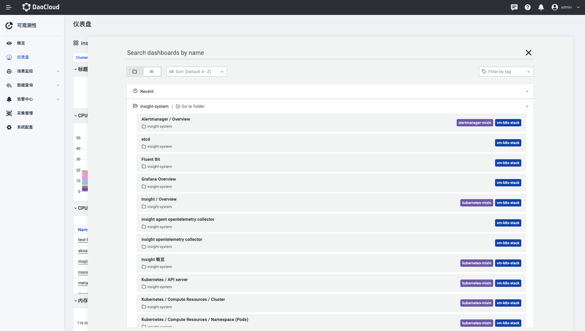

---
hide:
  - toc
---

# 仪表盘

可观测性 Insight 通过原生 Grafana 提供开源精选仪表盘，对集群、节点、命名空间等多维度提供监控。Grafana 使用的数据源支持查看多集群的数据。

1. 在左侧导航栏选择`仪表盘`。

    

2. 以 `Insight 概览` 为例，执行以下步骤，设置相关参数，查看集群指标。

    - 在页面左上角处，选择集群，查看选中集群中的资源使用情况。

    

3. 点击标题 `Insight概览` 区域，可切换仪表盘。

    

!!! note
    
    访问原生 Grafana 请参考：[以管理员身份登录 Grafana](../../06UserGuide/02dashboard/logingrafana.md)
    
    导入自定义仪表盘请参考：[导入自定义仪表盘](../../09FAQs/importdashboard.md)