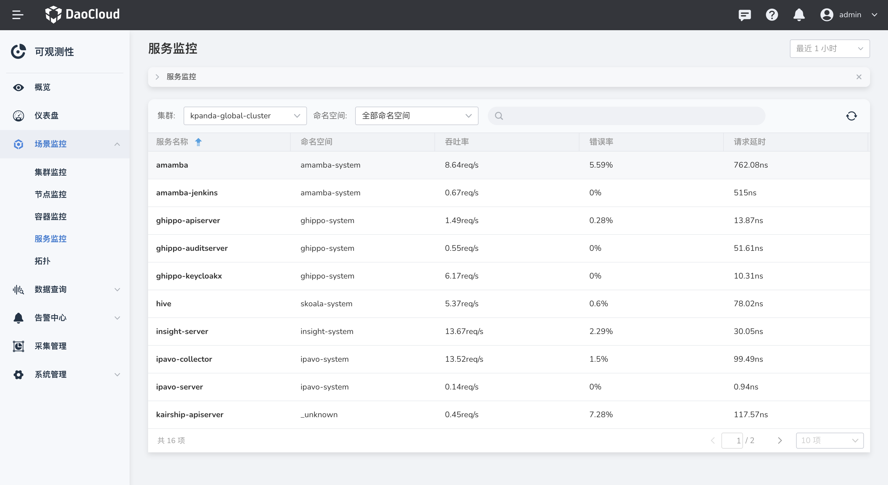
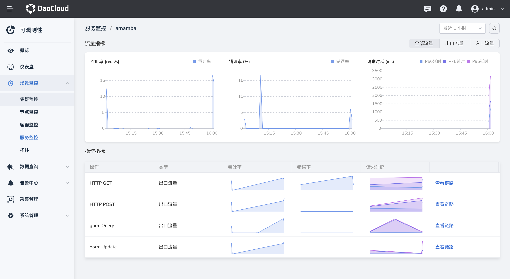

# 服务监控

可观测性 Insight 提供服务指标的监控，可查看服务的实时吞吐量、请求数、请求延时和错误率等关键指标。

## 前提条件

- 集群中已安装 insight-agent 且应用处于 `运行中` 状态。若未安装，请参考：[安装 insight-agent 采集数据](../../06UserGuide/01quickstart/installagent.md)

## 查看节点详情

1. 在左侧导航栏选择 `场景监控` -> `服务监控`。

    

2. 在服务详情中，可以查看服务当前的吞吐量、请求数、请求延时和错误率，同时可查看变化趋势。

    - 吞吐量：服务每秒接收的请求次数
    - 错误率：错误请求的百分比  
    - 请求数：服务端发起请求的数量
    - 请求速率：服务端处理请求的耗时

3. 切换到`操作`页签，查看时间范围内服务调用信息。

    

4. 在操作列，点击`查看链路`，可查看链路的详细信息。
