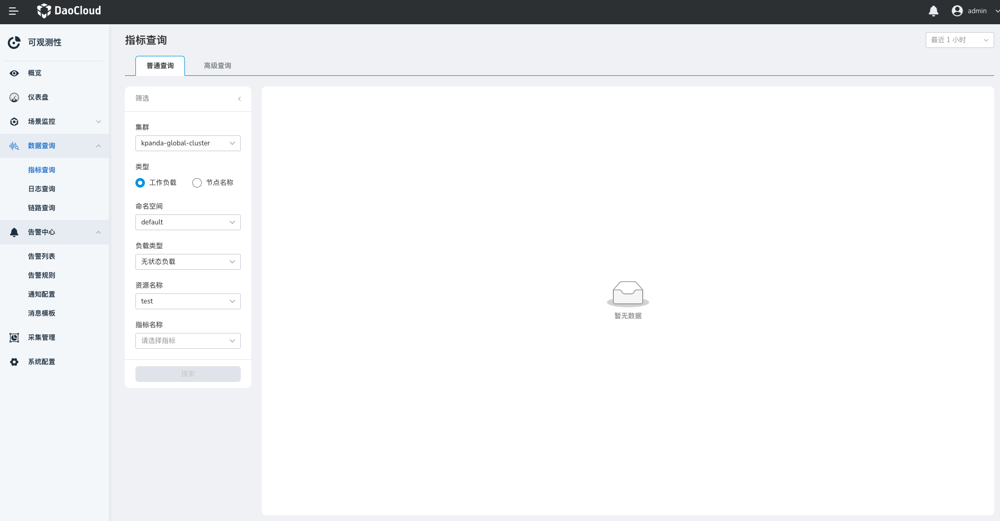
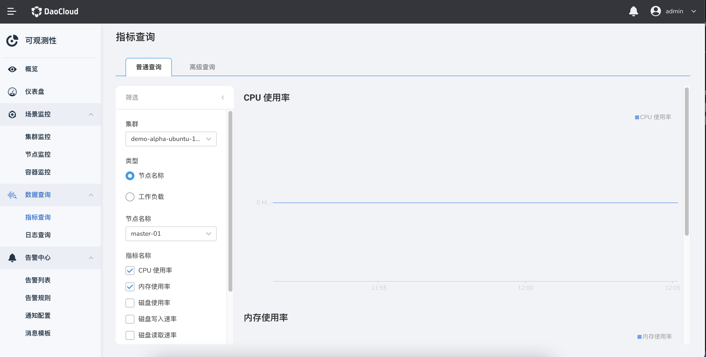
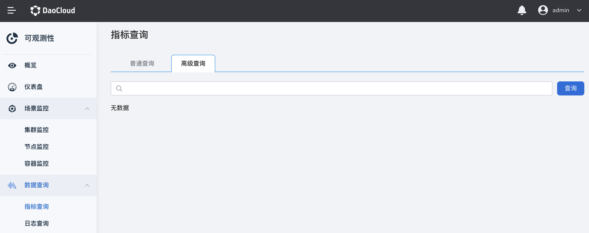
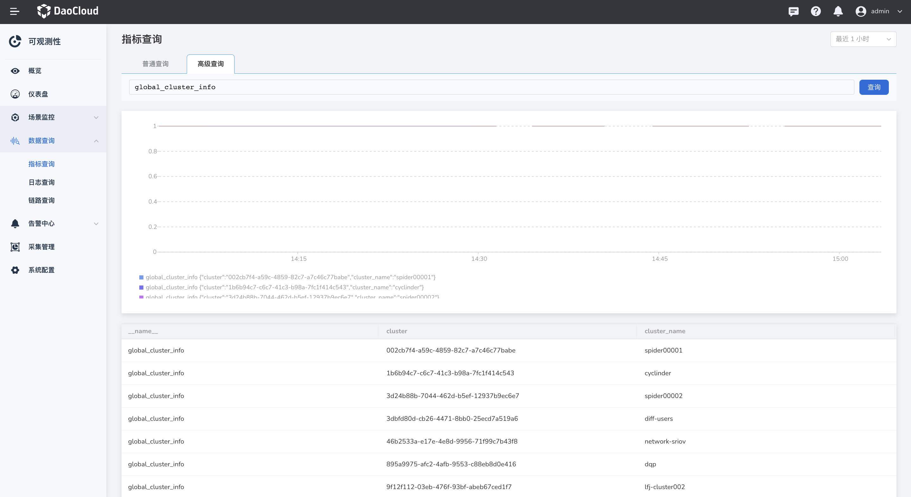

# 指标查询

指标查询支持查询容器各资源的指标数据，可查看监控指标的趋势变化。同时，高级查询支持原生 PromQL语句进行指标查询。

## 前提条件

- 集群中已[安装 insight-agent](../../06UserGuide/01quickstart/installagent.md) 且应用处于 `运行中` 状态。

## 普通查询

1. 在左侧导航栏中，点击`数据查询` -> `指标查询`。

    

2. 选择集群、类型、节点、指标名称等查询条件后，点击`搜索`，屏幕右侧将显示对应指标图表及数据详情。

    

!!! tip

    支持自定义时间范围。可手动点击`刷新`图标或选择默认时间间隔进行刷新。

## 高级查询

1. 在左侧导航栏中，点击`数据查询` -> `指标查询`，点击`高级查询`页签切换到高级查询页面。

    

2. 输入一条 PromQL 语句（参阅 [PromQL 语法](https://prometheus.io/docs/prometheus/latest/querying/basics/)，点击`查询`，将显示查询的指标图表及数据详情。

    
