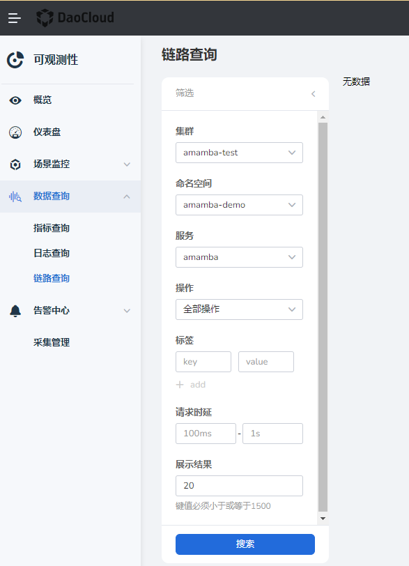

---
hide:
  - toc
---

# 链路查询

通过链路查询可查看详细的服务请求链路，帮助您快速的定位故障。

1. 在左侧导航选择`数据查询` -> `链路查询`。

2. 配置集群、命名空间、服务、操作、标签后点击`搜索`进行精准搜索，通过展示行数显示搜索结果，可查看近一小时、近一天活自定义时间维度的数据。

    

3. 在`操作`列，点击`查看链路`，可查看单个请求的聚合链路。

<!-- 本页内容稍后还需补充。 -->
