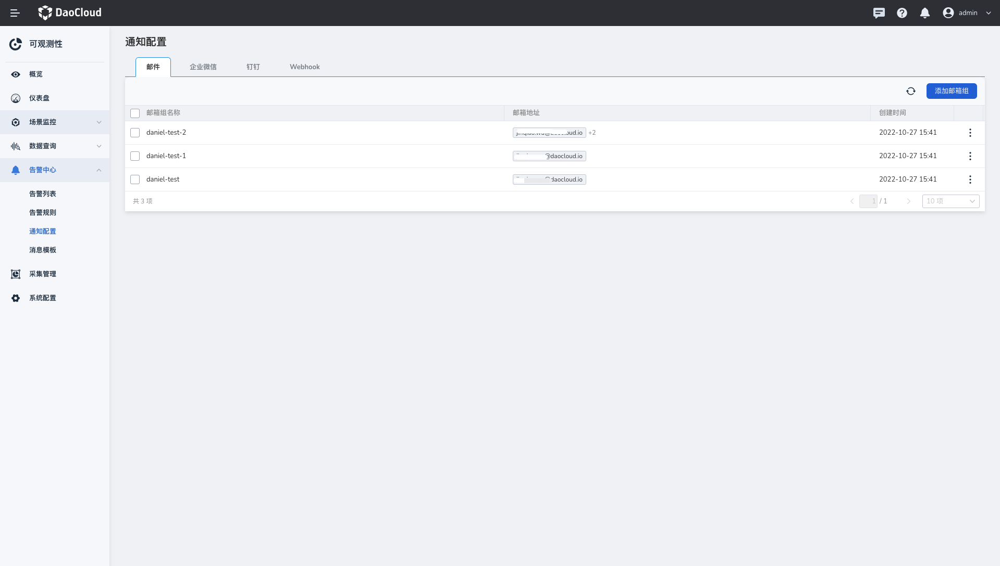
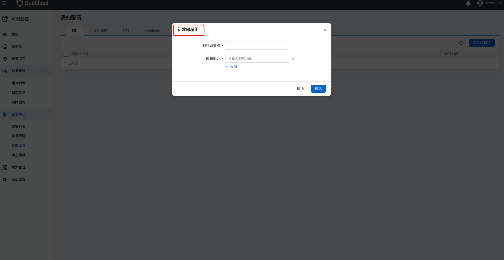
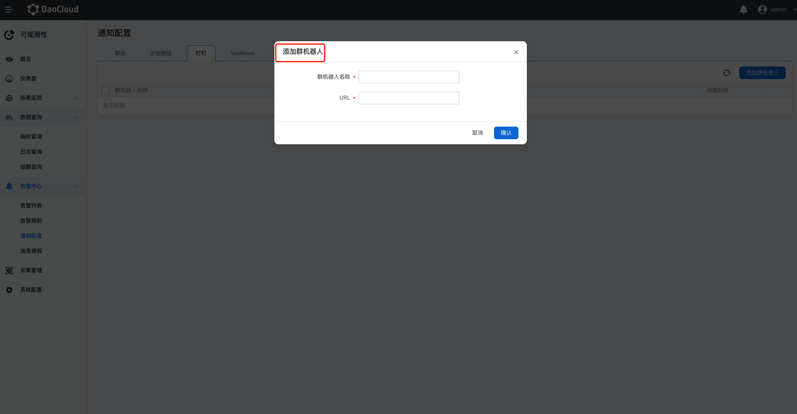
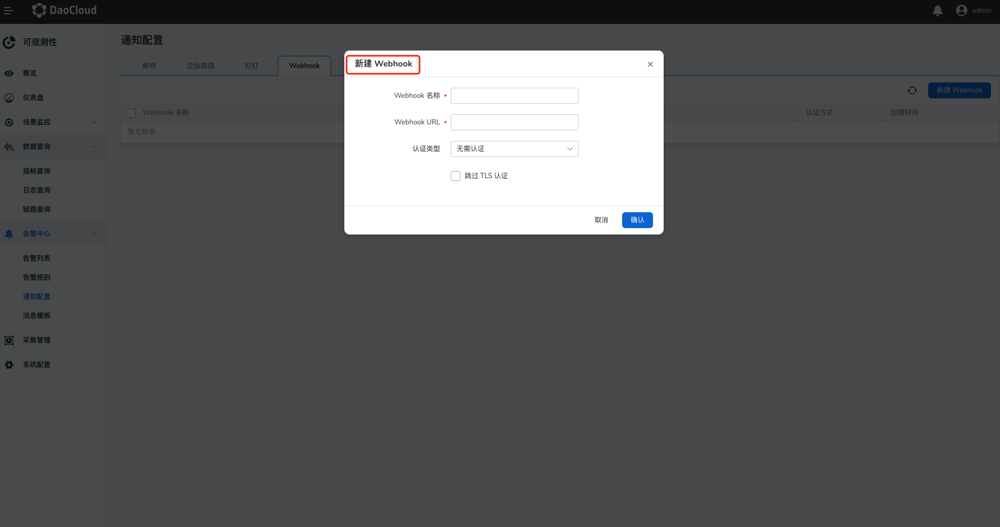

# 通知配置

在`通知配置`页面，可以配置通过邮件、企业微信、钉钉、Webhook 等方式向用户发送消息。

## 邮件

1. 在左侧导航栏中点击`告警中心` -> `通知配置` -> `邮件`，点击`添加邮箱组`，添加一个或多个邮件地址。

    

2. 支持添加多个邮箱地址。

    

3. 配置完成后自动返回通知列表，点击列表右侧的 `︙`，选择`发送测试信息`。

## 企业微信

1. 在左侧导航栏中点击`告警中心` -> `通知配置` -> `企业微信`，点击`添加群机器人`，添加一个或多个群机器人。

    

2. 配置完成后自动返回通知列表，点击列表右侧的 `︙`，选择`发送测试信息`。

## 钉钉

1. 在左侧导航栏中点击`告警中心` -> `通知配置` -> `钉钉`，点击`添加群机器人`，添加一个或多个群机器人。

    

2. 配置完成后自动返回通知列表，点击列表右侧的 `︙`，选择`发送测试信息`。

## Webhook

1. 在左侧导航栏中点击`告警中心` -> `通知配置` -> `Webhook`，点击`新建 Webhook`，添加一个或多个 Webhook。

    

2. 配置完成后自动返回通知列表，点击列表右侧的 `︙`，选择`发送测试信息`。
