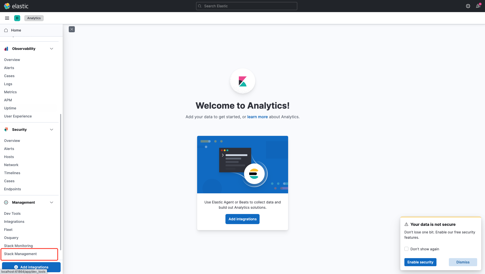
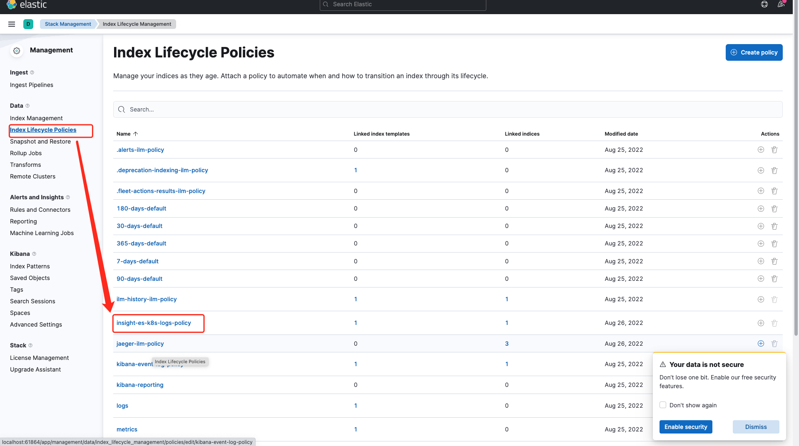
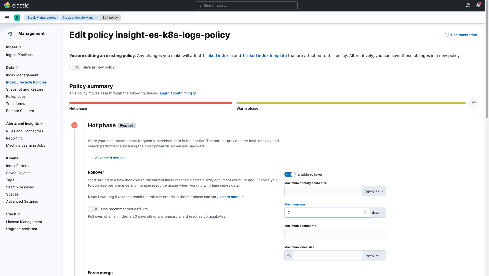
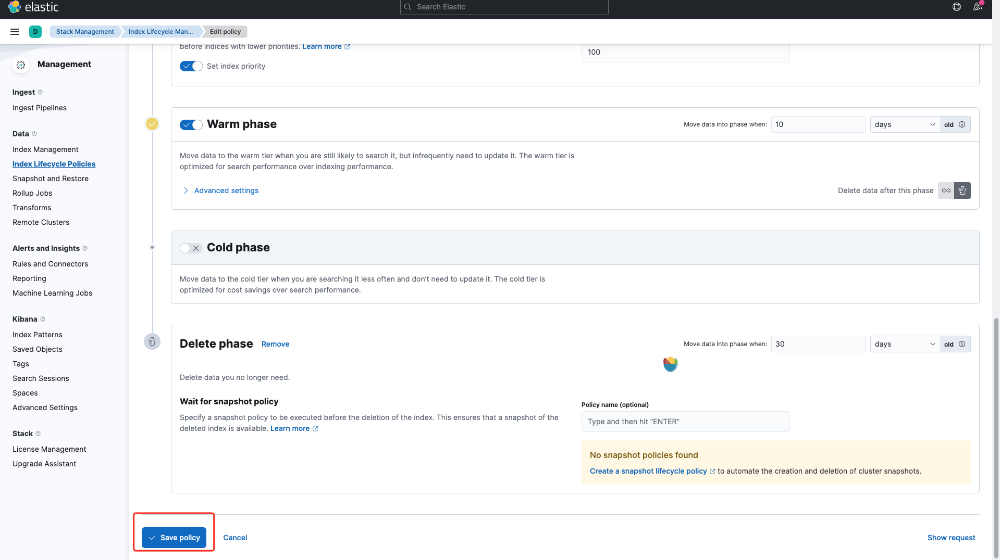
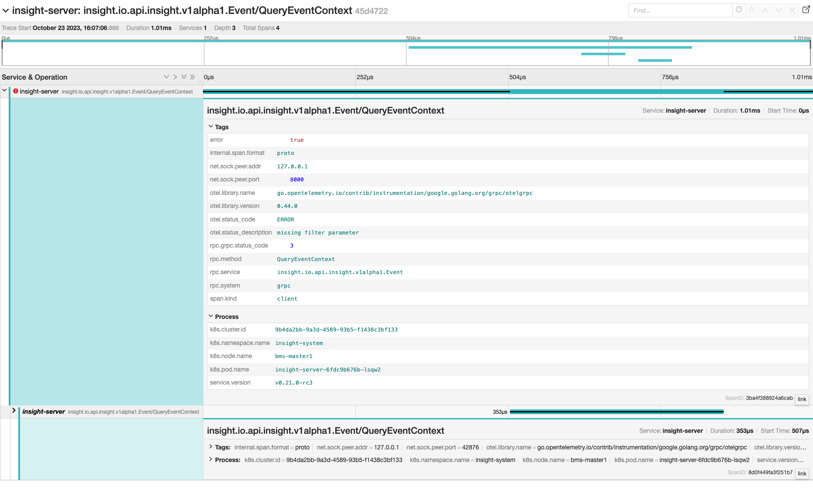
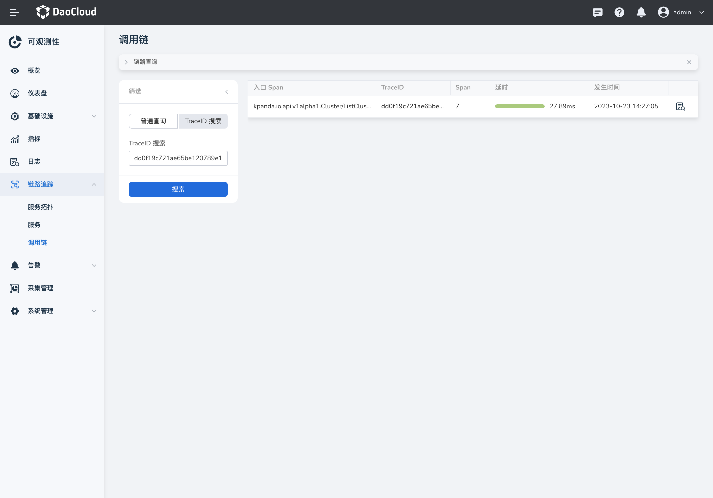

# 修改系统配置

可观测性会默认持久化保存指标、日志、链路的数据，用户可根据本文修改系统配置。

## 如何修改指标数据保留期限

参考以下步骤修改指标数据保留期限。

1. 执行以下命令：

    ```sh
    kubectl edit vmcluster insight-victoria-metrics-k8s-stack -n insight-system
    ```

2. 在 Yaml 文件中，`retentionPeriod` 的默认值为 `14`，单位为`天`。您可根据需求修改参数。

    ```Yaml
    apiVersion: operator.victoriametrics.com/v1beta1
    kind: VMCluster
    metadata:
      annotations:
        meta.helm.sh/release-name: insight
        meta.helm.sh/release-namespace: insight-system
      creationTimestamp: "2022-08-25T04:31:02Z"
      finalizers:
      - apps.victoriametrics.com/finalizer
      generation: 2
      labels:
        app.kubernetes.io/instance: insight
        app.kubernetes.io/managed-by: Helm
        app.kubernetes.io/name: victoria-metrics-k8s-stack
        app.kubernetes.io/version: 1.77.2
        helm.sh/chart: victoria-metrics-k8s-stack-0.9.3
      name: insight-victoria-metrics-k8s-stack
      namespace: insight-system
      resourceVersion: "123007381"
      uid: 55cee8d6-c651-404b-b2c9-50603b405b54
    spec:
      replicationFactor: 1
      retentionPeriod: "14"
      vminsert:
        extraArgs:
          maxLabelsPerTimeseries: "45"
        image:
          repository: docker.m.daocloud.io/victoriametrics/vminsert
          tag: v1.80.0-cluster
          replicaCount: 1
    ```

3. 保存修改后，负责存储指标的组件的容器组会自动重启，稍等片刻即可。

## 如何修改日志数据存储时长

参考以下步骤修改日志数据保留期限：

### 方法一：修改 Json 文件

1. 修改以下文件中 `rollover` 字段中的 `max_age` 参数，并设置保留期限，默认存储时长为 `7d`。将 `http://localhost:9200` 修改为 `elastic` 的地址。

    ```json
    curl -X PUT "http://localhost:9200/_ilm/policy/insight-es-k8s-logs-policy?pretty" -H 'Content-Type: application/json' -d'
    {
    "policy": {
        "phases": {
            "hot": {
                "min_age": "0ms",
                "actions": {
                "set_priority": {
                    "priority": 100
                },
                "rollover": {
                    "max_age": "7d",
                    "max_size": "10gb"
                }
                }
            }, 
        "warm": {
            "min_age": "10d",
            "actions": {
            "forcemerge": {
                "max_num_segments": 1
            }
            }
        },
        "delete": {
            "min_age": "30d",
            "actions": {
            "delete": {}
            }
        }
        }
    }
    }
    ```

2. 修改完后 ，执行以上命令。它会打印出如下所示内容，则修改成功。

    ```json
    {
    "acknowledged" : true
    }
    ```

### 方法二：从 UI 修改

1. 登录 `kibana`，选择左侧导航栏 `Stack Management`。

    

2. 选择左侧导航 `Index Lifecycle Polices`，并找到索引 `insight-es-k8s-logs-policy`，点击进入详情。

    

3. 展开 `Hot phase` 配置面板，修改 `Maximum age` 参数，并设置保留期限，默认存储时长为 `7d`。

    

4. 修改完后，点击页面底部的 `Save policy` 即修改成功。

    

## 如何修改链路数据存储时长

参考以下步骤修改链路数据保留期限：

### 方法一：修改 Json 文件

1. 修改以下文件中 `rollover` 字段中的 `max_age` 参数，并设置保留期限，默认存储时长为 `7d`。同时将 `http://localhost:9200` 修改为 `elastic` 的访问地址。

    ```json
    curl -X PUT "http://localhost:9200/_ilm/policy/jaeger-ilm-policy?pretty" -H 'Content-Type: application/json' -d'
    {
    "policy": {
        "phases": {
            "hot": {
                "min_age": "0ms",
                "actions": {
                "set_priority": {
                    "priority": 100
                },
                "rollover": {
                    "max_age": "7d",
                    "max_size": "10gb"
                }
                }
            }, 
        "warm": {
            "min_age": "10d",
            "actions": {
            "forcemerge": {
                "max_num_segments": 1
            }
            }
        },
        "delete": {
            "min_age": "30d",
            "actions": {
            "delete": {}
            }
        }
        }
    }
    }
    ```

2. 修改完后，在控制台执行以上命令。它会打印出如下所示内容，则修改成功。

    ```json
    {
    "acknowledged" : true
    }
    ```

### 方法二：从 UI 修改

1. 登录 `kibana`，选择左侧导航栏 `Stack Management`。

    

2. 选择左侧导航 `Index Lifecycle Polices`，并找到索引 `jaeger-ilm-policy`，点击进入详情。

    

3. 展开 `Hot phase` 配置面板，修改 `Maximum age` 参数，并设置保留期限，默认存储时长为 `7d`。

    

4. 修改完后，点击页面底部的 `Save policy` 即修改成功。

    
