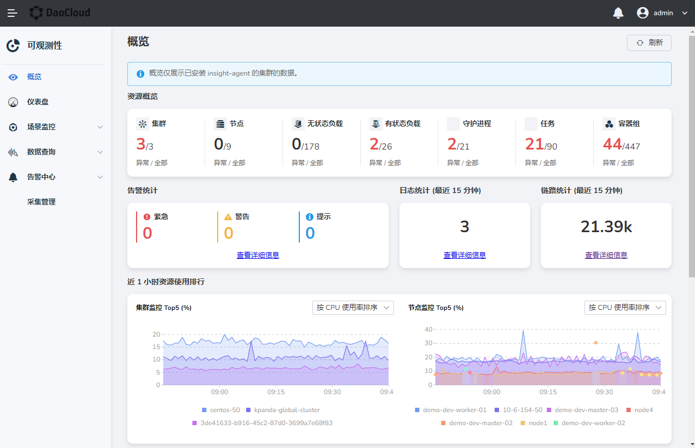

---
hide:
  - toc
---

# 概览

本文介绍了 `容器管理` 中所管理集群的总览信息，包括所有集群资源的异常数和总数、告警、链路数据、日志数据的统计，Top5 集群和节点的资源使用率，节点、容器组的变化趋势以及服务延时的 Top5。

1. 在左边导航栏选择`概览`，进入详情页。

    

2. （可选）点击右上角`刷新`按钮，自动更新数据。

    - 告警统计：可查看所有集群的正在告警的统计数据。
    - 资源消耗：可按 CPU 使用率、内存使用率和磁盘使用率分别查看近一小时 TOP5 集群、节点的资源变化趋势。
      默认按照根据 CPU 使用率排序。您可切换指标切换集群、节点的排序方式。
    - 资源变化趋势：可查看近 15 天的节点个数趋势以及一小时 Pod 的运行趋势。
    - 服务请求排行：可查看多集群中请求延时、错误率排行 TOP5 的服务及所在集群和命名空间。
