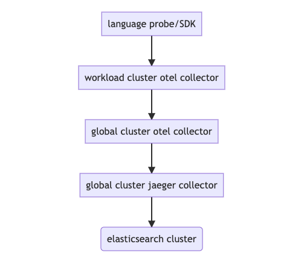
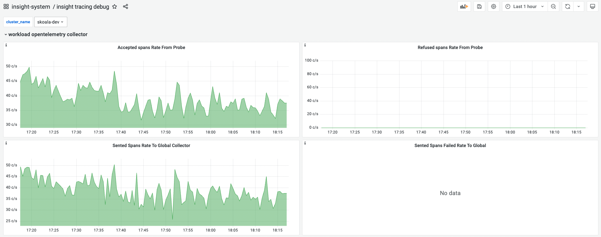
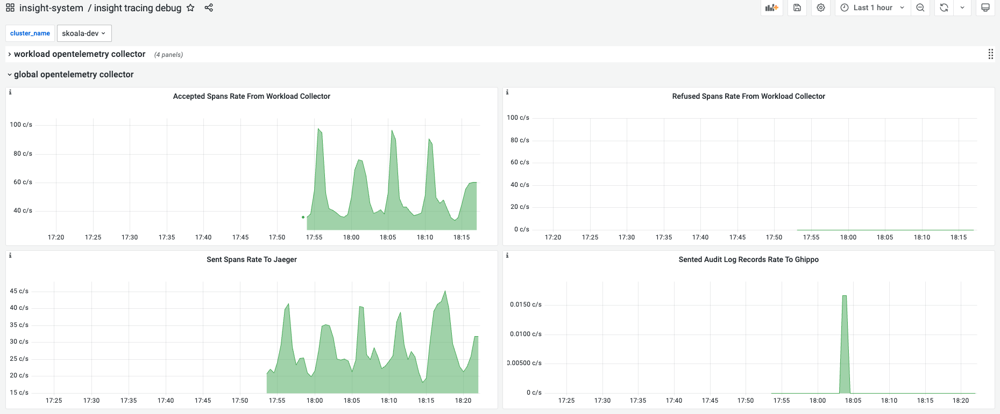
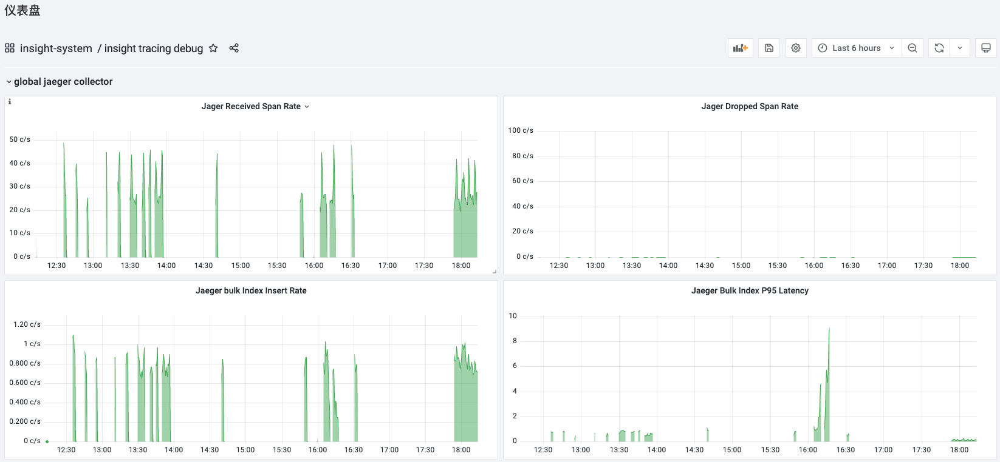

# 链路采集排障指南

## 链路数据传输图

在尝试排查链路数据采集的问题前，我们不妨理解链路数据的传输路径，下面是路径示意图：

    

由此可见，在任意步骤传输失败都会导致无法查询出链路数据。如果您在完成应用链路增强后发现没有链路数据，请执行以下步骤：

1. 使用 DCE 5.0 平台，进入 `可观测性`，选择左侧导航栏的 `仪表盘`。

2. 点击仪表盘标题 `概览`，切换到 `insight-system/insight tracing debug` 仪表盘进行排障：

    !!! note

        该仪表盘由三个模块组成：workload opentelemetry collector，global opentelemetry collector，global jaeger collector。这三个模块分别负责监控不同集群，不同组件传输链路的数据情况。通过生成的时序图表，检查链路数据传输是否存在问题。

    2.1 `workload opentelemetry collector ` 模块

    以下图表显示个不同工作集群的 `opentelemetry collector` 在接受 language probe/SDK 链路数据，发送它聚集到的链路数据的情况。你可以通过左上角的 `cluster_name` 选择框，选择服务所在的集群：

    	

    	!!! note

        	根据这四张时序图，可以判断出该集群的 `opentelemetry collector` 是否正常运行。如果您发现左上角以及坐下角的时序图有数据，说明组件工作正常，那么很可能您的服务没有正确上报数据。

    2.2 `global opentelemetry collector` 模块

    以下图表显示了`全局服务集群` 的 `opentelemetry collector` 在接收 `工作集群` 中 `otel collector` 链路数据以及发送聚集到的链路数据的情况。

    	

    	!!! note

        	`全局管理集群` 的 `opentelemetry collector` 还负责发送所有工作集群的 `全局管理`模块的审计日志以及 kubernetes 审计日志(默认不采集)到 `全局管理` 模块的 `audit server` 组件。您可以通过上图的右下角的时序图，检查这个功能是否正常。

    2.3 `global jaeger collector` 模块

    以下图表显示了 `全局管理集群` 的 `jaeger collector` 在接收 `全局管理集群`中 `otel collector` 的数据，并发送链路数据到 ElasticSearch 集群的情况：

    	

