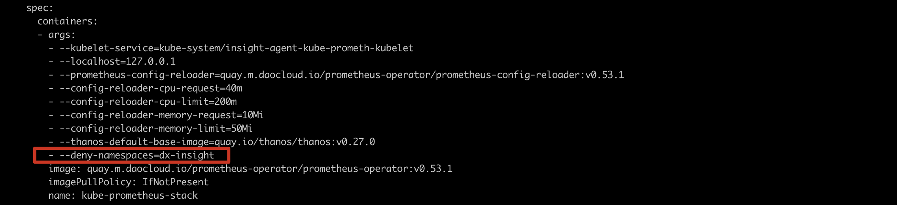

# DCE 4.0 中安装 insight-agent

## 背景
在DCE 5.0 中，DCE 4.0 可作为子集群被接入，但由于大多数客户的 DCE4.0 集群已安装 dx-insight 作为监控系统，若此时安装 insight-agent 会与集群中已有的 prometheus operator 冲突无法顺利安装。

## 方案

通过开启 prometheus operator 的参数，同时保留 dx-insight 中的 prometheus operator并兼容 5.0 中 insight-agent 的 prometheus operator。

## 操作步骤

1. 登陆到命令行，分别在两个 prometheus operator 中启用 --deny-namespaces参数，请执行以下命令（以下命令仅供参考，请替换命令中的 prometheus operator的名称和命名空间。）

    ```bash
    kubectl edit deploy insight-agent-kube-prometh-operator -n insight-system
    ```

    

!!! Note

    - 比如 dx-insight 组件都部署在 dx-insight租户下， insight-agent 都部署在 insight-system 租户下，如上图：在 dx-insight 中的 prometheus operator 中添加 --deny-namespaces=insight-system，在 insight-agent 中的 prometheus operato r添加 --deny-namespaces=dx-insight。
    - 只添加deny namespace，两个prometheus operator都可以继续扫描除此之外的命名空间，kube-system 或客户业务命名空间下的相关采集资源不受影响。
    -  请注意 node exporter 端口冲突的问题。
