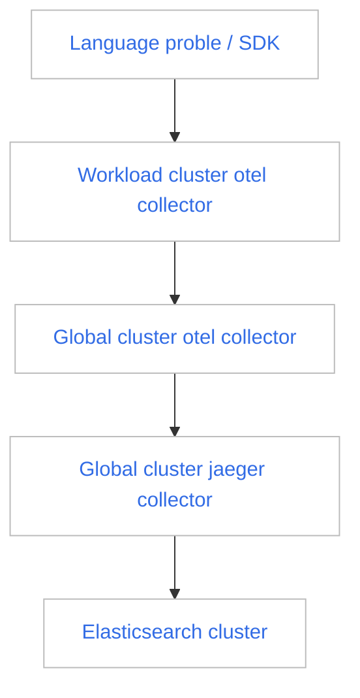

# 链路采集排障指南

在尝试排查链路数据采集的问题前，需先理解链路数据的传输路径，下面是链路数据传输示意图：

如上图所示，在任一步骤传输失败都会导致无法查询出链路数据。如果您在完成应用链路增强后发现没有链路数据，请执行以下步骤：

1. 使用 DCE 5.0 平台，进入`可观测性`，选择左侧导航栏的 `仪表盘`。

    

2. 点击仪表盘标题`概览`。

    

3. 切换到 `insight-system` -> `insight tracing debug` 仪表盘。

    

4. 可以看到该仪表盘由三个区块组成，分别负责监控不同集群、不同组件传输链路的数据情况。通过生成的时序图表，检查链路数据传输是否存在问题。

    - workload opentelemetry collector
    - global opentelemetry collector
    - global jaeger collector

    

## 区块介绍

1. **workload opentelemetry collector**

    展示不同工作集群的 `opentelemetry collector` 在接受 language probe/SDK 链路数据，发送聚合链路数据情况。可以通过左上角的 `Cluster` 选择框选择所在的集群。

    

    !!! note

        根据这四张时序图，可以判断出该集群的 `opentelemetry collector` 是否正常运行。

2. **global opentelemetry collector**

    展示`全局服务集群`的 `opentelemetry collector` 在接收`工作集群`中 `otel collector` 链路数据以及发送聚合链路数据的情况。

    

    !!! note

        `全局管理集群`的 `opentelemetry collector` 还负责发送所有工作集群的[全局管理模块](../../ghippo/intro/index.md)的[审计日志](../../ghippo/user-guide/audit/audit-log.md)以及 Kubernetes 审计日志（默认不采集）到全局管理模块的 `audit server` 组件。

3. **global jaeger collector**

    展示`全局管理集群`的 `jaeger collector` 在接收`全局管理集群`中 `otel collector` 的数据，并发送链路数据到 [ElasticSearch 集群](../../middleware/elasticsearch/intro/index.md)的情况。

    
