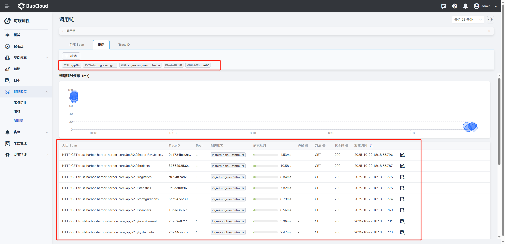

# 接入 Nginx Ingress 的链路追踪

将集群的 Nginx Ingress 组件的链路信息上报至可观测链路, 与后端服务链路串联。

## 开启功能
> 以下以 Helm Chart 部署 Ingress-Nginx 为例：

开启 ingress-nginx 的 Opentelemetry 功能，需编辑 ingress-nginx helm 的 `values.yaml` 文件并加入特定配置。

配置中涉及多个参数，如 `enable-opentelemetry:"true"`,`otlp-collector-host:insight-agent-opentelemetry-collector.insight-system.svc.cluster.local`, `otlp-collector-port:4317` 等。

```yaml
# values.yaml
······
controller:
  config:
    enable-opentelemetry: "true"
    opentelemetry-config: "/etc/ingress-controller/telemetry/opentelemetry.toml"
    opentelemetry-operation-name: "HTTP $request_method $service_name $uri"
    opentelemetry-trust-incoming-span: "true"
    otlp-collector-host: "insight-agent-opentelemetry-collector.insight-system.svc.cluster.local"
    otlp-collector-port: "4317"
    otel-max-queuesize: "2048"
    otel-schedule-delay-millis: "5000"
    otel-max-export-batch-size: "512"
    otel-service-name: "ingress-nginx-controller.ingress-nginx" # 👈 注意格式
    otel-sampler: "AlwaysOn"
    otel-sampler-ratio: "1.0"
    otel-sampler-parent-based: "false"
```

需要注意的是 `otel-service-name` 参数应该是 `xxx.xxx`格式  前面是 `service` 名、后面是 `k8s.namespace.name` 属性，ingress-nginx 上报链路至 `insight-agent-opentelemetry-collector` 后， `insight-agent-opentelemetry-collector` 会按照该格式进行解析。理

## 验证结果
配置完成后，所有经过 ingress-nginx 的链路都能被观测到。



## 参考资料
- [Ingress-Nginx 开启 opentelemetry 官方功能演示]( https://kubernetes.github.io/ingress-nginx/user-guide/third-party-addons/opentelemetry/)
- [Ingress-Nginx 中 nginx 的 OTel 模块配置参数](https://github.com/open-telemetry/opentelemetry-cpp-contrib/tree/main/instrumentation/nginx)
- [Ingress-Nginx 中 Configmap 参数](https://github.com/kubernetes/ingress-nginx/blob/main/docs/user-guide/nginx-configuration/configmap.md)
