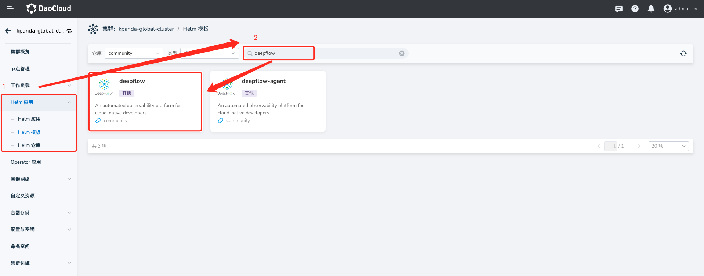
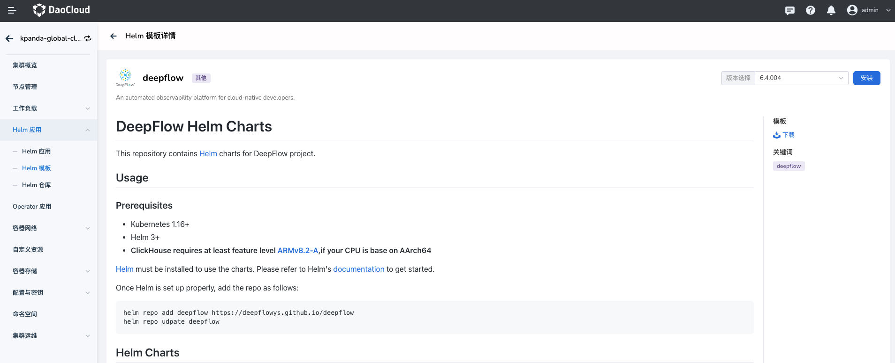
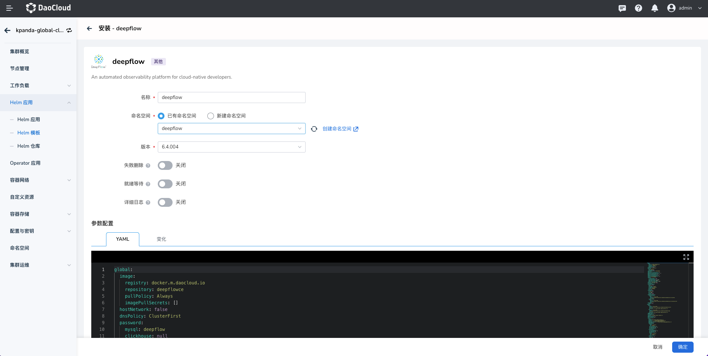
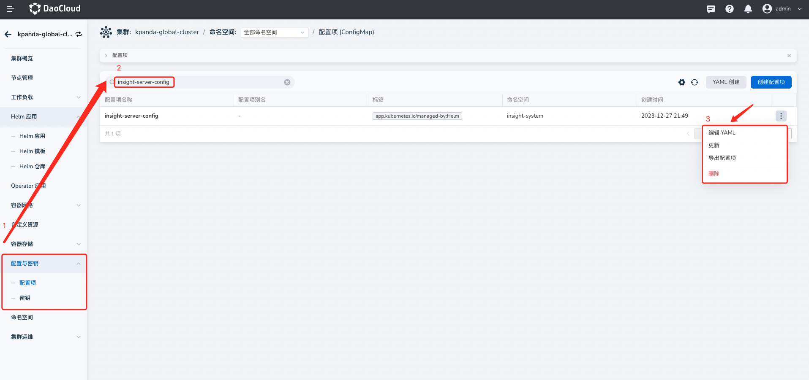
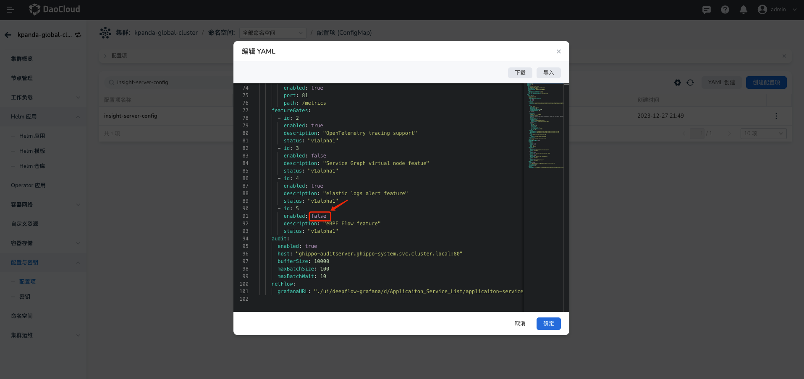
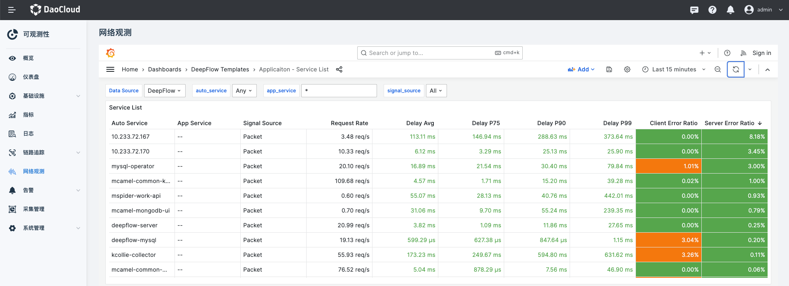
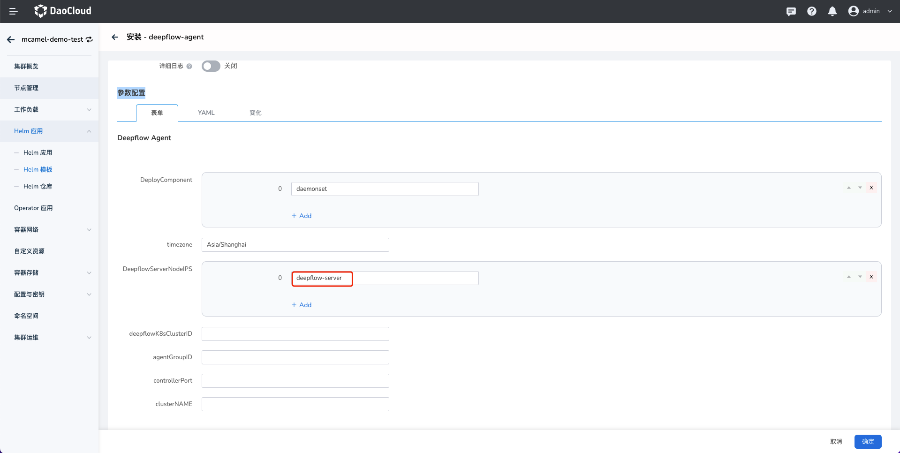
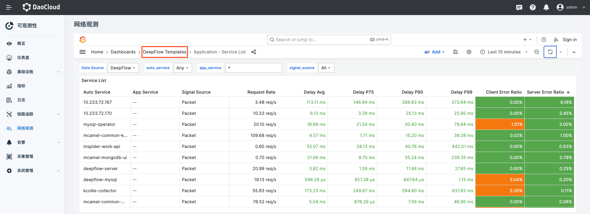
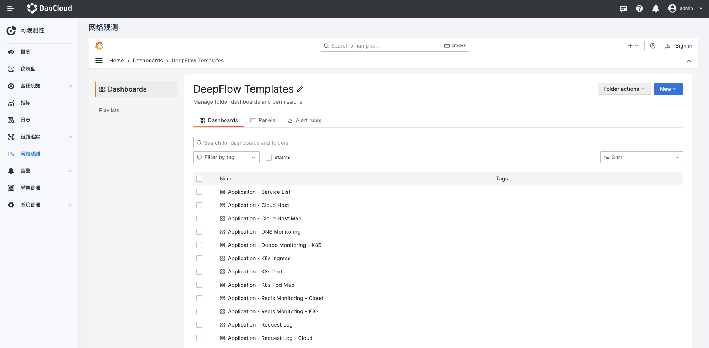

# 集成 DeepFlow

DeepFlow 是一款基于 eBPF 的可观测性产品。它的社区版已经被集成进 Insight 中，以下是集成方式。

## 前提条件

- Global 集群已经安装 Insight
- Insight 最低版本要求为 v0.23.0

## 安装 DeepFlow Server

1. 安装 DeepFlow chart

    DeepFlow Server 需要安装在 Global 集群中(它会默认安装 DeepFlow Agent)。进入 kpanda-global-cluster 集群，在左侧导航栏内点击
    `Helm 应用` -> `Helm 模板`，仓库选择 `community`，搜索框查询 deepflow:
    
    
    
    点击 deepflow 卡片进入详情：
    
    
    
    点击安装，进入安装界面：
    
    
    
    大部分 values 都有默认值。其中 DeepFlow 依赖的 Clickhouse 和 Mysql 都需要申请存储卷，他们的默认大小都是 `10Gi`，可以通过 `persistence`
    关键字搜索到相关配置并修改它们。
    
    配置好后就可以点击确定，执行安装了。

2. 修改 insight 配置

    在安装 DeepFlow 后，还需要在 Insight 中开启相关的特性门。在左侧导航栏内点击 `配置与密钥` -> `配置项`， 搜索框查询
    insight-server-config 并编辑它:
    
    
    
    在配置中找到 `eBPF Flow feature` 这个特性门并将它开启:
    
    
    
    保存更改，重启 insight-server 后，Insight 主界面就会出现 `网络观测`:
    
    

## 安装 DeepFlow Agent

DeepFlow Agent 被安装在子集群中，用于采集子集群的 eBPF 观测数据并上报到 Global 集群中。类似于安装 DeepFlow Server，
通过 `Helm 应用` -> `Helm 模板`，仓库选择 `community`，搜索框查询 deepflow-agent，按流程进入安装界面，在 `参数配置` 配置部分需要注意：

`DeepflowServerNodeIPS` 对应 deepflow server 安装集群的节点地址。配置好后点击确认，完成安装。

## 使用

在正确安装 DeepFlow 后，点击 `网络观测` 就可以进入 DeepFlow Grafana UI。它内置了大量的 Dashboard 可供查看与帮助分析问题，
点击 `DeepFlow Templates`，可以浏览所有可以查看的 Dashboard:

