# vmstorge 磁盘扩容

本文描述了 vmstorge 磁盘扩容的方法，
vmstorge 磁盘规范请参考 [vmstorage 磁盘容量规划](vmstorage-res-plan.md)。

## 操作步骤

### 开启存储池扩容

1. 以全局服务集群管理员权限登陆 DCE 5.0 平台，进入 `kpanda-global-cluster` 集群详情。
2. 选择左侧导航 `容器存储 -> 数据卷声明(PVC)` ，找到 vmstorage 绑定的数据卷声明

    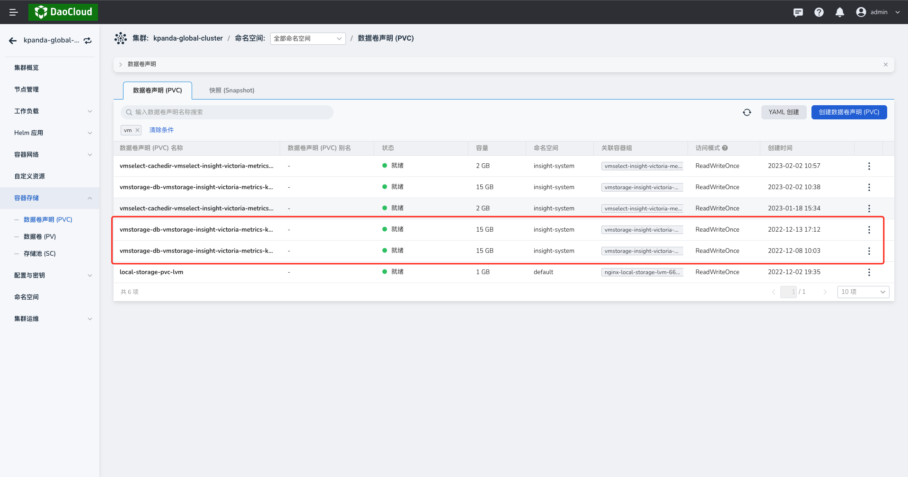

3. 点击进入 vmstorage 的数据卷声明详情，确认该数据卷声明绑定的存储池。

    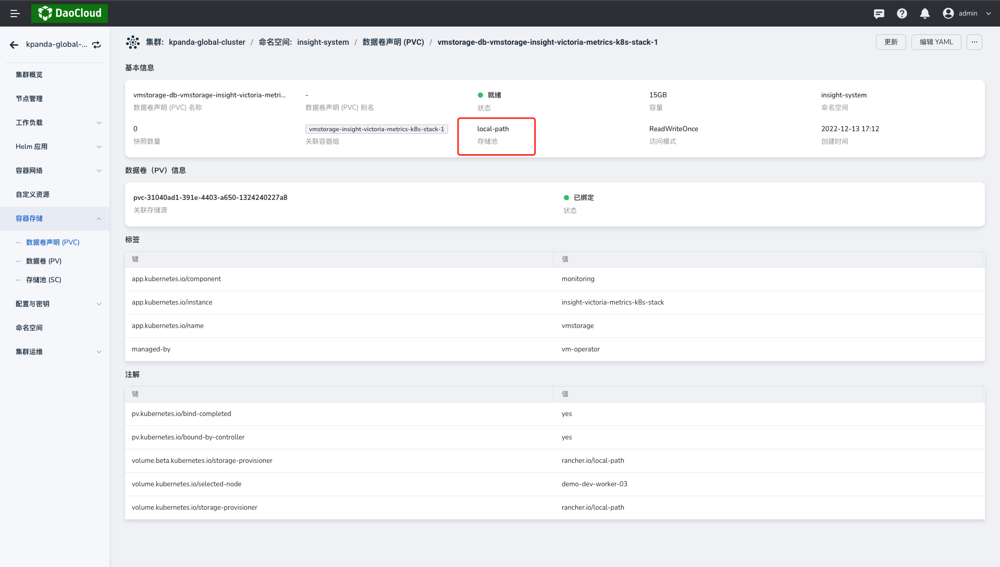

4. 选择左侧导航 `容器存储 -> 存储卷(SC)` ，找到 `local-path` ，单击目标右侧的 `...` ，在弹出菜单中选择`编辑`，**开启扩容**并保存。

    

    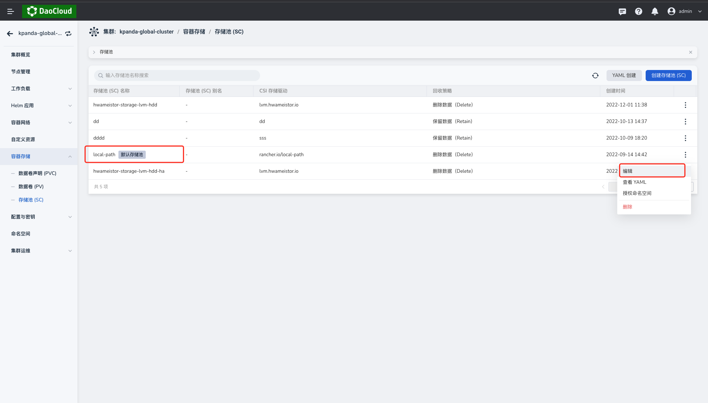

### 更改 vmstorage 的磁盘容量

1. 以全局服务集群管理员权限登陆 DCE 5.0 平台，进入 `kpanda-global-cluster` 集群详情。
2. 选择左侧导航 `自定义资源`，找到 `vmcluster` 的自定义资源。

    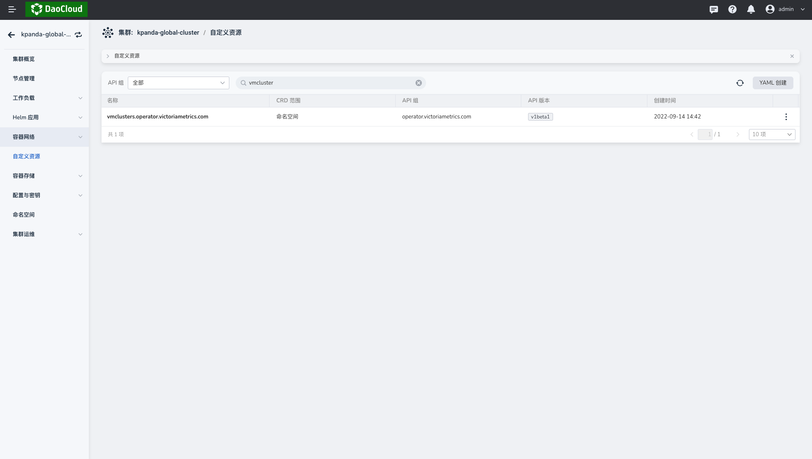

3. 单击 `vmcluster` 的自定义资源详情，切换到 `insight-system` 命名空间下，点击编辑 `insight-victoria-metrics-k8s-stack` CR 实例的 YAML 后根据图例修改并保存。

    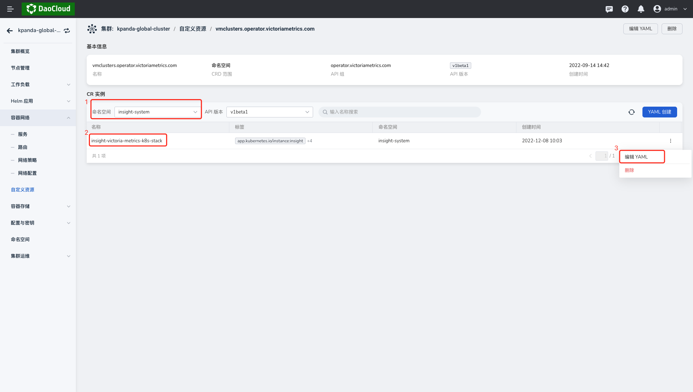

    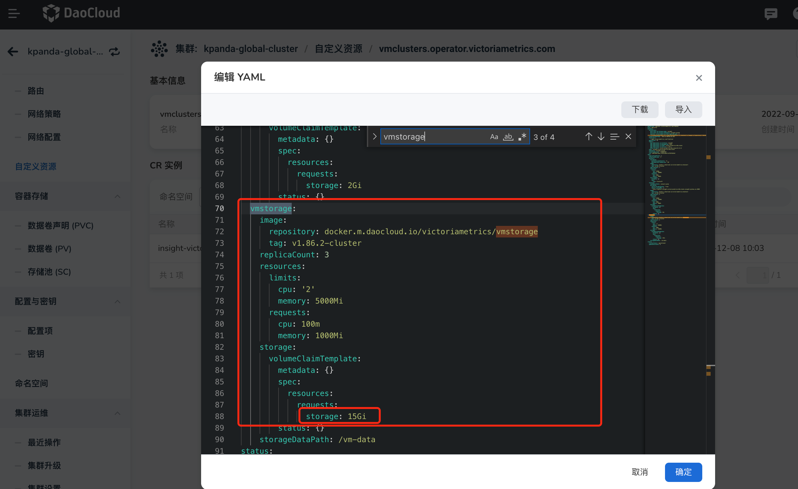

4. 再次选择左侧导航 `容器存储 -> 数据卷声明(PVC)` ，找到 vmstorage 绑定的数据卷声明确认修改已生效。进入 PVC 详情查看关联存储源(PV)。

    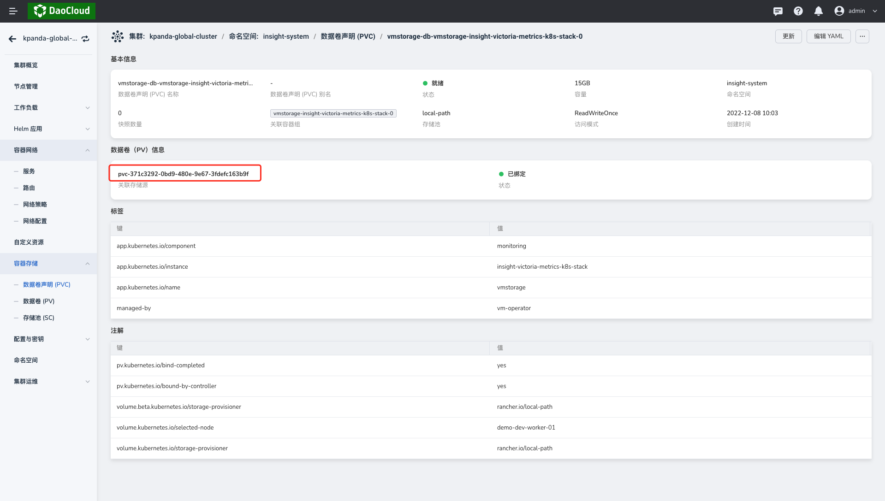

5. 点击 `PV名称` 跳转至对应的存储卷详情页，点击`更新`修改容量并保存。稍等片刻等到扩容成功。

    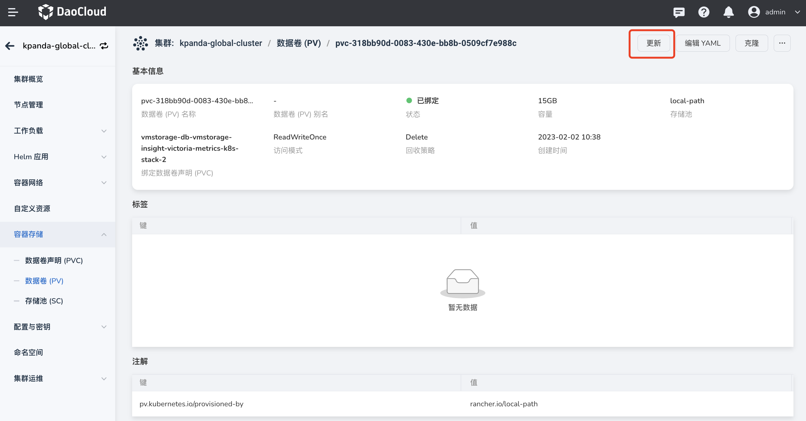

    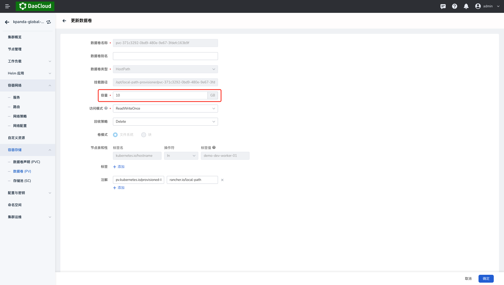

### 克隆存储卷

> 若存储卷扩容失败，可参考该方法克隆存储卷。

1. 以全局服务集群管理员权限登陆 DCE 5.0 平台，进入 `kpanda-global-cluster` 集群详情。
2. 选择左侧导航 `工作负载 -> 有状态负载` ，找到 `vmstorage` 的有状态负载，单击目标右侧的 `...` ，在弹出菜单中选择`状态`后点击`停止`并保存。

    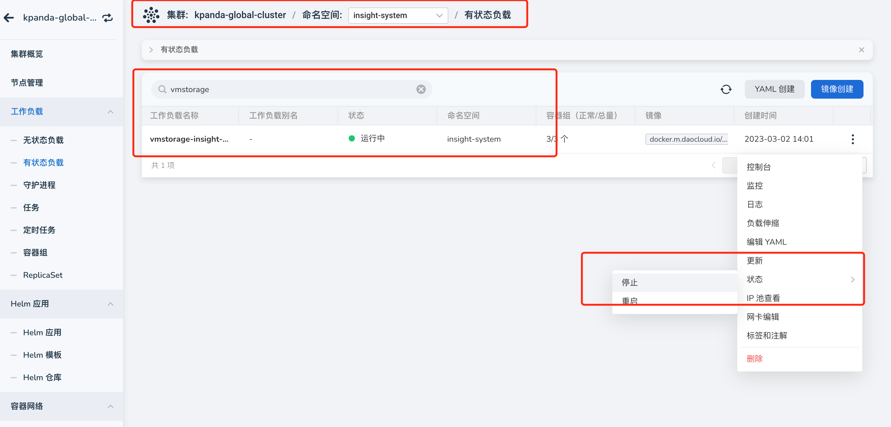

3. 在命令行中登陆 `kpanda-global-cluster` 集群的 `master` 节点后，执行以下命令复制 vmstorage 容器中的 vm-data 目录将指标信息存储在本地：

    ```bash
    kubectl cp -n insight-system vmstorage-insight-victoria-metrics-k8s-stack-1:vm-data ./vm-data
    ```

4. 登陆 DCE 5.0 平台进入 `kpanda-global-cluster` 集群详情，选择左侧导航 `容器存储 -> 数据卷(PV)`，点击右上角的`克隆`，并修改数据卷的容量。

    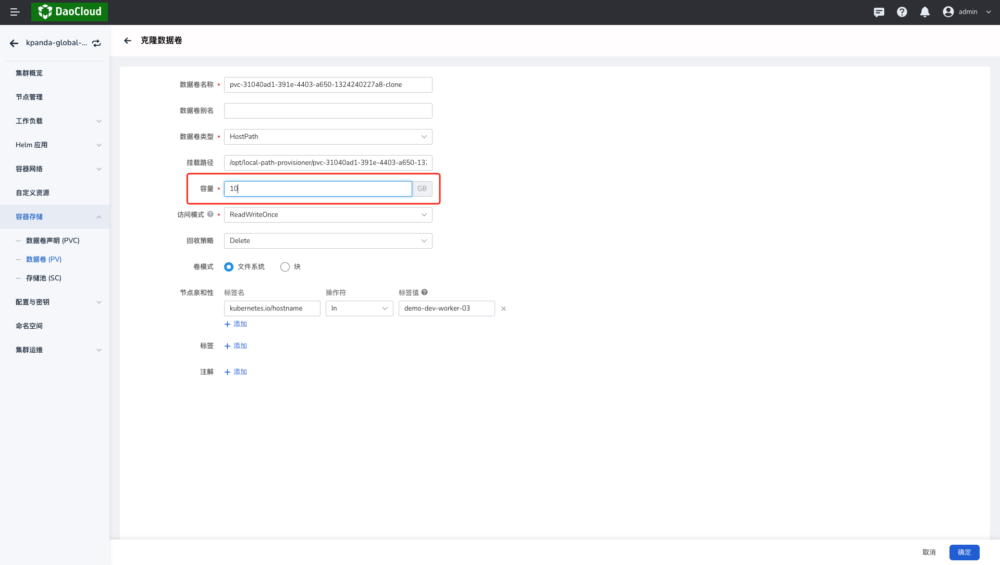

    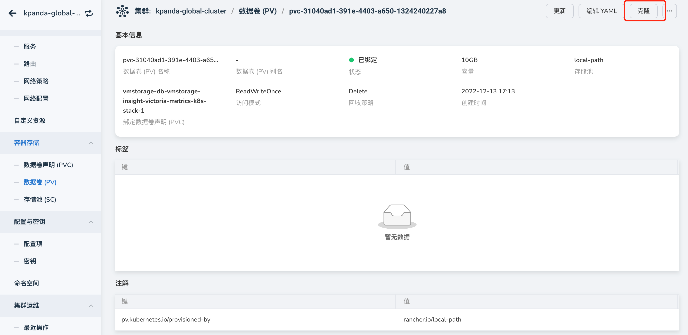

5. 删除之前 vmstorage 的数据卷。

    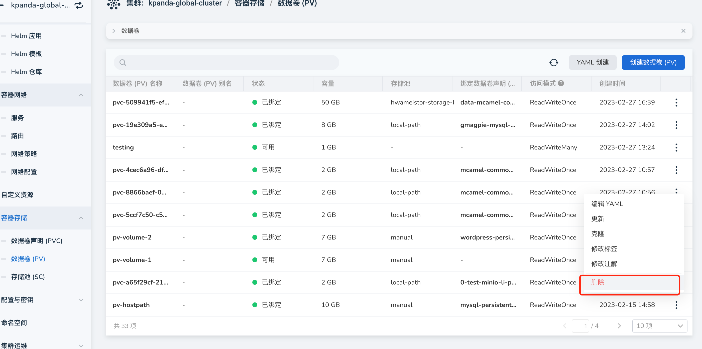

6. 稍等片刻，待存储卷声明跟克隆的数据卷绑定后，执行以下命令将第三步中导出的数据导入到对应的容器中，然后开启之前暂停的 `vmstorage`。

    ```bash
    kubectl cp -n insight-system ./vm-data vmstorage-insight-victoria-metrics-k8s-stack-1:vm-data
    ```
