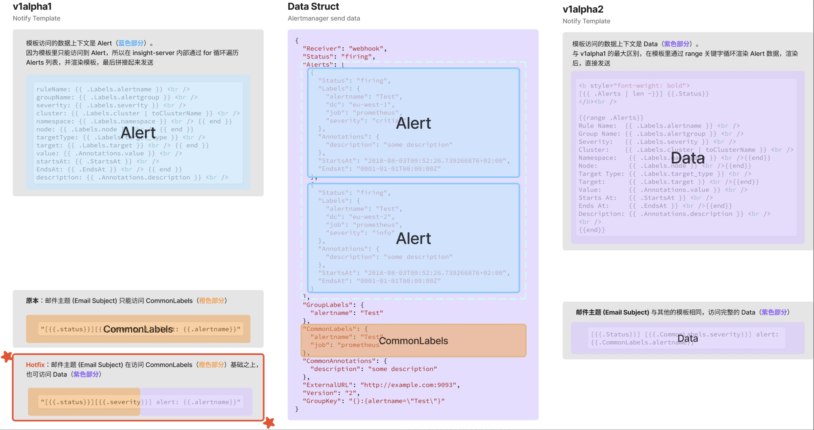
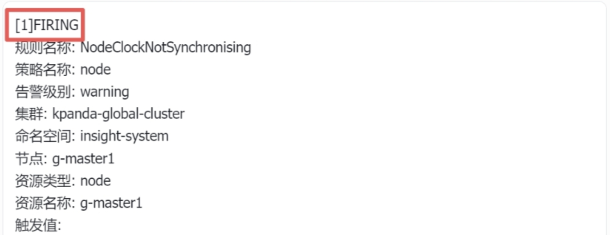

# Insight 告警通知开启  v1alpha2

Insight 引入了新的模板体系，新的模板体系在渲染的数据结构上做了调整，因此和旧版本（v1alpha1） **存在兼容性** 的问题。 因此 默认不启用 v1alpah2。运维可以根据客户的需求开启。

> 🔥 开启后，需要 **立即迁移模板到 v1alpha2 语法** ，否则告警消息将无法正常的发送给 企业微信、电子邮件、飞书等。
>  
> **运维最佳实践，务必通过 SQL 备份旧模板数据。**

## 为什么引入新的模板

引入 v1alpah2 的原因是调整模板可以到的数据，在 v1alpah2 的模板里可以访问到 **更多更完整的** 告警数据。



### 两个版本数据访问的差异

在 **v1alpha1** 版本 模板访问到的数据 有 2 个 限制：

1. 除了 “邮件标题” 之外，模板只能用模板格式化某一条 Alert 的数据（<span style="color: #87CEEB;">蓝色部分</span>）。因此，一些 **换行符** ，还有 **首行的 `[1]FIRING` 字样** 无法定制。



2. “邮件标题” 仅能访问 CommonLabels 里的数据（<span style="color: orange;">橙色部分</span>）。

而在 **v1alpha2** 版本里修复了这 2 个限制，任何模板都可以完整放到告警 Data 数据（<span style="color: purple;">紫色部分</span>）。

因为作用域的调整，所以导致  v1alpha1 和 v1alpha2 存在不兼容的情况。具体的差异是： **需要在模板里手动通过 go-templates 的 `range` 关键字手动遍历循环 Alerts 数据数据。**

### 升级示例

我们以邮件的正文和标题的模板为例，讲解 2 个不同版本的差异：

#### 邮件正文

下面是 邮件正文 的 新旧模板的 diff。
```text
<b style="font-weight: bold">[{{ .Alerts | len -}}] {{.Status}}</b><br />
{{range .Alerts}}
ruleName: {{ .Labels.alertname }} <br />
groupName: {{ .Labels.alertgroup }} <br />
severity: {{ .Labels.severity }} <br />
cluster: {{ .Labels.cluster | toClusterName }} <br />
{{if .Labels.namespace }} namespace: {{ .Labels.namespace }} <br /> {{ end }}
{{if .Labels.node }} node: {{ .Labels.node }} <br /> {{ end }}
targetType: {{ .Labels.target_type }} <br />
{{if .Labels.target }} target: {{ .Labels.target }} <br /> {{ end }}
value: {{ .Annotations.value }} <br />
startsAt: {{ .StartsAt }} <br />
{{if ne "0001-01-01T00:00:00Z" .EndsAt }} EndsAt: {{ .EndsAt }} <br /> {{ end }}
description: {{ .Annotations.description }} <br />
<br />
{{end}}
```

1. `第 2 行` 和 `第 16 行` ，分别新增了 `{{range .Alerts}}` 和 `{{end}}`，将旧版本的模板包裹在 `range` 关键字中。基本上大多数的模板只要这么处理即可。
2. `第 15 行`，增加 `<br />` 作为换行符。渲染出来的内容不会 “堆叠在” 一起，而是按照 Alert 一组一组展示。

#### 邮件标题

需要特别注意的是，v1alpha2 的邮件模板的标题和正文 **共享相同的数据结构** ，不再进行特殊处理，从而降低负担。

旧模板的写法：

```text
[{{ .status }}] [{{ .severity }}] alert: {{ .alertname }}
```

新模板里，可以注意到 severity 调整为 CommonLabels.severity，这才是原始的数据结构。

```text
[{{ .Status }}] [{{ .CommonLabels.severity }}] alert: {{ .CommonLabels.alertname }}
```

#### 更多示例

飞书、钉钉和企业微信的通知模板：

```text
[{{ .Alerts | len -}}] {{.Status}}
{{range .Alerts}}
Rule Name:   {{ .Labels.alertname }}
Group Name:  {{ .Labels.alertgroup }}
Severity:    {{ .Labels.severity }}
Cluster:     {{ .Labels.cluster | toClusterName }}
{{if .Labels.namespace }}Namespace:  {{ .Labels.namespace }}
{{ end }}{{if .Labels.node }}Node:  {{ .Labels.node }}
{{ end }}Target Type: {{ .Labels.target_type }}
{{if .Labels.target }}Target:  {{ .Labels.target }} 
{{ end }}Value:       {{ .Annotations.value }}
Starts At:   {{ .StartsAt }}
{{if ne "0001-01-01T00:00:00Z" .EndsAt }}Ends At:     {{ .EndsAt }}
{{ end }}Description: {{ .Annotations.description }}
{{end}}
```

## 如何在 Insight 中启用 v1alpha2

当确认需要 开启 v1alpah2 的能力之后，我们可以通过如下的 2 个配置开启。需要注意：

1. **内置模板** ：insight-server 内置一套中文和英文的模板，开启 v1alpha2 之后，程序会自动更新 内置模板 到新版本，无需迁移；
2. **客户创建模板** ：因为兼容性问题，insight-server 默认不会迁移客户创建的模板。因此，在模板迁移之前，所有的告警通知都将失效，因为无法正确的解析模板，无法正确的生成通知内容，因此无法通知到外部的 webhook，邮件，企业微信。

> 🔥 注意，如果客户不能接受 迁移期间内 无告警通知，那么此方案不可行。


### 方法 1：(推荐) 通过 helm 命令 upgrade

1. 在 Helm upgrade 的执行命令中增加如下参数：

    ```shell
    --set server.alerting.notifyTemplate.version="v1alpha2"
    ```

2. 除「helm 命令升级」之外亦可编辑 helm 的 values 文件，如下：

    ```diff
    server:
      alerting:
        notifyTemplate:
    -     version: v1alpha1
    +     version: v1alpha2
    ```

### 方法 2：临时调整配置文件（configmap）

1. 编辑 insight-server 的配置文件（configmap）insight-server-config，调整配置文件如下：

    ```diff
    alerting:
      notifyTemplate:
    -   version: v1alpha1
    +   version: v1alpha2
    ```

2. 编辑保存之后，重启 insight-server 即可。
