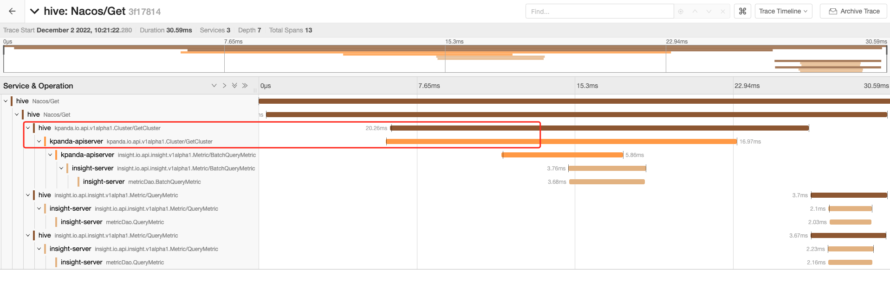
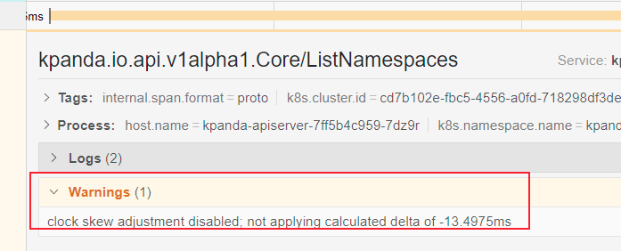

# 链路数据中的时钟偏移

在一个分布式系统中，由于[Clock Skew(时钟偏斜调整](https://zh.wikipedia.org/wiki/%E6%97%B6%E9%92%9F%E5%81%8F%E7%A7%BB)影响，不同主机间存在时间漂移现象。通俗来说，不同主机在同一时刻的系统时间是有微小的偏差的。

链路追踪系统是一个典型的分布式系统，它在涉及时间数据采集上也受这种现象影响，比如在一条链路中服务端 span 的开始时间早于客户端 span，这种现象逻辑上是不存在的，但是由于时钟偏移影响，链路数据在各个服务中被采集到的那一刻主机间的系统时存在偏差，最终造成如下图所示的现象：

上图中出现的现象理论上无法消除。但该现象出的较少，即使出现也不会影响服务间的调用关系。

目前在使用 Insight 使用 Jaeger UI 来展示链路数据，UI 在遇到这种链路时会提醒：

目前 Jaeger 的社区正在[尝试通过UI层面来优化这个问题](https://github.com/jaegertracing/jaeger-ui/issues/197)。

更多的相关资料，请参考：

- [https://github.com/jaegertracing/jaeger/issues/1459#issuecomment-582519000](https://github.com/jaegertracing/jaeger/issues/1459#issuecomment-582519000)
- [https://github.com/jaegertracing/jaeger-ui/issues/197](https://github.com/jaegertracing/jaeger-ui/issues/197)
- [https://www.jaegertracing.io/docs/1.40/deployment/#clock-skew-adjustment](https://www.jaegertracing.io/docs/1.40/deployment/#clock-skew-adjustment)