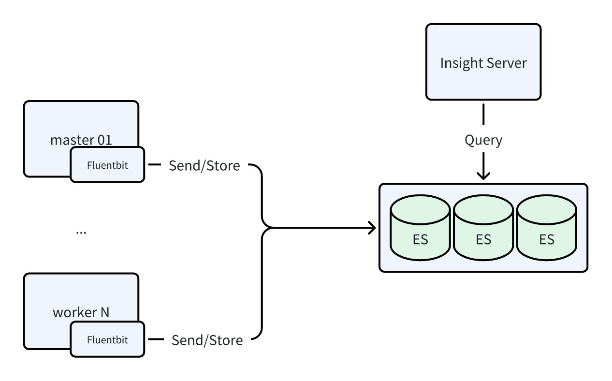
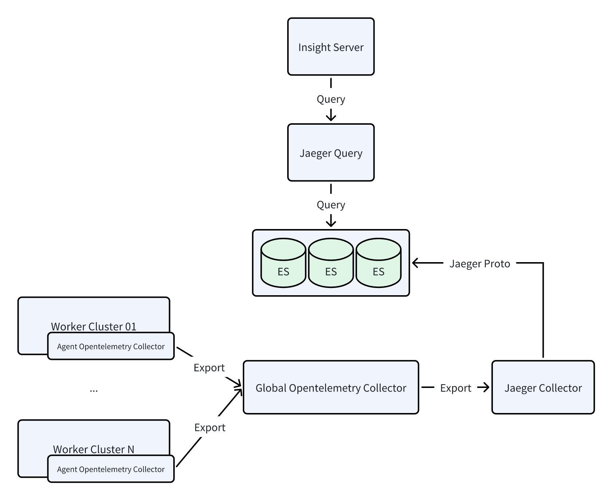
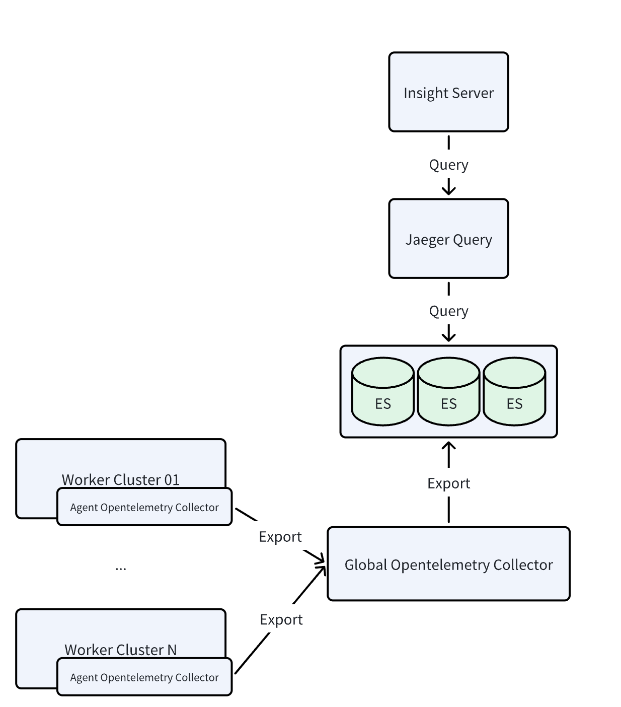
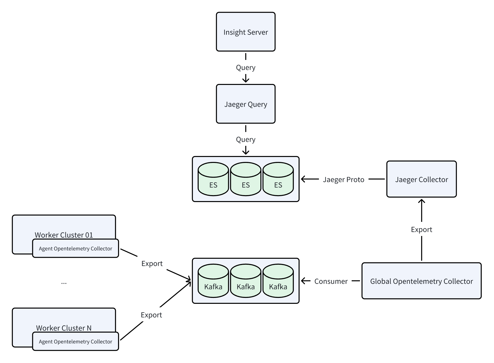
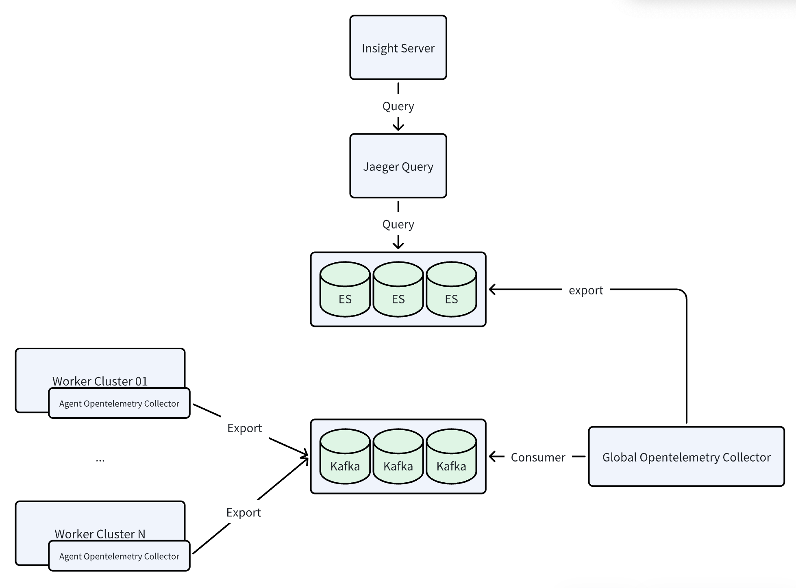
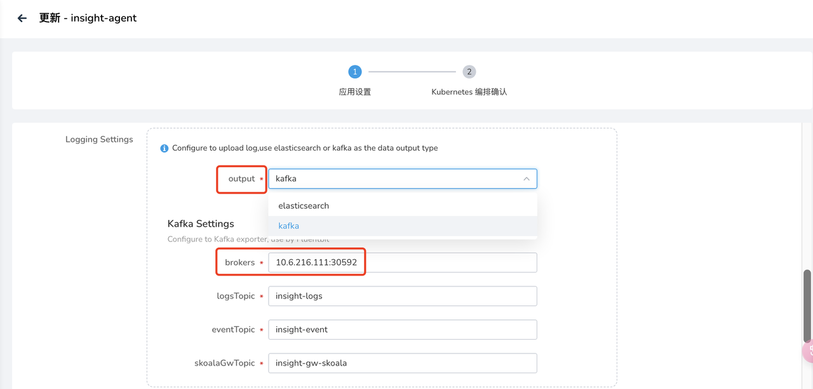
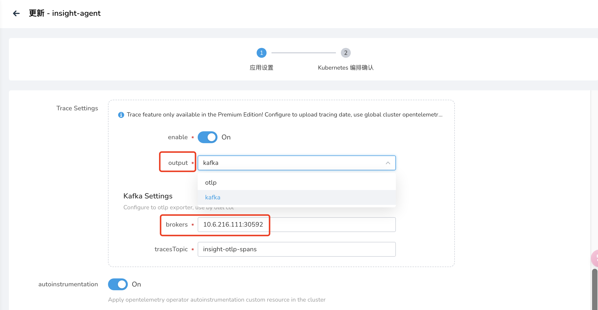

# 开启大日志和大链路模式

可观测性模块为了提高大规模环境下的数据写入能力，支持将日志切换为
**大日志** 模式、将链路切换为 **大链路** 模式。本文将介绍以下几种开启方式：

- 通过[安装器开启或升级](#_8)至大日志和大链路模式（通过 manifest.yaml 中同一个参数值控制）
- 通过 [Helm 命令手动开启](#helm)大日志和大链路模式

## 日志

本节说明普通日志模式和大日志模式的区别。

### 日志模式

组件：Fluentbit + Elasticsearch

该模式简称为 ES 模式，数据流图如下所示：



### 大日志模式

组件：Fluentbit + **Kafka** + **Vector** + Elasticsearch

该模式简称为 Kafka 模式，数据流图如下所示：


## 链路

本节说明普通链路模式和大链路模式的区别。

### 链路（OTLP）模式

该模式简称为 OTLP 模式。
注意：链路的架构在 0.38.x 版本之后有所调整，数据流图如下所示：

=== "0.38.x 之前的版本"

  组件：Agent opentelemetry-collector + Global opentelemetry-collector + Jaeger-collector + Elasticsearch

  

=== "0.38.x+ 之后的版本"

  组件：Agent opentelemetry-collector + Global opentelemetry-collector + Elasticsearch

  

### 大链路模式

该模式简称为 Kafka 模式。

注意：链路的架构在 0.38.x 版本之后有所调整，数据流图如下所示：

=== "0.38.x 之前的版本"
  组件：Agent opentelemetry-collector + Kafka + Global opentelemetry-collector + Jaeger-collector + Elasticsearch

  

=== "0.38.x+ 之后的版本"
  组件：Agent opentelemetry-collector + Kafka + Global opentelemetry-collector + Elasticsearch
  

## 通过安装器开启

通过安装器部署/升级 DCE 5.0 时使用的 manifest.yaml 中存在 infrastructures.kafka 字段，
如果想开启可观测的大日志和大链路模式，则需要启用 kafka：

```yaml title="manifest.yaml"
apiVersion: manifest.daocloud.io/v1alpha1
kind: DCEManifest
...
infrastructures:
  ...
  kafka:
    enable: true # 默认为 false
    cpuLimit: 1
    memLimit: 2Gi
    pvcSize: 15Gi
```

### 开启

安装时使用启用 `kafka` 的 manifest.yaml，则会默认安装 kafka 中间件，
并在安装 Insight 时默认开启大日志和大链路模式。安装命令为：

```bash
./dce5-installer cluster-create -c clusterConfig.yaml -m manifest.yaml
```

### 升级

升级同样是修改 `kafka` 字段。但需要注意的是，因为老环境安装时使用的是 `kafka: false`，
所以环境中无 kafka。此时升级需要指定升级 `middleware`，才会同时安装 kafka 中间件。升级命令为：

```bash
./dce5-installer cluster-create -c clusterConfig.yaml -m manifest.yaml -u gproduct,middleware
```

!!! note

    在升级完成后，需要手动重启以下组件：
    
    - insight-agent-fluent-bit
    - insight-agent-opentelemetry-collector
    - insight-opentelemetry-collector

## 通过 Helm 命令开启

前提条件：需要保证存在 **可用的 kafka** 且地址可正常访问。

根据以下命令获取老版本 insight 和 insight-agent 的 values（建议做好备份）：

```bash
helm get values insight -n insight-system -o yaml > insight.yaml
helm get values insight-agent -n insight-system -o yaml > insight-agent.yaml
```

### 开启大日志

有以下几种方式开启或升级至大日志模式：

=== "在 `helm upgrade` 命令中使用 --set"

    先运行以下 insight 升级命令，注意 kafka brokers 地址需正确：

    ```bash
    helm upgrade insight insight-release/insight \
      -n insight-system \
      -f ./insight.yaml \
      --set global.kafka.brokers="10.6.216.111:30592" \
      --set global.kafka.enabled=true \
      --set vector.enabled=true \
      --version 0.30.1
    ```

    然后运行以下 insight-agent 升级命令，注意 kafka brokers 地址需正确：

    ```bash
    helm upgrade insight-agent insight-release/insight-agent \
      -n insight-system \
      -f ./insight-agent.yaml \
      --set global.exporters.logging.kafka.brokers="10.6.216.111:30592" \
      --set global.exporters.logging.output=kafka \
      --version 0.30.1
    ```

=== "修改 YAML 后运行 helm upgrade"

    参照以下步骤修改 YAMl 后运行 `helm upgrade` 命令：

    1. 修改 insight.yaml

        ```yaml title="insight.yaml"
        global:
          ...
          kafka:
            brokers: 10.6.216.111:30592
            enabled: true
        ...
        vector:
          enabled: true
        ```

    1. 升级 insight 组件：

        ```bash
        helm upgrade insight insight-release/insight \
          -n insight-system \
          -f ./insight.yaml \
          --version 0.30.1
        ```

    1. 修改 insight-agent.yaml

        ```yaml title="insight-agent.yaml"
        global:
          ...
          exporters:
            ...
            logging:
              ...
              kafka:
                brokers: 10.6.216.111:30592
              output: kafka
        ```

    1. 升级 insight-agent：

        ```bash
        helm upgrade insight-agent insight-release/insight-agent \
          -n insight-system \
          -f ./insight-agent.yaml \
          --version 0.30.1
        ```

=== "容器管理 UI 升级"

    在容器管理模块中，找到对应的集群，从左侧导航栏选择 **Helm 应用** ，找到并更新 insight-agent。

    在 **Logging Settings** 中，为 **output** 选择 **kafka**，并填写正确的 **brokers** 地址。

    

    需要注意的是，在升级完成后，需手动重启 **insight-agent-fluent-bit** 组件。

### 开启大链路

有以下几种方式开启或升级至大链路模式：

=== "在 `helm upgrade` 命令中使用 --set"

    先运行以下 insight 升级命令，注意 kafka brokers 地址需正确：

    ```bash
    helm upgrade insight insight-release/insight \
      -n insight-system \
      -f ./insight.yaml \
      --set global.kafka.brokers="10.6.216.111:30592" \
      --set global.kafka.enabled=true \
      --set global.tracing.kafkaReceiver.enabled=true \
      --version 0.30.1
    ```

    然后运行以下 insight-agent 升级命令，注意 kafka brokers 地址需正确：

    ```bash
    helm upgrade insight-agent insight-release/insight-agent \
      -n insight-system \
      -f ./insight-agent.yaml \
      --set global.exporters.trace.kafka.brokers="10.6.216.111:30592" \
      --set global.exporters.trace.output=kafka \
      --version 0.30.1
    ```

=== "修改 YAML 后运行 helm upgrade"

    参照以下步骤修改 YAMl 后运行 `helm upgrade` 命令：

    1. 修改 insight.yaml

        ```yaml title="insight.yaml"
        global:
          ...
          kafka:
            brokers: 10.6.216.111:30592
            enabled: true
        ...
        tracing:
          ...
          kafkaReceiver:
            enabled: true
        ```

    1. 升级 insight 组件：

        ```bash
        helm upgrade insight insight-release/insight \
          -n insight-system \
          -f ./insight.yaml \
          --version 0.30.1
        ```

    1. 修改 insight-agent.yaml

        ```yaml title="insight-agent.yaml"
        global:
          ...
          exporters:
            ...
            trace:
              ...
              kafka:
                brokers: 10.6.216.111:30592
              output: kafka
        ```

    1. 升级 insight-agent：

        ```bash
        helm upgrade insight-agent insight-release/insight-agent \
          -n insight-system \
          -f ./insight-agent.yaml \
          --version 0.30.1
        ```

=== "容器管理 UI 升级"

    在容器管理模块中，找到对应的集群，从左侧导航栏选择 **Helm 应用** ，找到并更新 insight-agent。

    在 **Trace Settings** 中，为 **output** 选择 **kafka**，并填写正确的 **brokers** 地址。

    

    需要注意的是，在升级完成后，需手动
    **重启 insight-agent-opentelemetry-collector** 和 **insight-opentelemetry-collector** 组件。

## 如何消费 Kafka 中的日志和链路数据？

在使用 Kafka 模式时，目前 Insight 会采集日志、Kube 审计、Kube 事件和链路四种数据至 Kafka，以下分别是数据类型对应的 Kafka Topic 名字：

|  类型   | Topic Name  | 格式 | 
|  ----  | ----  | ----  |
| 日志（Log）  | 默认是：insight-logs | JSON |
| Kube 事件  | 默认是：insight-event | JSON |
| Kube 审计  | 默认是：insight-kube-audit | JSON |
| 链路（Trace）  | 默认是：insight-otlp-spans | Protobuf |

以下是各个类型在 Kafka Topic 中的样例数据：

### 日志（Log）

```json
{
    "@timestamp": 1764739584.504833,
    "kubernetes": {
        "container_name": "ebpf-instrument",
        "container_image": "i.sanxian.tech/open-telemetry/opentelemetry-ebpf-instrumentation/ebpf-instrument:v0.1.0",
        "namespace_name": "otel-ebpf-inst",
        "pod_name": "my-opentelemetry-ebpf-instrumentation-zgmkl",
        "pod_ip": "10.233.110.39"
    },
    "_p": "F",
    "time": "2025-12-03T05:26:24.504832869Z",
    "log": "time=2025-12-03T05:26:24.504Z level=INFO msg=\"failed to upload metrics: failed to send metrics to http://insight-agent-opentelemetry-collector.insight-system.svc.cluster.local:4318/v1/metrics: 404 Not Found (body: 404 page not found)\"",
    "tag": "kube.containers",
    "cluster_uuid": "c1ff703c-dc97-44d3-917a-23588b7882cb",
    "cluster_name": "insight-dev"
}
```

### Kube 事件

```json
{
    "resourceLogs": [
        {
            "resource": {},
            "scopeLogs": [
                {
                    "scope": {
                        "name": "github.com/open-telemetry/opentelemetry-collector-contrib/receiver/k8sobjectsreceiver",
                        "version": "0.137.0-dev"
                    },
                    "logRecords": [
                        {
                            "observedTimeUnixNano": "1764736302355133267",
                            "body": {
                                "stringValue": "{\"@timestamp\":\"2025-12-03T04:31:42.355133267Z\",\"apiVersion\":\"v1\",\"cluster_name\":\"kpanda-global-cluster\",\"cluster_uuid\":\"a32bf78c-48e6-46a0-9618-a00c235de31e\",\"count\":601,\"eventTime\":null,\"firstTimestamp\":\"2025-12-01T02:31:31Z\",\"involvedObject\":{\"apiVersion\":\"hwameistor.io/v1alpha1\",\"kind\":\"LocalDiskNode\",\"name\":\"cluster-bm-master1\",\"resourceVersion\":\"152713502\",\"uid\":\"29461f1d-cd47-4962-80ba-a7ce9eb24dd9\"},\"kind\":\"Event\",\"lastTimestamp\":\"2025-12-03T04:31:42Z\",\"message\":\"Insufficient storage capacity\",\"metadata\":{\"creationTimestamp\":\"2025-12-01T02:31:31Z\",\"name\":\"cluster-bm-master1.187cf69935559781\",\"namespace\":\"default\",\"resourceVersion\":\"155466075\",\"uid\":\"2558a5c9-ecce-4e07-b930-37195f77326b\"},\"reason\":\"StorageUnAvailable\",\"reportingComponent\":\"\",\"reportingInstance\":\"\",\"source\":{\"component\":\"localdiskmanager/cluster-bm-master1\"},\"time\":\"2025-12-03T04:31:42.355133267Z\",\"type\":\"Warning\"}"
                            }
                        }
                    ]
                }
            ]
        }
    ]
}
```

### Kube 审计

```json
{
    "@timestamp": 1764730101.93227,
    "cluster_uuid": "a32bf78c-48e6-46a0-9618-a00c235de31e", 
    "cluster_name": "kpanda-global-cluster",
    "log": "{\"kind\":\"Event\",\"apiVersion\":\"audit.k8s.io/v1\",\"level\":\"RequestResponse\",\"auditID\":\"b2b57298-3ca4-4acf-b182-8e81abb84d1c\",\"stage\":\"ResponseStarted\",\"requestURI\":\"/api/v1/namespaces/insight-system/pods/prometheus-insight-agent-kube-prometh-prometheus-0/portforward\",\"verb\":\"create\",\"user\":{\"username\":\"admin\",\"groups\":[\"system:authenticated\"]},\"sourceIPs\":[\"127.0.0.1\",\"10.64.0.247\"],\"userAgent\":\"kubectl/v1.27.16 (darwin/arm64) kubernetes/cbb86e0\",\"objectRef\":{\"resource\":\"pods\",\"namespace\":\"insight-system\",\"name\":\"prometheus-insight-agent-kube-prometh-prometheus-0\",\"apiVersion\":\"v1\",\"subresource\":\"portforward\"},\"responseStatus\":{\"metadata\":{},\"code\":101},\"requestReceivedTimestamp\":\"2025-12-03T02:41:53.616485Z\",\"stageTimestamp\":\"2025-12-03T02:41:53.646835Z\",\"annotations\":{\"authorization.k8s.io/decision\":\"allow\",\"authorization.k8s.io/reason\":\"RBAC: allowed by ClusterRoleBinding \\\"kpanda-user-admin-admin\\\" of ClusterRole \\\"role-template-cluster-admin\\\" to User \\\"admin\\\"\"}}"
}
```

### 链路（Trace）

参考 [OTLP Trace Protobuf](https://github.com/open-telemetry/opentelemetry-proto/blob/main/opentelemetry/proto/trace/v1/trace.proto)
