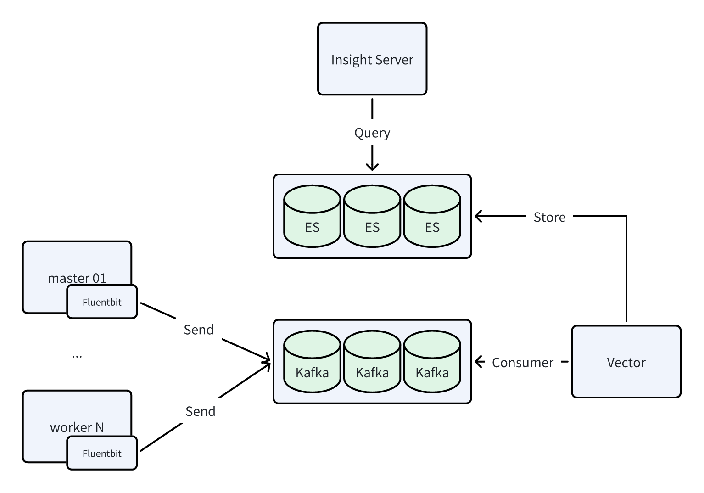

# 开启大日志和大链路模式

可观测性模块为了提高大规模环境下的数据写入能力，支持将日志切换为
**大日志** 模式、将链路切换为 **大链路** 模式。本文将介绍以下几种开启方式：

- 通过[安装器开启或升级](#_8)至大日志和大链路模式（通过 manifest.yaml 中同一个参数值控制）
- 通过 [Helm 命令手动开启](#helm)大日志和大链路模式

## 日志

本节说明普通日志模式和大日志模式的区别。

### 日志模式

组件：Fluentbit + Elasticsearch

该模式简称为 ES 模式，数据流图如下所示：


### 大日志模式

组件：Fluentbit + **Kafka** + **Vector** + Elasticsearch

该模式简称为 Kafka 模式，数据流图如下所示：



## 链路

本节说明普通链路模式和大链路模式的区别。

### 链路模式

组件：Agent opentelemetry-collector + Global opentelemetry-collector + Jaeger-collector + Elasticsearch

该模式简称为 OTlp 模式，数据流图如下所示：


### 大链路模式

组件：Agent opentelemetry-collector + Kafka + Global opentelemetry-collector + Jaeger-collector + Elasticsearch

该模式简称为 Kafka 模式，数据流图如下所示：


## 通过安装器开启

通过安装器部署/升级 DCE 5.0 时使用的 manifest.yaml 中存在 infrastructures.kafka 字段，
如果想开启可观测的大日志和大链路模式，则需要启用 kafka：

```yaml title="manifest.yaml"
apiVersion: manifest.daocloud.io/v1alpha1
kind: DCEManifest
...
infrastructures:
  ...
  kafka:
    enable: true # 默认为 false
    cpuLimit: 1
    memLimit: 2Gi
    pvcSize: 15Gi
```

### 开启

安装时使用启用 `kafka` 的 manifest.yaml，则会默认安装 kafka 中间件，
并在安装 Insight 时默认开启大日志和大链路模式。安装命令为：

```bash
./dce5-installer cluster-create -c clusterConfig.yaml -m manifest.yaml
```

### 升级

升级同样是修改 `kafka` 字段。但需要注意的是，因为老环境安装时使用的是 `kafka: false`，
所以环境中无 kafka。此时升级需要指定升级 `middleware`，才会同时安装 kafka 中间件。升级命令为：

```bash
./dce5-installer cluster-create -c clusterConfig.yaml -m manifest.yaml -u gproduct,middleware
```

!!! note

    在升级完成后，需要手动重启以下组件：
    
    - insight-agent-fluent-bit
    - insight-agent-opentelemetry-collector
    - insight-opentelemetry-collector

## 通过 Helm 命令开启

前提条件：需要保证存在 **可用的 kafka** 且地址可正常访问。

根据以下命令获取老版本 insight 和 insight-agent 的 values（建议做好备份）：

```bash
helm get values insight -n insight-system -o yaml > insight.yaml
helm get values insight-agent -n insight-system -o yaml > insight-agent.yaml
```

### 开启大日志

有以下几种方式开启或升级至大日志模式：

=== "在 `helm upgrade` 命令中使用 --set"

    先运行以下 insight 升级命令，注意 kafka brokers 地址需正确：

    ```bash
    helm upgrade insight insight-release/insight \
      -n insight-system \
      -f ./insight.yaml \
      --set global.kafka.brokers="10.6.216.111:30592" \
      --set global.kafka.enabled=true \
      --set vector.enabled=true \
      --version 0.30.1
    ```

    然后运行以下 insight-agent 升级命令，注意 kafka brokers 地址需正确：

    ```bash
    helm upgrade insight-agent insight-release/insight-agent \
      -n insight-system \
      -f ./insight-agent.yaml \
      --set global.exporters.logging.kafka.brokers="10.6.216.111:30592" \
      --set global.exporters.logging.output=kafka \
      --version 0.30.1
    ```

=== "修改 YAML 后运行 helm upgrade"

    参照以下步骤修改 YAMl 后运行 `helm upgrade` 命令：

    1. 修改 insight.yaml

        ```yaml title="insight.yaml"
        global:
          ...
          kafka:
            brokers: 10.6.216.111:30592
            enabled: true
        ...
        vector:
          enabled: true
        ```

    1. 升级 insight 组件：

        ```bash
        helm upgrade insight insight-release/insight \
          -n insight-system \
          -f ./insight.yaml \
          --version 0.30.1
        ```

    1. 修改 insight-agent.yaml

        ```yaml title="insight-agent.yaml"
        global:
          ...
          exporters:
            ...
            logging:
              ...
              kafka:
                brokers: 10.6.216.111:30592
              output: kafka
        ```

    1. 升级 insight-agent：

        ```bash
        helm upgrade insight-agent insight-release/insight-agent \
          -n insight-system \
          -f ./insight-agent.yaml \
          --version 0.30.1
        ```

=== "容器管理 UI 升级"

    在容器管理模块中，找到对应的集群，从左侧导航栏选择 **Helm 应用** ，找到并更新 insight-agent。

    在 **Logging Settings** 中，为 **output** 选择 **kafka**，并填写正确的 **brokers** 地址。

    

    需要注意的是，在升级完成后，需手动重启 **insight-agent-fluent-bit** 组件。

### 开启大链路

有以下几种方式开启或升级至大链路模式：

=== "在 `helm upgrade` 命令中使用 --set"

    先运行以下 insight 升级命令，注意 kafka brokers 地址需正确：

    ```bash
    helm upgrade insight insight-release/insight \
      -n insight-system \
      -f ./insight.yaml \
      --set global.kafka.brokers="10.6.216.111:30592" \
      --set global.kafka.enabled=true \
      --set global.tracing.kafkaReceiver.enabled=true \
      --version 0.30.1
    ```

    然后运行以下 insight-agent 升级命令，注意 kafka brokers 地址需正确：

    ```bash
    helm upgrade insight-agent insight-release/insight-agent \
      -n insight-system \
      -f ./insight-agent.yaml \
      --set global.exporters.trace.kafka.brokers="10.6.216.111:30592" \
      --set global.exporters.trace.output=kafka \
      --version 0.30.1
    ```

=== "修改 YAML 后运行 helm upgrade"

    参照以下步骤修改 YAMl 后运行 `helm upgrade` 命令：

    1. 修改 insight.yaml

        ```yaml title="insight.yaml"
        global:
          ...
          kafka:
            brokers: 10.6.216.111:30592
            enabled: true
        ...
        tracing:
          ...
          kafkaReceiver:
            enabled: true
        ```

    1. 升级 insight 组件：

        ```bash
        helm upgrade insight insight-release/insight \
          -n insight-system \
          -f ./insight.yaml \
          --version 0.30.1
        ```

    1. 修改 insight-agent.yaml

        ```yaml title="insight-agent.yaml"
        global:
          ...
          exporters:
            ...
            trace:
              ...
              kafka:
                brokers: 10.6.216.111:30592
              output: kafka
        ```

    1. 升级 insight-agent：

        ```bash
        helm upgrade insight-agent insight-release/insight-agent \
          -n insight-system \
          -f ./insight-agent.yaml \
          --version 0.30.1
        ```

=== "容器管理 UI 升级"

    在容器管理模块中，找到对应的集群，从左侧导航栏选择 **Helm 应用** ，找到并更新 insight-agent。

    在 **Trace Settings** 中，为 **output** 选择 **kafka**，并填写正确的 **brokers** 地址。

    

    需要注意的是，在升级完成后，需手动
    **重启 insight-agent-opentelemetry-collector** 和 **insight-opentelemetry-collector** 组件。
