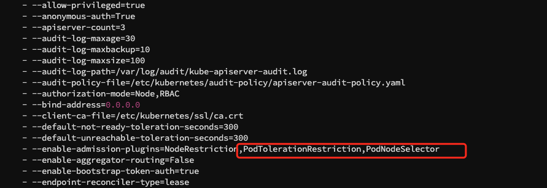

# 自定义 Insight 组件调度策略

当部署可观测平台 Insight 到 Kubernetes 环境时，正确的资源管理和优化至关重要。
Insight 包含多个核心组件，如 Prometheus、OpenTelemetry、FluentBit、Vector、Elasticsearch 等，
这些组件在运行过程中可能因为资源占用问题对集群内其他 Pod 的性能产生负面影响。
为了有效地管理资源并优化集群的运行，节点亲和性成为一项重要的配置选项。

本文将重点探讨如何通过[污点](#insight)和[节点亲和性](#label)的配置策略，使得每个组件能够在适当的节点上运行，
并避免资源竞争或争用，从而确保整个 Kubernetes 集群的稳定性和高效性。

## 通过污点为 Insight 配置专有节点

由于 Insight Agent 包含了 DaemonSet 组件，所以本节所述的配置方式是让除了 Insight DameonSet 之外的其余组件均运行在专有节点上。

该方式是通过为专有节点添加污点（taint），并配合污点容忍度（tolerations）来实现的。
更多细节可以参考 [Kubernetes 官方文档](https://kubernetes.io/zh-cn/docs/concepts/scheduling-eviction/taint-and-toleration/)。

可以参考如下命令为节点添加及移除污点：

```bash
# 添加污点
kubectl taint nodes worker1 node.daocloud.io=insight-only:NoSchedule

# 移除污点
kubectl taint nodes worker1 node.daocloud.io:NoSchedule-
```

有以下两种途径让 Insight 组件调度至专有节点：

### 1. 为每个组件添加污点容忍度

针对 `insight-server` 和 `insight-agent` 两个 Chart 分别进行配置：

=== "insight-server Chart 配置"

    ```yaml
    server:
      tolerations:
        - key: "node.daocloud.io"
          operator: "Equal"
          value: "insight-only"
          effect: "NoSchedule"
    
    ui:
      tolerations:
        - key: "node.daocloud.io"
          operator: "Equal"
          value: "insight-only"
          effect: "NoSchedule"
    
    runbook:
      tolerations:
        - key: "node.daocloud.io"
          operator: "Equal"
          value: "insight-only"
          effect: "NoSchedule"
    
    # mysql:
    victoria-metrics-k8s-stack:
      victoria-metrics-operator:
        tolerations:
          - key: "node.daocloud.io"
            operator: "Equal"
            value: "insight-only"
            effect: "NoSchedule"
      vmcluster:
        spec:
          vmstorage:
            tolerations:
              - key: "node.daocloud.io"
                operator: "Equal"
                value: "insight-only"
                effect: "NoSchedule"
          vmselect:
            tolerations:
              - key: "node.daocloud.io"
                operator: "Equal"
                value: "insight-only"
                effect: "NoSchedule"
          vminsert:
            tolerations:
              - key: "node.daocloud.io"
                operator: "Equal"
                value: "insight-only"
                effect: "NoSchedule"
      vmalert:
        spec:
          tolerations:
            - key: "node.daocloud.io"
              operator: "Equal"
              value: "insight-only"
              effect: "NoSchedule"
      alertmanager:
        spec:
          tolerations:
            - key: "node.daocloud.io"
              operator: "Equal"
              value: "insight-only"
              effect: "NoSchedule"
    
    jaeger:
      collector:
        tolerations:
          - key: "node.daocloud.io"
            operator: "Equal"
            value: "insight-only"
            effect: "NoSchedule"
      query:
        tolerations:
          - key: "node.daocloud.io"
            operator: "Equal"
            value: "insight-only"
            effect: "NoSchedule"
    
    opentelemetry-collector-aggregator:
      tolerations:
        - key: "node.daocloud.io"
          operator: "Equal"
          value: "insight-only"
          effect: "NoSchedule"
    
    opentelemetry-collector:
      tolerations:
        - key: "node.daocloud.io"
          operator: "Equal"
          value: "insight-only"
          effect: "NoSchedule"
    
    grafana-operator:
      operator:
        tolerations:
          - key: "node.daocloud.io"
            operator: "Equal"
            value: "insight-only"
            effect: "NoSchedule"
      grafana:
        tolerations:
          - key: "node.daocloud.io"
            operator: "Equal"
            value: "insight-only"
            effect: "NoSchedule"
    kibana:
      tolerations:
        - key: "node.daocloud.io"
          operator: "Equal"
          value: "insight-only"
          effect: "NoSchedule"
    
    elastic-alert:
      tolerations:
        - key: "node.daocloud.io"
          operator: "Equal"
          value: "insight-only"
          effect: "NoSchedule"
    
    vector:
      tolerations:
        - key: "node.daocloud.io"
          operator: "Equal"
          value: "insight-only"
          effect: "NoSchedule"
    ```

=== "insight-agent Chart 配置"

    ```yaml
    kube-prometheus-stack:
      prometheus:
        prometheusSpec:
          tolerations:
            - key: "node.daocloud.io"
              operator: "Equal"
              value: "insight-only"
              effect: "NoSchedule"
      prometheus-node-exporter:
        tolerations:
          - effect: NoSchedule
            operator: Exists
      prometheusOperator:
        tolerations:
          - key: "node.daocloud.io"
            operator: "Equal"
            value: "insight-only"
            effect: "NoSchedule"
    
    kube-state-metrics:
      tolerations:
        - key: "node.daocloud.io"
          operator: "Equal"
          value: "insight-only"
          effect: "NoSchedule"
    opentelemetry-operator:
      tolerations:
        - key: "node.daocloud.io"
          operator: "Equal"
          value: "insight-only"
          effect: "NoSchedule"
    opentelemetry-collector:
      tolerations:
        - key: "node.daocloud.io"
          operator: "Equal"
          value: "insight-only"
          effect: "NoSchedule"
    tailing-sidecar-operator:
      operator:
        tolerations:
        - key: "node.daocloud.io"
          operator: "Equal"
          value: "insight-only"
          effect: "NoSchedule"
    opentelemetry-kubernetes-collector:
      tolerations:
        - key: "node.daocloud.io"
          operator: "Equal"
          value: "insight-only"
          effect: "NoSchedule"
    prometheus-blackbox-exporter:
      tolerations:
        - key: "node.daocloud.io"
          operator: "Equal"
          value: "insight-only"
          effect: "NoSchedule"
    etcd-exporter:
      tolerations:
        - key: "node.daocloud.io"
          operator: "Equal"
          value: "insight-only"
          effect: "NoSchedule" 
    ```

### 2. 通过命名空间级别配置

让 `insight-system` 命名空间的 Pod 都容忍 `node.daocloud.io=insight-only` 污点。

1. 调整 `apiserver` 的配置文件 `/etc/kubernetes/manifests/kube-apiserver.yaml`，放开 `PodTolerationRestriction,PodNodeSelector`, 参考下图：

    

2. 给 `insight-system` 命名空间增加注解：

    ```yaml
    apiVersion: v1
    kind: Namespace
    metadata:
      name: insight-system
      annotations:
        scheduler.alpha.kubernetes.io/defaultTolerations: '[{"operator": "Equal", "effect": "NoSchedule", "key": "node.daocloud.io", "value": "insight-only"}]'
    ```

重启 insight-system 命名空间下面的组件即可正常容忍 insight-system 下的 Pod 调度。

## 为节点添加 Label 和节点亲和性来管理组件调度

!!! info

    节点亲和性概念上类似于 `nodeSelector`，它使你可以根据节点上的 **标签(label)** 来约束 Pod 可以调度到哪些节点上。 
    节点亲和性有两种：
    
    1. requiredDuringSchedulingIgnoredDuringExecution：调度器只有在规则被满足的时候才能执行调度。此功能类似于 nodeSelector， 但其语法表达能力更强。
    2. preferredDuringSchedulingIgnoredDuringExecution：调度器会尝试寻找满足对应规则的节点。如果找不到匹配的节点，调度器仍然会调度该 Pod。

    更过细节请参考 [kubernetes 官方文档](https://kubernetes.io/zh-cn/docs/concepts/scheduling-eviction/assign-pod-node/#affinity-and-anti-affinity)。

为了实现不同用户对 Insight 组件调度的灵活需求，Insight 分别提供了较为细粒度的 Label 来实现不同组件的调度策略，以下是标签与组件的关系说明：

| 标签 Key | 标签 Value | 说明 |
| --- | ------- | ------------ |
| `node.daocloud.io/insight-any` | 任意值，推荐用 `true` | 代表 Insight 所有组件优先考虑带了该标签的节点 |
| `node.daocloud.io/insight-prometheus`  | 任意值，推荐用 `true` | 特指 Prometheus 组件 |
| `node.daocloud.io/insight-vmstorage` | 任意值，推荐用 `true` | 特指 VictoriaMetrics vmstorage 组件 |
| `node.daocloud.io/insight-vector` | 任意值，推荐用 `true` | 特指 Vector 组件 |
| `node.daocloud.io/insight-otel-col` | 任意值，推荐用 `true` | 特指 OpenTelemetry 组件 |

可以参考如下命令为节点添加及移除标签：

```bash
# 为 node8 添加标签，先将 insight-prometheus 调度到 node8 
kubectl label nodes node8 node.daocloud.io/insight-prometheus=true

# 移除 node8 的 node.daocloud.io/insight-prometheus 标签
kubectl label nodes node8 node.daocloud.io/insight-prometheus-
```

以下是 insight-prometheus 组件在部署时默认的亲和性偏好：

```yaml
affinity:
  nodeAffinity:
    preferredDuringSchedulingIgnoredDuringExecution:
    - preference:
        matchExpressions:
        - key: node-role.kubernetes.io/control-plane
          operator: DoesNotExist
      weight: 1
    - preference:
        matchExpressions:
        - key: node.daocloud.io/insight-prometheus # (1)!
          operator: Exists
      weight: 2
    - preference:
        matchExpressions:
        - key: node.daocloud.io/insight-any
          operator: Exists
      weight: 3
    podAntiAffinity:
      preferredDuringSchedulingIgnoredDuringExecution:
        - weight: 1
          podAffinityTerm:
            topologyKey: kubernetes.io/hostname
            labelSelector:
              matchExpressions:
                - key: app.kubernetes.io/instance
                  operator: In
                  values:
                    - insight-agent-kube-prometh-prometheus
```

1. 先将 insight-prometheus 调度到带有 node.daocloud.io/insight-prometheus 标签的节点
