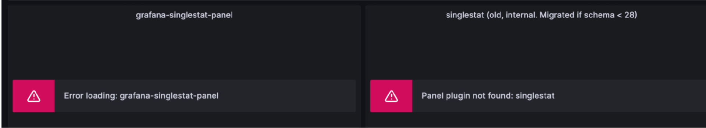
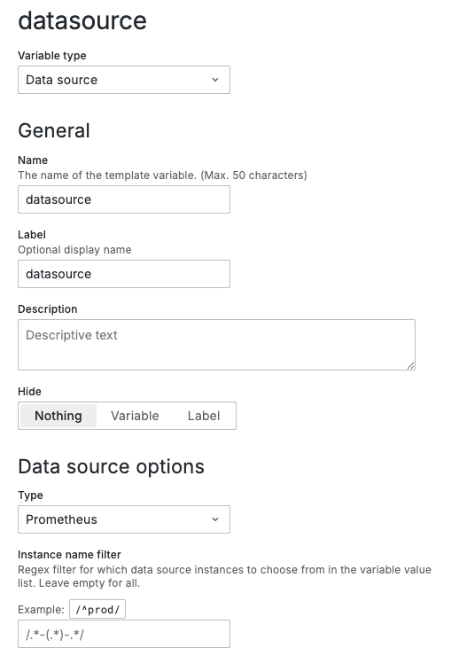
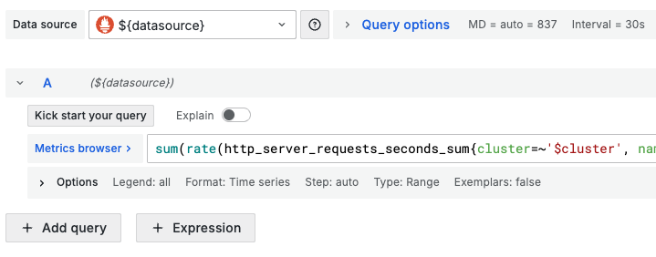

# 升级注意事项

本页介绍一些升级 insight 和 insight-agent chart 的注意事项。

## insight

###  从 v0.39.x（或更低版本）升级到 v0.40.x 或更高版本

在 v0.40.0 版本中，grafana operator 会从 v4 升级到 v5 并会引入大量的 CRD 变更。 升级过程会由 `helm upgrade` 自动完成。
如果客户需要 `helm rollback` 回到老版本（比如，v0.40.0 -> v0.39.0）需要是手动清理 v5 的 CR:

```shell
kubectl delete grafanas.grafana.integreatly.org -n insight-system --selector operator.insight.io/managed-by=insight --ignore-not-found=true
kubectl delete grafanadashboards.grafana.integreatly.org -n insight-system --selector operator.insight.io/managed-by=insight --ignore-not-found=true
kubectl delete grafanadatasources.grafana.integreatly.org -n insight-system --selector operator.insight.io/managed-by=insight --ignore-not-found=true
```

这部分命令只清理了 insight-system 命名空间下的 `grafanadashboards.grafana.integreatly.org`, 其他命名空间可以用相同的方式处理。

在 v0.40.x 的 grafana deployment 会添加一个 [dashboard-discover](https://github.com/openinsight-proj/dashboard-discover) sidecar
用于将现有环境中特定的 GrafanaDashboard(v4)，ConfigMap 写入到 grafana dashboard provider 指定目录(/var/lib/grafana/plugins/dashboards)中。

架构图如下：


具体规则如下：

1. GrafanaDashboard(v4)

   dashboard-discover sidecar 会 watch 集群中所用命名空间中带有：`operator.insight.io/managed-by=insight` label 的 GrafanaDashboard(v4)
并将其 Json 内容写入到 Grafana 容器的 `/var/lib/grafana/plugins/dashboards` 中。


2. ConfigMap

   dashboard-discover sidecar 会 watch 集群中所用命名空间中带有：`operator.insight.io/managed-by=insight,operator.insight.io/dashboard=true` label 的 ConfigMap
并将其 data 下的所有内容写入到 Grafana 容器的 `/var/lib/grafana/plugins/dashboards` 中。

> 如果需要将 Json 文件存入特定文件夹中，可以在对应资源 label 中添加：`operator.insight.io/dashboard-folder=you-folder`

在 v0.40.0 版本中， grafana 从 9.3.14 升级到 12.1.3。grafana 12.1.3 已完全移除对 AngularJS 的支持，转而优先支持 React。具体可以看[社区说明](https://grafana.com/blog/2025/04/03/angularjs-support-will-be-removed-in-grafana-12-what-you-need-to-know)。

insight 以及兄弟团队维护的仪表盘已经自动迁移，开箱即用。对于客户自己维护的仪表盘，grafana 12.1.3 对部分核心预置（pre-installed）的
AngularJS 面板提供自动迁移支持。在客户首次在 Grafana 12.1.3 打开自定义仪表盘后 grafana 会自动触发迁移, 迁移完成后，务必点击仪表盘的「Save」按钮保存变更，避免每次加载时重复迁移。

若未完成 AngularJS 面板迁移，在 Grafana 12.1.3 后会出现以下问题：

1. 依赖 AngularJS 的插件无法加载，在插件目录中不会显示已安装状态。
2. 已配置的 AngularJS 数据源不会出现在数据源列表中。
3. 仪表盘中原 AngularJS 面板会显示错误提示，如 `Error loading: plugin_name` 或 `Panel plugin not found: plugin_name`； 如下图：

   

   可以手动替换类似的面板或插件。

4. 仪表盘中原 Datasource 丢失，如 `Datasource XXX was not found`, 如下图：

   

   可以手动创建一个 Datasource 变量:

   

   然后在面板中使用：

   

### 从 v0.37.x（或更低版本）升级到 v0.38.x

在 v0.38.x 版本中 insight 将 Jaeger 从 v1 升级到 v2，部署架构上也有调整，jaeger Collector 现已弃用，其功能作为插件合并到 Global Opentelemetry Collector 中，
在升级 insight 时，需要指定 `--set jaeger.collector.enabled=false`。

### 从 v0.26.x（或更低版本）升级到 v0.27.x 或更高版本

在 v0.27.x 版本中将 vector 组件的开关单独抽出。故原有环境开启了 vector，那在升级 insight 时，需要指定 `--set vector.enabled=true` 。

### 从 v0.19.x（或更低版本）升级到 0.20.x

在升级 __Insight__ 之前，您需要执行以下命令手动删除 __jaeger-collector__ 和 __jaeger-query__ 部署：

```bash
kubectl -n insight-system delete deployment insight-jaeger-collector
kubectl -n insight-system delete deployment insight-jaeger-query
```

### 从 v0.17.x（或更低版本）升级到 v0.18.x

由于 0.18.x 中更新了 Jaeger 相关部署文件，因此需要在升级 insight  前手动执行如下命令：

```bash
kubectl -n insight-system delete deployment insight-jaeger-collector
kubectl -n insight-system delete deployment insight-jaeger-query
```

由于 0.18.x 中指标名产生了变动，因此，需要在升级 insight 之后，insight-agent 也应该做升级。

此外，调整了开启链路模块的参数，以及 ElasticSearch 连接调整。具体参考以下参数：

```diff
+  --set global.tracing.enable=true \
-  --set jaeger.collector.enabled=true \
-  --set jaeger.query.enabled=true \
+  --set global.elasticsearch.scheme=${your-external-elasticsearch-scheme} \
+  --set global.elasticsearch.host=${your-external-elasticsearch-host} \
+  --set global.elasticsearch.port=${your-external-elasticsearch-port} \
+  --set global.elasticsearch.user=${your-external-elasticsearch-username} \
+  --set global.elasticsearch.password=${your-external-elasticsearch-password} \
-  --set jaeger.storage.elasticsearch.scheme=${your-external-elasticsearch-scheme} \
-  --set jaeger.storage.elasticsearch.host=${your-external-elasticsearch-host} \
-  --set jaeger.storage.elasticsearch.port=${your-external-elasticsearch-port} \
-  --set jaeger.storage.elasticsearch.user=${your-external-elasticsearch-username} \
-  --set jaeger.storage.elasticsearch.password=${your-external-elasticsearch-password} \
```

### 从 v0.15.x（或更低版本）升级到 v0.16.x

由于 0.16.x 中使用了 vmalertmanagers CRD 的新特性参数 disableRouteContinueEnforce，
因此需要在升级 insight 前手动执行如下命令。

```shell
kubectl apply --server-side -f https://raw.githubusercontent.com/VictoriaMetrics/operator/v0.33.0/config/crd/bases/operator.victoriametrics.com_vmalertmanagers.yaml --force-conflicts
```

!!! note

    如您是离线安装，可以在解压 Insight 离线包后，请执行以下命令更新 CRD。
    
    ```shell
    kubectl apply --server-side -f insight/dependency-crds --force-conflicts 
    ```

## insight-agent

### 从 v0.28.x（或更低版本）升级到 v0.29.x

由于 v0.29.0 升级了 Opentelemetry 社区的 operator chart 版本，values 中的 featureGates 的支持的值有所变化，因此，在 upgrade 之前，需要将 `featureGates` 的值设置为空, 即：

```diff
-  --set opentelemetry-operator.manager.featureGates="+operator.autoinstrumentation.go,+operator.autoinstrumentation.multi-instrumentation,+operator.autoinstrumentation.nginx" \
+  --set opentelemetry-operator.manager.featureGates=""
```

### 从 v0.23.x（或更低版本）升级到 v0.24.x

由于 0.24.x 版本中 `OTEL operator chart` 中新增了 CRD，但由于 Helm Upgrade 时并不会更新 CRD，因此，需要手动执行以下命令：

```shell
kubectl apply -f https://raw.githubusercontent.com/open-telemetry/opentelemetry-helm-charts/main/charts/opentelemetry-operator/crds/crd-opentelemetry.io_opampbridges.yaml
```

如您是离线安装，可以在解压 insight-agent 离线包后可找到上述 CRD 的 yaml，解压 Insight-Agent Chart 之后手动执行以下命令：

```shell
kubectl apply -f charts/agent/crds/crd-opentelemetry.io_opampbridges.yaml
```

### 从 v0.19.x（或更低版本）升级到 v0.20.x

由于 0.20.x 中增加了 Kafka 日志导出配置，日志导出配置做了一些调整。升级 __insight-agent__ 之前需要注意参数变化，
即原来 logging 的配置已经移到了配置中 logging.elasticsearch：

```diff
-  --set global.exporters.logging.host \
-  --set global.exporters.logging.port \
+  --set global.exporters.logging.elasticsearch.host \
+  --set global.exporters.logging.elasticsearch.port \
```

### 从 v0.17.x（或更低版本）升级到 v0.18.x

由于 0.18.x 中更新了 Jaeger 相关部署文件，因此需要在升级 insight-agent 前需要注意参数的改动。

```diff
+  --set global.exporters.trace.enable=true \
-  --set opentelemetry-collector.enabled=true \
-  --set opentelemetry-operator.enabled=true \
```

### 从 v0.16.x（或更低版本）升级到 v0.17.x

在 v0.17.x 版本中将 kube-prometheus-stack chart 版本从 41.9.1 升级至 45.28.1, 其中使用的 CRD 也存在一些字段的升级，如 servicemonitor 的 __attachMetadata__ 字段，因此需要在升级 insight-agent 前执行如下命令：

```bash
kubectl apply --server-side -f https://raw.githubusercontent.com/prometheus-operator/prometheus-operator/v0.65.1/example/prometheus-operator-crd/monitoring.coreos.com_servicemonitors.yaml --force-conflicts
```

如您是离线安装，可以在解压 insight-agent 离线包后，在 insight-agent/dependency-crds 中找到上述 CRD 的 yaml。

### 从 v0.11.x（或更低版本）升级到 v0.12.x

在 v0.12.x 将 kube-prometheus-stack chart 从 39.6.0 升级到 41.9.1，其中包括 prometheus-operator 升级到 v0.60.1, prometheus-node-exporter chart 升级到 4.3.0 等。
prometheus-node-exporter 升级后使用了 [Kubernetes 推荐 label](https://kubernetes.io/docs/concepts/overview/working-with-objects/common-labels/)，因此需要在升级前删除 __node-exporter__ 的 DaemonSet。
prometheus-operator 更新了 CRD，因此需要在升级 insight-agent 前执行如下命令：

```shell linenums="1"
kubectl delete daemonset insight-agent-prometheus-node-exporter -n insight-system
kubectl apply --server-side -f https://raw.githubusercontent.com/prometheus-operator/prometheus-operator/v0.60.1/example/prometheus-operator-crd/monitoring.coreos.com_alertmanagerconfigs.yaml --force-conflicts
kubectl apply --server-side -f https://raw.githubusercontent.com/prometheus-operator/prometheus-operator/v0.60.1/example/prometheus-operator-crd/monitoring.coreos.com_alertmanagers.yaml --force-conflicts
kubectl apply --server-side -f https://raw.githubusercontent.com/prometheus-operator/prometheus-operator/v0.60.1/example/prometheus-operator-crd/monitoring.coreos.com_podmonitors.yaml --force-conflicts
kubectl apply --server-side -f https://raw.githubusercontent.com/prometheus-operator/prometheus-operator/v0.60.1/example/prometheus-operator-crd/monitoring.coreos.com_probes.yaml --force-conflicts
kubectl apply --server-side -f https://raw.githubusercontent.com/prometheus-operator/prometheus-operator/v0.60.1/example/prometheus-operator-crd/monitoring.coreos.com_prometheuses.yaml --force-conflicts
kubectl apply --server-side -f https://raw.githubusercontent.com/prometheus-operator/prometheus-operator/v0.60.1/example/prometheus-operator-crd/monitoring.coreos.com_prometheusrules.yaml --force-conflicts
kubectl apply --server-side -f https://raw.githubusercontent.com/prometheus-operator/prometheus-operator/v0.60.1/example/prometheus-operator-crd/monitoring.coreos.com_servicemonitors.yaml --force-conflicts
kubectl apply --server-side -f https://raw.githubusercontent.com/prometheus-operator/prometheus-operator/v0.60.1/example/prometheus-operator-crd/monitoring.coreos.com_thanosrulers.yaml --force-conflicts
```

!!! note

    如您是离线安装，可以在解压 insight-agent 离线包后，执行以下命令更新 CRD。
    
    ```shell
    kubectl apply --server-side -f insight-agent/dependency-crds --force-conflicts
    ```
