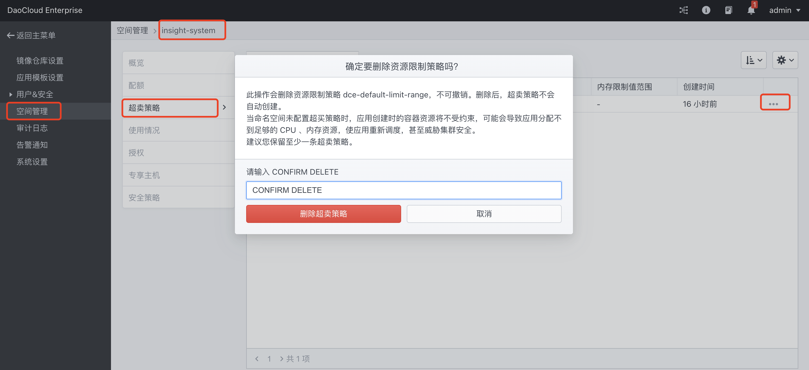

# DCE 4.0 中安装 Insight Agent

在 DCE 5.0 中，可以将以前的 DCE 4.0 可作为子集群接入。本文提供在 DCE4.0 集群中安装 insight-agent 时可能遇到的问题以及解决方案。

## 问题一

由于大多数 DCE 4.0 集群已安装 dx-insight 作为监控系统，若此时安装 insight-agent 会与集群中已有的 prometheus operator 冲突，导致无法顺利安装。

### 解决方案

开启 prometheus operator 的参数，保留 dx-insight 中的 prometheus operator，并兼容 5.0 中 insight-agent 的 prometheus operator。

### 操作步骤

1. 登录 DCE4.0 集群，进入 `「设置」-「空间管理」-「insight-system」-「超卖策略」` 中删除 insight-system 下的超卖策略。

    

2. 登录 DCE4.0 集群的控制台。分别在两个 prometheus operator 中启用 `--deny-namespaces` 参数。执行以下命令（以下命令仅供参考，实际需替换命令中的 prometheus operator 名称和命名空间）。

    ```bash
    kubectl edit deploy insight-agent-kube-prometh-operator -n insight-system
    ```

    

!!! note

    - 如上图 dx-insight 组件部署在 dx-insight 租户下，insight-agent 部署在 insight-system 租户下。
      在 dx-insight 中的 prometheus operator 中添加 `--deny-namespaces=insight-system`，
      在 insight-agent 中的 prometheus operator 中添加 `--deny-namespaces=dx-insight`。
    - 只添加 deny namespace，两个 prometheus operator 都可以继续扫描除此之外的命名空间，而 kube-system 或客户业务命名空间下的相关采集资源不受影响。
    - 请注意 node exporter 端口冲突的问题。

### 补充说明

开源 `node-exporter` 默认开启 hostnetwork 且默认端口为 9100。
若集群已有的监控系统已安装 `node-exporter`，则在安装 `insight-agent` 时会因为 node-exporter 端口冲突而无法正常运行。

!!! note

    Insight 的 `node exporter` 会开启一些特性来采集特殊指标，所以推荐安装。

目前不支持在安装命令中修改端口，需要在 `helm install insight-agent` 之后手动修改 insight node-exporter daemonset 和 svc 的相关端口。

## 问题二

Insight Agent 部署成功后，fluentbit 未采集 DCE 4.0 的日志。

!!! note

    该问题已在 Insight Agent v0.22.0 版本修复，安装或升级后即不存在该问题。

### 解决方案

DCE4.0 的 docker 存储目录是 `/var/lib/containers` ，与 insigh-agent 的配置中的路径不同，故未采集日志。

### 操作步骤

1. 登录到控制台。
2. 修改 insight-agent Chart 中的如下参数。

    ```diff
    fluent-bit:
    daemonSetVolumeMounts:
        - name: varlog
        mountPath: /var/log
        - name: varlibdockercontainers
    -     mountPath: /var/lib/docker/containers
    +     mountPath: /var/lib/containers/docker/containers
        readOnly: true
        - name: etcmachineid
        mountPath: /etc/machine-id
        readOnly: true
        - name: dmesg
        mountPath: /var/log/dmesg
        readOnly: true
    ```
