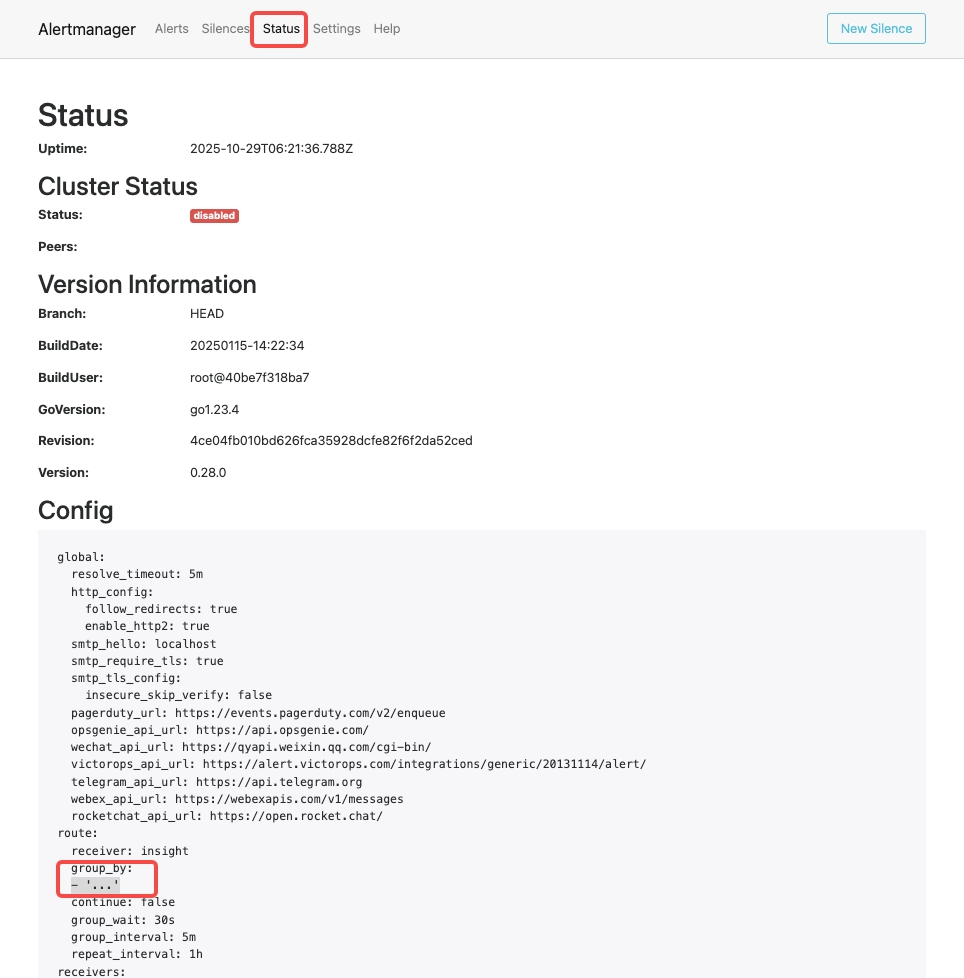

# 配置 Alertmanager 逐条发送告警通知

在特定客户场景下，用户可能希望 Insight 将告警通知逐条发送至企业微信、钉钉、飞书、电子邮件或外部 Webhook，而非以默认的聚合（分组）形式发送。

本文档将指导您如何修改 Insight 部署的 Alertmanager 配置，以实现此目的。

## 背景：Alertmanager 的默认分组行为

默认情况下，Insight 平台集成的 Alertmanager 会将具有相似标签（如 `alertname` 告警规则名、`group_id` 告警策略 ID）的告警 **聚合（Grouping）** 到单条通知中。

这种机制旨在有效减少告警风暴，避免在短时间内发送大量重复或相关的通知。

## 解决方案：禁用分组 (Grouping)

要实现逐条发送，我们需要修改 Alertmanager 的路由（`route`）配置，使其不按任何特定标签分组。

具体操作是将 `route.group_by` 参数设置为特殊值 `['...']`。

这个 `...` 特殊值会指示 Alertmanager 按照 **所有** 标签（包括内部标签）进行分组。由于每个告警的标签组合通常是唯一的，这实际上导致了每个告警都会成为一个独立的组，从而实现了“逐条发送”的效果。

> **重要提示：**
> 禁用分组后，告警消息的发送将变得更加频繁。这将 **显著增加** 目标 Webhook 接口（如 Insight Server、企业微信、钉钉等）的请求量和负载。在应用此配置前，请务必评估下游系统的接收和处理能力。

-----

我们提供两种方法来调整配置，强烈推荐使用 [Helm 方式](#helm) 进行变更，以便于配置的跟踪和管理。

### 方法一：通过 Helm 调整 (推荐)

您可以通过修改 `values.yaml` 文件或使用 `helm upgrade` 命令参数来应用配置。

#### 方式 A：修改 `values.yaml` 文件

编辑您的 `values.yaml` 文件，修改 `vm_alertmanager.config.route` 部分：

```diff
vm_alertmanager:
  config:
    global:
      resolve_timeout: 5m
      slack_api_url: "http://slack:30500/"
    templates:
      - "/etc/vm/configs/**/*.tmpl"
    route:
      group_by:
+       - "..."
-       - "alertname"
-       - "group_id"
      group_wait: 30s
      group_interval: 5m
      repeat_interval: 1h
      receiver: "insight"
    receivers:
      baseURI: "/apis/insight.io/v1alpha1/alert/hook"

```

修改后，执行 `helm upgrade` 使配置生效。

#### 方式 B：使用 `helm upgrade` 命令行参数

如果您不希望修改 `values.yaml` 文件，可以在执行 `helm upgrade` 命令时通过 `--set` 参数直接指定：

```bash
helm upgrade insight \
 # ... 其他参数省略 ...
 --set vm_alertmanager.config.route.group_by={"..."}
```

-----

### 方法二：手动编辑 Kubernetes Secret (不推荐)

**警告：** 此方法绕过了 Helm 的配置管理，可能导致后续 Helm 升级时配置被覆盖。仅在紧急或测试情况下使用。

1.  **编辑 Secret：**
    找到 Insight 部署的 Alertmanager 配置，通常名为 `insight-vmalertmanager-config`（请根据您的实际环境确认）。

2.  **修改 `alertmanager.yaml`：**
    在打开的编辑器中，找到 `alertmanager.yaml` 键（key），并修改其 `data` 字段下的 `route.group_by` 值：

    ```diff
    global:
      resolve_timeout: 5m
    templates:
      - "/etc/vm/configs/**/*.tmpl"
    route:
      group_by:
    +   - "..."
    -   - "alertname"
    -   - "group_id"
      group_wait: 30s
      group_interval: 5m
      repeat_interval: 1h
      receiver: insight
    receivers:
      - name: insight
        webhook_configs:
          - url: http://insight-server.insight-system.svc.cluster.local:80/apis/insight.io/v1alpha1/alert/hook
    ```

    保存并退出编辑器后，配置将自动更新到 Alertmanager 的 Pod 中。
    
-----

## 验证配置

配置生效后，您可以访问 Alertmanager 的 Web UI。在 "Status" 页面，您将看到原有的分组规则（如 `alertname`, `group_id`）已消失，表明它们是按唯一的标签组合进行分组的。




