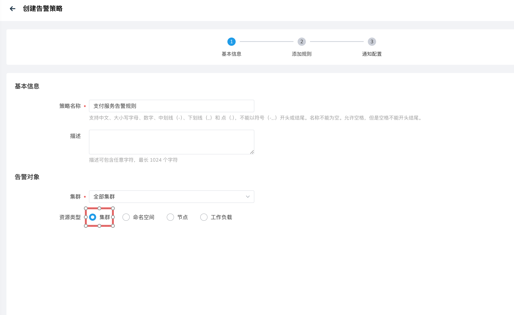
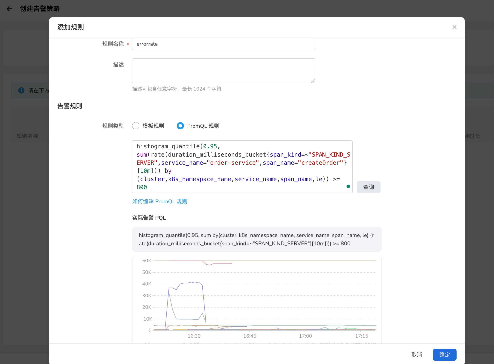

# 开启链路指标告警规则与自定义链路告警规则

自 v0.33.0 版本起，Insight 内置了针对服务链路（SpanMetrics）的核心监控告警策略，在通过 Helm 安装 Insight 时可通过参数 `--set victoria-metrics-k8s-stack.defaultRules.spanmetrics=true` 来开启。开启之后，无需用户手动配置基础规则，即可实现对服务或接口调用的错误率、请求延时两大关键维度的自动化监控与异常告警，进一步降低可观测性落地门槛，提升微服务架构下的问题发现效率。

本文档针对 Insight 可观测平台内置的 spanmetrics 告警规则（VMRule 类型）进行详细说明，帮助你理解各告警规则对应的指标含义、PromQL 逻辑，以便在告警中心中正确配置或自定义相关告警规则。

该组规则支持服务级（整服务维度）和Span 级（具体接口 / 方法维度）的异常检测，兼顾整体服务健康度与细粒度问题定位。

## 一、内置告警规则明细

内置规则共包含 4 条核心告警，分为错误率和延时两大类别，覆盖服务 / Span 两个粒度，具体配置如下表所示：

| 告警名称 | 监控维度 | 监控指标 | 触发条件 | 严重级别 | 持续生效时间 |
| :--- | :----: | ---: | ---: | ---: | ---: |
| ServiceErrorRate | 服务级错误率 | calls_total | 服务端 Span 错误率 ≥ 15%（统计窗口 10 分钟）| critical | 10 分钟 |
| SpanErrorRate | Span 级错误率 | calls_total | 具体接口的服务端 Span 错误率 ≥ 15%（统计窗口 10 分钟） | critical | 10 分钟 |
| ServiceLatency  | 服务级平均延时 | duration_milliseconds_bucket | 服务端 Span 平均调用延时 ≥ 1000ms（1 秒，统计窗口 10 分钟） | critical | 10 分钟 |
| SpanLatency | Span 级平均延时 | duration_milliseconds_bucket | 具体接口的服务端 Span 平均调用延时 ≥ 1000ms（1 秒，统计窗口 10 分钟） | critical | 10 分钟 |

以下是内置告警规则的具体内容：

```yaml
apiVersion: operator.victoriametrics.com/v1beta1
kind: VMRule
metadata:
  name: spanmetrics
  namespace: insight-system
  labels:
    "operator.insight.io/builtin-rule": "true" 
spec:
  groups:
  - name: spanmetrics
    rules:
    - alert: ServiceErrorRate
      annotations:
        description: Error rate of Service {{`{{`}} $labels.service_name {{`}}`}} in cluster/namespace {{`{{`}} $labels.cluster {{`}}`}}/{{`{{`}} $labels.k8s_namespace_name {{`}}`}} is greater than {{`{{`}} printf "%.2f" $value {{`}}`}}%.'
      expr: 100 * (sum(rate(calls_total{status_code="STATUS_CODE_ERROR",span_kind =~"SPAN_KIND_SERVER"}[10m])) by (cluster,namespace,k8s_namespace_name,k8s,service_name) / sum(rate(calls_total{span_kind =~"SPAN_KIND_SERVER"}[10m])) by (cluster,namespace,k8s_namespace_name,service_name)) >= 15
      for: 10m
      labels:
        severity: critical
        # namespace from k8s_namespace_name: backward Backwards-compatible scenarios where the agent is not upgraded
        namespace: '{{`{{`}} $labels.k8s_namespace_name {{`}}`}}'
    - alert: SpanErrorRate
      annotations:
        description: Error rate of SpanName {{`{{`}} $labels.span_name {{`}}`}} of {{`{{`}} $labels.pod {{`}}`}} Service {{`{{`}} $labels.service_name {{`}}`}} in cluster/namespace {{`{{`}} $labels.cluster {{`}}`}}/{{`{{`}} $labels.k8s_namespace_name {{`}}`}} is greater than {{`{{`}} printf "%.2f" $value {{`}}`}}%.
      expr: 100 * (sum(rate(calls_total{status_code="STATUS_CODE_ERROR",span_kind =~"SPAN_KIND_SERVER"}[10m])) by (cluster,namespace,k8s_namespace_name,service_name,span_name) / sum(rate(calls_total{span_kind =~"SPAN_KIND_SERVER"}[10m])) by (cluster,namespace,k8s_namespace_name,service_name,span_name)) >= 15
      for: 10m
      labels:
        severity: critical
        namespace: '{{`{{`}} $labels.k8s_namespace_name {{`}}`}}'
    - alert: ServiceLatency
      annotations:
        description: Latency of Service {{`{{`}} $labels.service_name {{`}}`}} in cluster/namespace {{`{{`}} $labels.cluster {{`}}`}}/{{`{{`}} $labels.k8s_namespace_name {{`}}`}} is greater than {{`{{`}} printf "%.2f" $value {{`}}`}}.
      expr: (sum(rate(duration_milliseconds_bucket{span_kind =~"SPAN_KIND_SERVER"}[10m])) by (cluster,namespace,k8s_namespace_name,service_name,le)) >= 1000
      for: 10m
      labels:
        severity: critical
        namespace: '{{`{{`}} $labels.k8s_namespace_name {{`}}`}}'
    - alert: SpanLatency
      annotations:
        description: Latency of SpanName {{`{{`}} $labels.span_name {{`}}`}} of {{`{{`}} $labels.pod }} Service {{`{{`}} $labels.service_name {{`}}`}} in cluster/namespace {{`{{`}} $labels.cluster {{`}}`}}/{{`{{`}} $labels.k8s_namespace_name {{`}}`}} is greater than {{`{{`}} printf "%.2f" $value {{`}}`}}.
      expr: (sum(rate(duration_milliseconds_bucket{span_kind =~"SPAN_KIND_SERVER"}[10m])) by (cluster,namespace,k8s_namespace_name,service_name,span_name,le)) >= 1000
      for: 10m
      labels:
        severity: critical
        namespace: '{{`{{`}} $labels.k8s_namespace_name {{`}}`}}'
```

### 规则特点说明：
- 统计范围：仅针对 span_kind=~"SPAN_KIND_SERVER"（服务端 Span），聚焦服务对外提供的接口调用，排除客户端、内部链路等非核心场景；
- 指标计算：错误率采用 rate 函数计算每秒调用速率，延时采用 increase 函数计算计数器增量，避免精度丢失，符合 Prometheus 计数器指标的最佳实践；
- 标签透传：告警信息中包含 cluster（集群）、service_name（服务名）、k8s_namespace_name（命名空间）、span_name（接口名）等关键标签，便于快速定位问题所属环境与业务模块。


## 二、自定义规则

此处主要举例说明如何在创建规则是编写 PromQL 语句满足业务需求。界面操作请参考：[告警策略](../user-guide/alert-center/alert-policy.md)

例如：

- 先为 `集群` 对象创建告警策略：

- 再通过 PromQL 添加告警规则：


以下是不同场景的 PromQL 示例说明：

1. 示例一

> 调整特定服务的错误率阈值（核心服务严格监控）：支付服务（service_name: "pay-service"）, 需将错误率阈值从内置的 15% 降至 5%，且持续 5 分钟即触发告警。

```promql
100 * (sum(rate(calls_total{status_code="STATUS_CODE_ERROR",span_kind=~"SPAN_KIND_SERVER",service_name="pay-service"}[5m])) by (cluster,service_name,k8s_namespace_name) / sum(rate(calls_total{span_kind=~"SPAN_KIND_SERVER",service_name="pay-service"}[5m])) by (cluster,service_name,k8s_namespace_name)) >= 5
```

2. 示例二

> 监控特定服务的 P95 延迟（细粒度性能监控）：订单服务的「创建订单」接口（span_name: "createOrder"），需监控其 P95 延迟，超过 800ms 即触发告警。

```promql
histogram_quantile(0.95, sum(rate(duration_milliseconds_bucket{span_kind=~"SPAN_KIND_SERVER",service_name="order-service",span_name="createOrder"}[10m])) by (cluster,k8s_namespace_name,service_name,span_name,le)) >= 800
```

> 说明：内置规则仅监控平均延迟，P95/P99 分位值延迟需基于 duration_milliseconds_bucket（直方图指标）计算，更贴合真实用户体验。

3. 示例三

> 监控服务调用量突降（可用性兜底监控）: 用户服务（service_name: "user-service"）的调用量突然下降 50% 以上，可能是服务不可用或流量异常，需及时告警。

```promql
rate(calls_total{span_kind=~"SPAN_KIND_SERVER",service_name="user-service"}[5m]) / rate(calls_total{span_kind=~"SPAN_KIND_SERVER",service_name="user-service"}[5m] offset 5m) <= 0.5
```