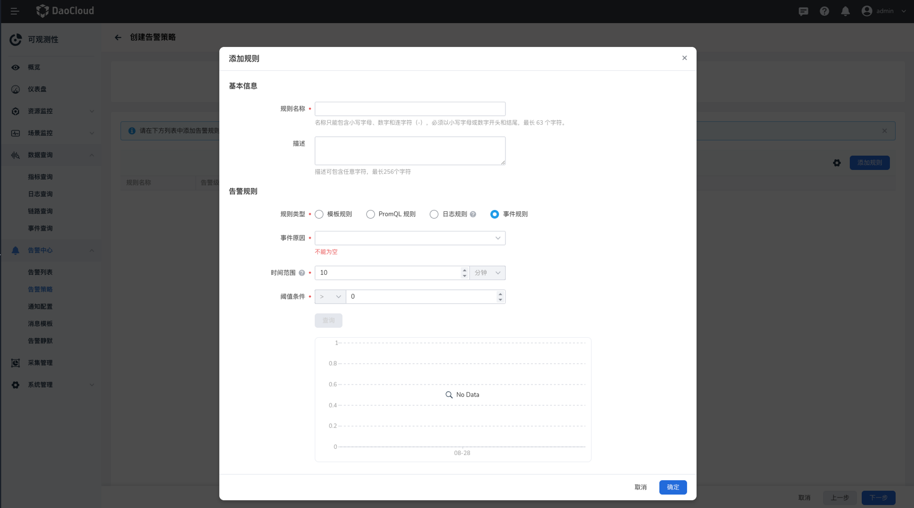

# 告警策略

DCE 5.0 除了内置的告警策略外，还可以自定义创建新的告警策略。
每条告警策略是一组告警规则的集合，支持对集群、节点、工作负载等资源设置告警规则。
当告警对象达到策略下任一规则设定的阈值，则会自动触发告警并发送通知。

以内置告警为例，点击第一条告警策略 `alertmanager.rules`。

可以看到其下已设置了一些告警规则，可以在该策略下添加更多规则，也可以随时编辑或删除规则。还可以查看有关这条告警策略的历史告警和活动告警，编辑通知配置等。

## 创建告警策略

1. 选择`告警中心` -> `告警策略`，点击`创建告警策略`按钮。

    

1. 填写基本信息，选择一个或多个集群、节点或工作负载为告警对象后点击`下一步`。

    

1. 列表需至少有一条规则。如果列表为空，请`添加规则`。

    

    在弹窗中创建告警规则，填写各项参数后点击`确定`。

    

    - 模板规则：预定义了基础指标，可以按 CPU、内存、磁盘、网络设定要监控的指标。
    - PromQL 规则：输入一个 PromQL 表达式，具体请[查询 Prometheus 表达式](https://prometheus.io/docs/prometheus/latest/querying/basics/)。
    - 持续时长：告警被触发且持续时间达到该设定值后，告警策略将变为触发中状态。
    - 告警级别：包含紧急、警告、信息三种级别。
    - 高级设置：可以自定义标签和注解。

1. 点击`下一步`后配置通知。

    

1. 配置完成后，点击`确定`按钮，返回告警策略列表。

!!! tip

    新建的告警策略为`未触发`状态。一旦满足规则中的阈值条件和持续时间后，将变为`触发中`状态。

### 创建日志规则

完成基本信息的填写后，点击`添加规则`，规则类型选择`日志规则`。

仅当资源对象选择节点或工作负载时，支持创建日志规则。

**字段说明：**

- `过滤条件`：查询日志内容的字段，支持与、或、正则匹配、模糊匹配四种过滤条件。
- `判断条件`：根据`过滤条件`，输入关键字或匹配条件。
- `时间范围`：日志查询的时间范围。
- `阈值条件`：在输入框中输入告警阈值。当达到设置的阈值时，则触发告警。支持的比较运算符有： >、≥、=、≤、< 。
- `告警级别`：选择告警级别，用于表示告警的严重程度。

### 创建事件规则

完成基本信息的填写后，点击`添加规则`，规则类型选择`事件规则`。

仅当资源对象选择工作负载时，支持创建事件规则。

**字段说明：**

- `事件规则`：仅支持资源对象选择工作负载
- `事件原因`：不同的工作负载类型的事件原因不同，事件原因之间是“和”的关系。
- `时间范围`：检测该时间范围内产生数据，若达到设置的阈值条件，则触发告警事件。
- `阈值条件`：当产生的事件达到设置的阈值时，则触发告警事件。
- `趋势图`：默认查询 10 分钟内的事件变化趋势，每个点的数值统计的是当前时间点到之前的某段时间（时间范围）内发生的总次数。

## 其他操作

在列表右侧点击 `⋮`，在弹出菜单中选择`删除`，可以删除告警策略。点击策略名称，进入策略详情，可以添加、编辑、删除其下的告警规则。

!!! warning

    删除后的告警策略将完全消失，请谨慎操作。
