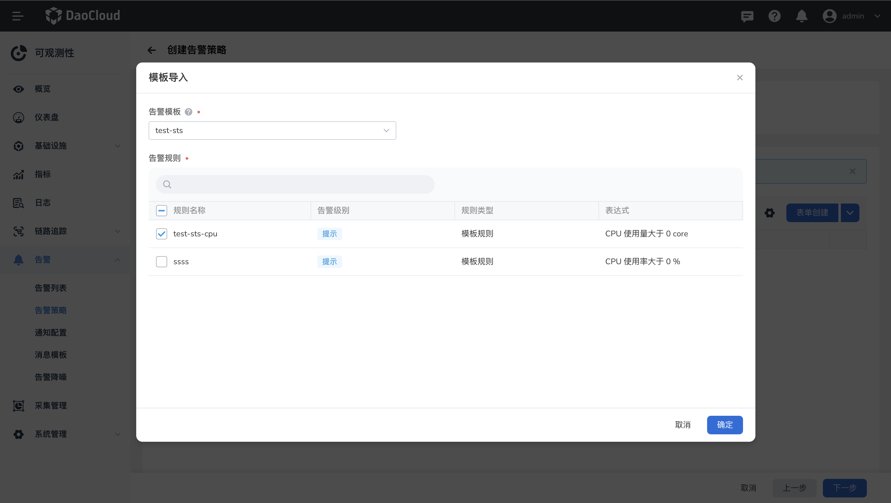

# 告警策略

告警策略是在可观测性系统中定义的一组规则和条件，用于检测和触发警报，以便在系统出现异常或达到预定的阈值时及时通知相关人员或系统。

每条告警策略是一组告警规则的集合，支持对集群、节点、工作负载等资源、日志、事件设置告警规则。当告警对象达到策略下任一规则设定的阈值，则会自动触发告警并发送通知。

## 查看告警策略

1. 点击一级导航栏进入 __可观测性__。
2. 左侧导航栏中，选择 __告警中心__ -> __告警策略__。

    - 集群：单击集群下拉框可切换集群；
    - 命名空间：单击命名空间切换下拉框。

    

3. 点击告警策略名称可查看策略的基本信息、规则以及通知配置。

    1. 在规则列表中可查看规则类型、规则的表达式、级别、状态等信息。
    2. 进入策略详情，可以添加、编辑、删除其下的告警规则。

    

## 创建告警策略

1. 填写基本信息，选择一个或多个集群、节点或工作负载为告警对象后点击 __下一步__。

    

2. 列表需至少有一条规则。如果列表为空，可观测性提供了两种方式添加告警规则，

    - 方式一：第一种为 __表单创建__，用户可自行定义规则以及阈值等信息。

        

       在弹窗中创建告警规则，填写各项参数后点击 __确定__。

        

        - 模板规则：预定义了基础指标，可以按 CPU、内存、磁盘、网络设定要监控的指标。
        - PromQL 规则：输入一个 PromQL 表达式，具体请[查询 Prometheus 表达式](https://prometheus.io/docs/prometheus/latest/querying/basics/)。
        - 持续时长：告警被触发且持续时间达到该设定值后，告警策略将变为触发中状态。
        - 告警级别：包含紧急、警告、信息三种级别。
        - 高级设置：可以自定义标签和注解。

    方式二：可点击 __模板导入__，选择平台管理员已创建好的告警模版批量导入告警规则。

    { width=1000px}

3. 点击 __下一步__ 后配置通知。

    

4. 配置完成后，点击 __确定__ 按钮，返回告警策略列表。

!!! tip

    新建的告警策略为 __未触发__ 状态。一旦满足规则中的阈值条件和持续时间后，将变为 __触发中__ 状态。

### 创建日志规则

完成基本信息的填写后，点击 __添加规则__，规则类型选择 __日志规则__。

!!! note

    仅当资源对象选择节点或工作负载时，支持创建日志规则。

**字段说明：**

- __过滤条件__：查询日志内容的字段，支持与、或、正则匹配、模糊匹配四种过滤条件。
- __判断条件__：根据 __过滤条件__，输入关键字或匹配条件。
- __时间范围__：日志查询的时间范围。
- __阈值条件__：在输入框中输入告警阈值。当达到设置的阈值时，则触发告警。支持的比较运算符有： >、≥、=、≤、<。
- __告警级别__：选择告警级别，用于表示告警的严重程度。

### 创建事件规则

完成基本信息的填写后，点击 __添加规则__，规则类型选择 __事件规则__。

!!! note

    仅当资源对象选择工作负载时，支持创建事件规则。

**字段说明：**

- __事件规则__：仅支持资源对象选择工作负载
- __事件原因__：不同的工作负载类型的事件原因不同，事件原因之间是“和”的关系。
- __时间范围__：检测该时间范围内产生数据，若达到设置的阈值条件，则触发告警事件。
- __阈值条件__：当产生的事件达到设置的阈值时，则触发告警事件。
- __趋势图__：默认查询 10 分钟内的事件变化趋势，每个点的数值统计的是当前时间点到之前的某段时间（时间范围）内发生的总次数。

!!! warning

    删除后的告警策略将完全消失，请谨慎操作。

## 通过 YAML 导入告警策略

1. 进入告警策略列表，点击 __YAML 创建__。

   - 集群、命名空间的选择是为了告警策略的管理权限。
   - YAML 编辑器中请填写 __spec__ 及其中的内容，仅支持导入一个 group。
   - __告警规则名称__ 需要符合规范：名称只能包含大小写字母、数字、下划线（_）和连字符（-），必须以字母开头，最长 63 个字符。
   - 必填 __severity__ 且符合规范：critical、warning、info。
   - 必填表达式 __expr__。

    { width=1000px}

2. 导入 YAML 文件后，点击 __预览__，可以对导入的 YAML 格式进行验证，并快速确认导入的告警规则。

    { width=1000px}
