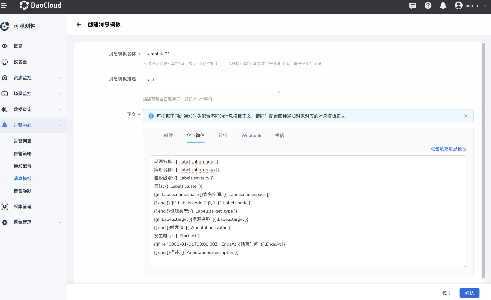
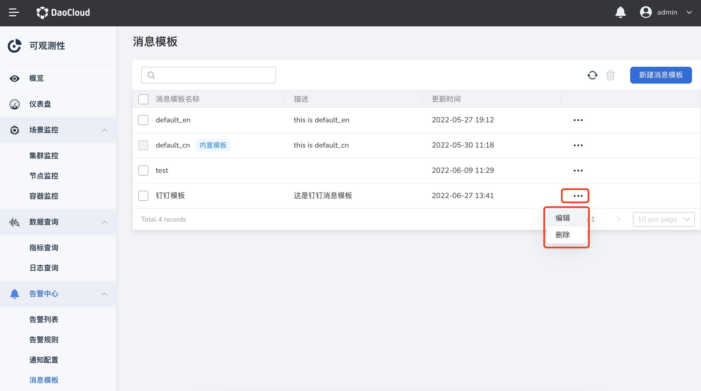
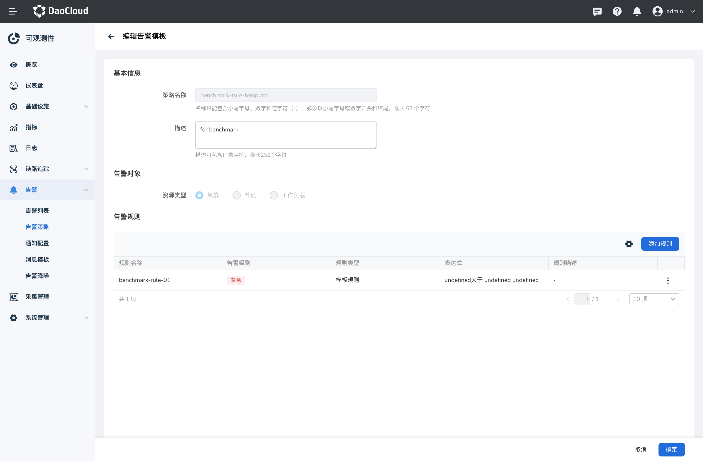

# 告警模板

告警模板可支持平台管理员创建告警模板及规则，业务侧可以直接使用告警模板创建告警策略。
这个功能可以减少业务人员对告警规则的管理，且可以根据环境实际情况自行修改告警阈值。

## 创建告警模板

1. 左侧导航栏中，选择 **告警中心** -> **告警策略**，单击顶部的 **告警模板** 。

    { width=1000px}

2. 点击 **创建告警模板** ，设置告警模板的名称、描述等信息。

    { width=1000px}

    { width=1000px}

    | 参数 | 说明 |
    | ---- | ---- |
    | 模板名称 | 名称只能包含小写字母、数字和连字符（-），必须以小写字母或数字开头和结尾，最长 63 个字符。 |
    | 描述 | 描述可包含任意字符，最长 256 个字符。|
    | 资源类型 | 用于指定告警模板的匹配类型。 |
    | 告警规则 | 支持预定义多个告警规则，可添加模板规则、PromQL 规则。 |

3. 点击 **确定** 完成创建后返回告警模板列表，点击模板名称后可查看模板详情。

## 编辑告警模板

点击目标规则后的 **⋮** ，点击 **编辑**，进入抑制规则的编辑页。

{ width=1000px}

## 删除告警模板

点击目标模板后侧的 **⋮** ，点击 **删除**，在输入框中输入告警模板的名称即可删除。

{ width=1000px}