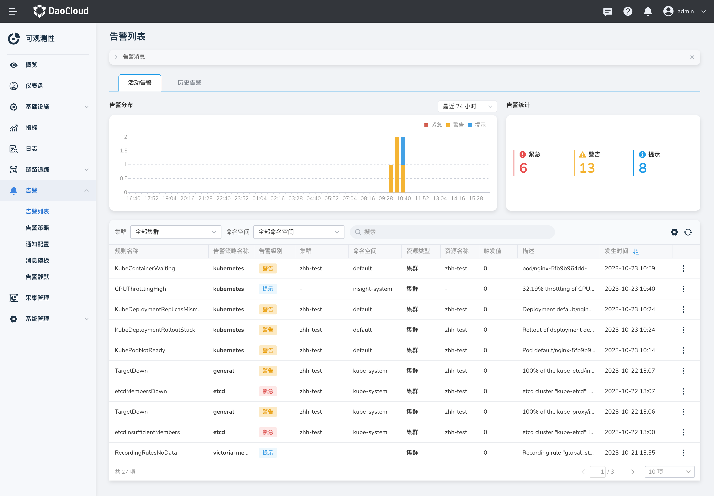

# 告警中心

告警中心是 DCE 5.0 提供的一个重要功能，它让用户可以通过图形界面方便地按照集群和命名空间查看所有活动和历史告警，
并根据告警级别（紧急、警告、提示）来搜索告警。

所有告警都是基于预设的告警规则设定的阈值条件触发的。在 DCE 5.0 中，内置了一些全局告警策略，同时您也可以随时创建、删除告警策略，对以下指标进行设置：

- CPU 使用量
- 内存使用量
- 磁盘使用量
- 磁盘每秒读次数
- 磁盘每秒写次数
- 集群磁盘读取吞吐量
- 集群磁盘写入吞吐量
- 网络发送速率
- 网络接收速率

还可以为告警规则添加标签和注解。告警规则分为活跃和过期规则，支持启用/禁用某些规则来实现告警静默。

当达到阈值条件后，可以配置告警通知方式，包括邮件、钉钉、企业微信、Webhook 和短信通知。
所有通知的消息模板都可以自定义，同时还支持按设定的间隔时间发送通知。

此外，告警中心还支持通过阿里云、腾讯云等提供的短信服务将告警消息发送给指定用户，实现多种方式的告警通知。

DCE 5.0 告警中心是一个功能强大的告警管理平台，可帮助用户及时发现和解决集群中出现的问题，
提高业务稳定性和可用性，便于集群巡检和故障排查。
