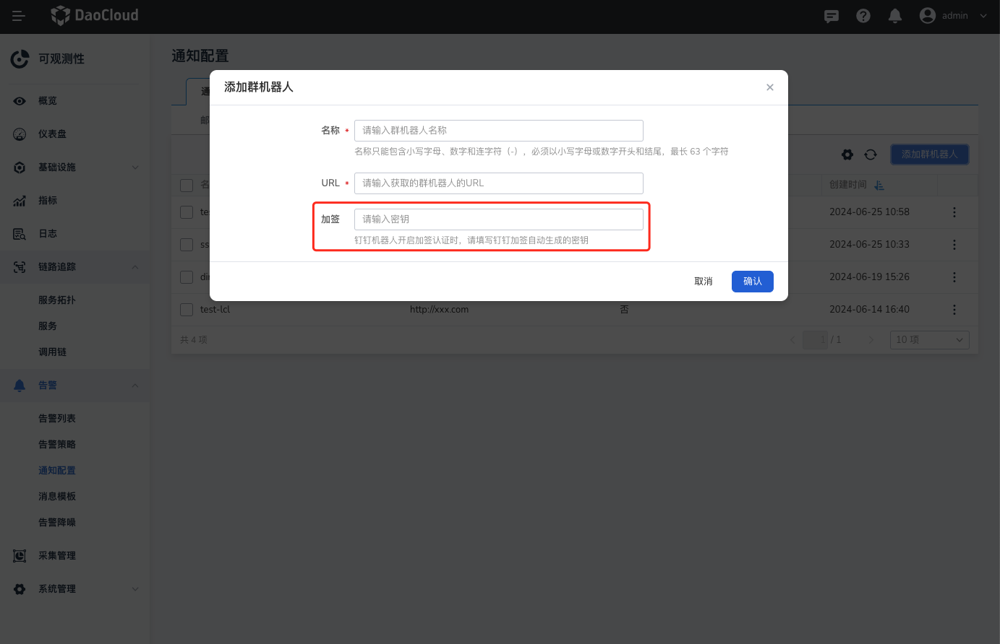
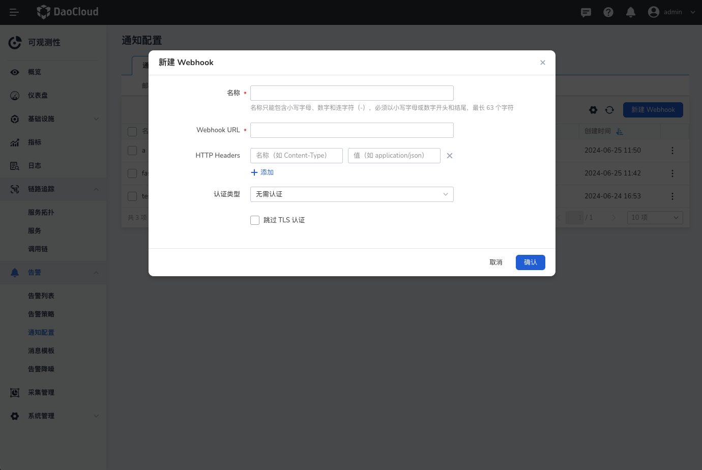

# 通知配置

在 __通知配置__ 页面，可以配置通过邮件、企业微信、钉钉、Webhook 和短信等方式向用户发送消息。

## 邮件组

1. 进入 __可观测性__ 后，在左侧导航栏中点击 __告警中心__ -> __通知配置__ ，默认位于邮件通知对象。

    

2. 点击 __添加邮箱组__ ，添加一个或多个邮件地址。

    

3. 配置完成后自动返回通知列表，点击列表右侧的 __┇__ ，可以编辑或删除邮箱组。

## 企业微信

1. 在左侧导航栏中点击 __告警中心__ -> __通知配置__ -> __企业微信__ 。

    

    有关企业微信群机器人的 URL，请参阅[企业微信官方文档：如何使用群机器人](https://developer.work.weixin.qq.com/document/path/91770)。

2. 点击 __添加群机器人__ ，添加一个或多个群机器人。

    

3. 配置完成后自动返回通知列表，点击列表右侧的 __┇__ ，选择 __发送测试信息__ ，还可以编辑或删除群机器人。

## 钉钉

1. 在左侧导航栏中点击 __告警中心__ -> __通知配置__ -> __钉钉__，点击 __添加群机器人__ ，添加一个或多个群机器人。

    

    有关钉钉群机器人的 URL，请参阅[钉钉官方文档：自定义机器人接入](https://open.dingtalk.com/document/robots/custom-robot-access)。

    !!! note

        加签的方式是钉钉机器人与开发者双向进行安全认证，若在创建钉钉机器人时开启了加签，则需要在此处输入钉钉生成的密钥。可参考：[钉钉自定义机器人安全设置](https://open.dingtalk.com/document/robots/customize-robot-security-settings)

1. 配置完成后自动返回通知列表，点击列表右侧的 __┇__ ，选择 __发送测试信息__ ，还可以编辑或删除群机器人。

## Webhook

1. 在左侧导航栏中点击 __告警中心__ -> __通知配置__ -> __Webhook__ 。

    

    有关 Webhook URL 及更多配置方式，请参阅 [webhook 文档](https://github.com/webhooksite/webhook.site)。

2. 点击 __新建 Webhook__，添加一个或多个 Webhook。

    

    - `HTTP Headers`: 非必填，设置请求头。可以添加多个 Headers。

    !!! note

        有关 Webhook URL 及更多配置方式，请参阅 [webhook 文档](https://github.com/webhooksite/webhook.site)。

3. 配置完成后自动返回通知列表，点击列表右侧的 __┇__ ，选择 __发送测试信息_ ，还可以编辑或删除 Webhook。

## 短信组

1. 在左侧导航栏中点击 __告警中心__ -> __通知配置__ -> __短信__ ，点击 __添加短信组__ ，添加一个或多个短信组。

    

2. 在弹窗中输入名称、接收短信的对象、手机号以及通知服务器。

    

    通知服务器需要预先在 __通知配置__ -> __通知服务器__ 中添加创建。目前支持阿里云、腾讯云两种云服务器，具体配置的参数请参阅自己的云服务器信息。

    

3. 短信组添加成功后，自动返回通知列表，点击列表右侧的 __┇__ ，可以编辑或删除短信组。
