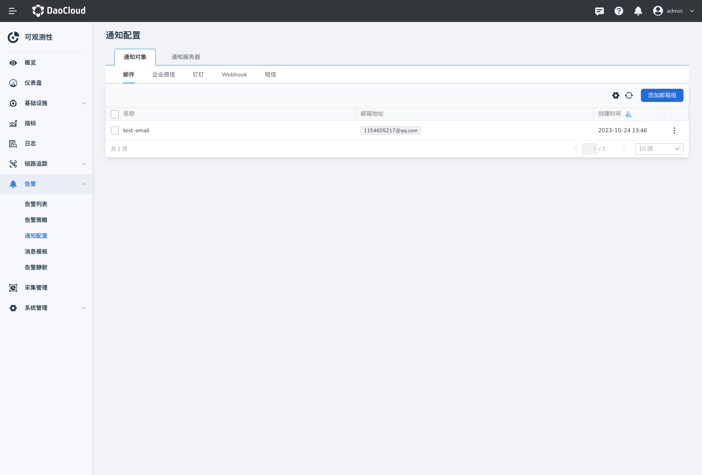
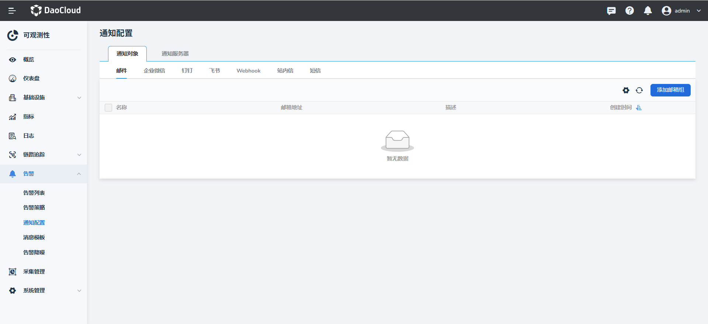
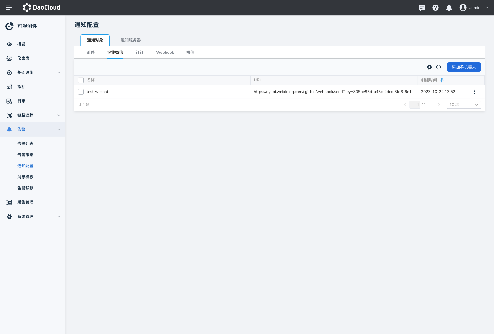
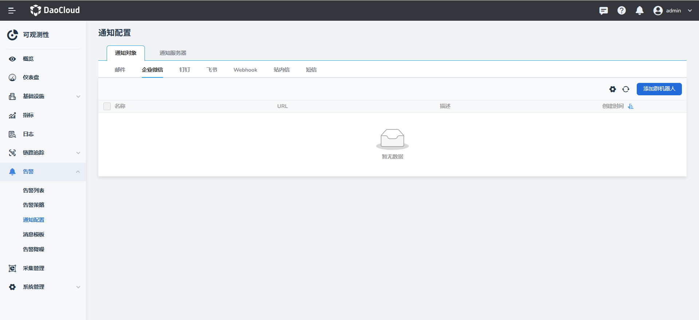
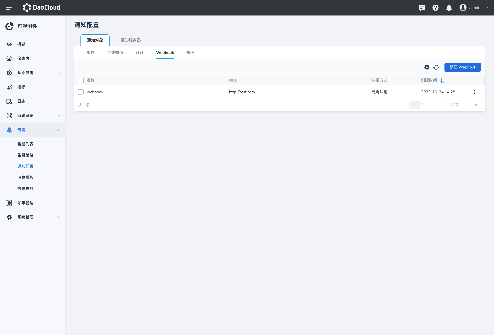
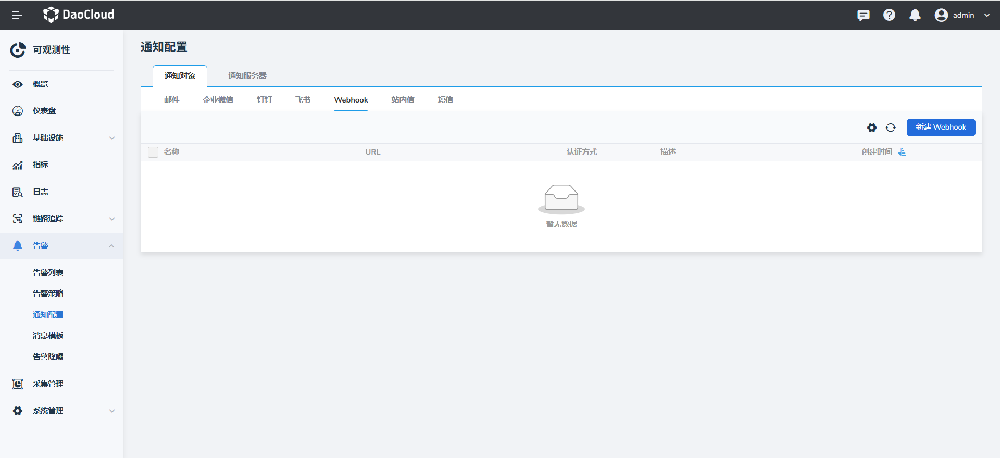

# 通知配置

在`通知配置`页面，可以配置通过邮件、企业微信、钉钉、Webhook 和短信等方式向用户发送消息。

## 邮件组

1. 进入`可观测性`后，在左侧导航栏中点击`告警中心` -> `通知配置`，默认位于邮件通知对象。

    

2. 点击`添加邮箱组`，添加一个或多个邮件地址。

    

3. 配置完成后自动返回通知列表，点击列表右侧的 `︙`，可以编辑或删除邮箱组。

## 企业微信

1. 在左侧导航栏中点击`告警中心` -> `通知配置` -> `企业微信`。

    

    有关企业微信群机器人的 URL，请参阅[企业微信官方文档：如何使用群机器人](https://developer.work.weixin.qq.com/document/path/91770)。

2. 点击`添加群机器人`，添加一个或多个群机器人。

    

3. 配置完成后自动返回通知列表，点击列表右侧的 `︙`，选择`发送测试信息`，还可以编辑或删除群机器人。

## 钉钉

1. 在左侧导航栏中点击`告警中心` -> `通知配置` -> `钉钉`，点击`添加群机器人`，添加一个或多个群机器人。

    

    有关钉钉群机器人的 URL，请参阅[钉钉官方文档：自定义机器人接入](https://open.dingtalk.com/document/robots/custom-robot-access)。

2. 配置完成后自动返回通知列表，点击列表右侧的 `︙`，选择`发送测试信息`，还可以编辑或删除群机器人。

## Webhook

1. 在左侧导航栏中点击`告警中心` -> `通知配置` -> `Webhook`。

    

    有关 Webhook URL 及更多配置方式，请参阅 [webhook 文档](https://github.com/webhooksite/webhook.site)。

2. 点击`新建 Webhook`，添加一个或多个 Webhook。

    

    有关 Webhook URL 及更多配置方式，请参阅 [webhook 文档](https://github.com/webhooksite/webhook.site)。

3. 配置完成后自动返回通知列表，点击列表右侧的 `︙`，选择`发送测试信息`，还可以编辑或删除 Webhook。

## 短信组

1. 在左侧导航栏中点击`告警中心` -> `通知配置` -> `短信`，点击`添加短信组`，添加一个或多个短信组。

    

2. 在弹窗中输入名称、接收短信的对象、手机号以及通知服务器。

    

    通知服务器需要预先在`通知配置` -> `通知服务器`中添加创建。目前支持阿里云、腾讯云两种云服务器，具体配置的参数请参阅自己的云服务器信息。

    

3. 短信组添加成功后，自动返回通知列表，点击列表右侧的 `︙`，可以编辑或删除短信组。
