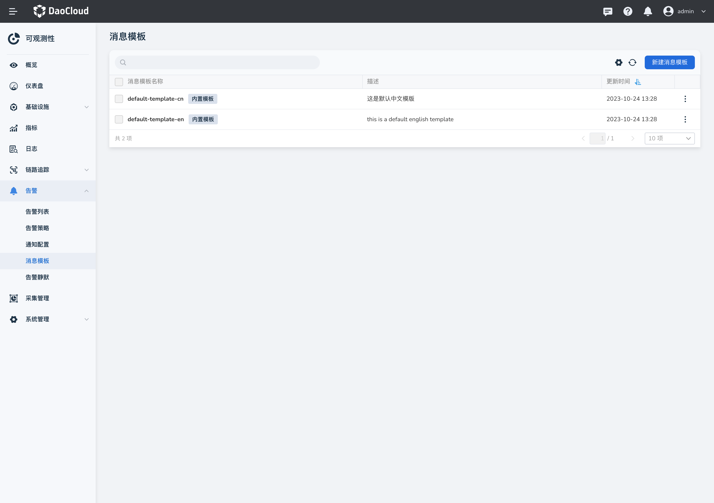

# 消息模板

可观测性提供自定义消息模板内容的能力，支持邮件、企业微信、钉钉、Webhook 等不同的通知对象定义不同的消息通知内容。

## 创建消息模板

1. 在左侧导航栏中，选择`告警中心` -> `消息模板`。

   - Insight 默认内置中英文两个模版，以便用户使用。

    

2. 点击`新建消息模板`按钮，填写模板内容。

    

!!! info

    可观测性预置了消息模板。若需要定义模板的内容，请参考：[配置通知模板](../../best-practice/notify-helper.md)

## 编辑或删除消息模板

在列表右侧点击 `︙`，在弹出菜单中选择`编辑`或`删除`，可以修改或删除消息模板。

!!! warning

    请注意，删除模板后无法恢复，请谨慎操作。
