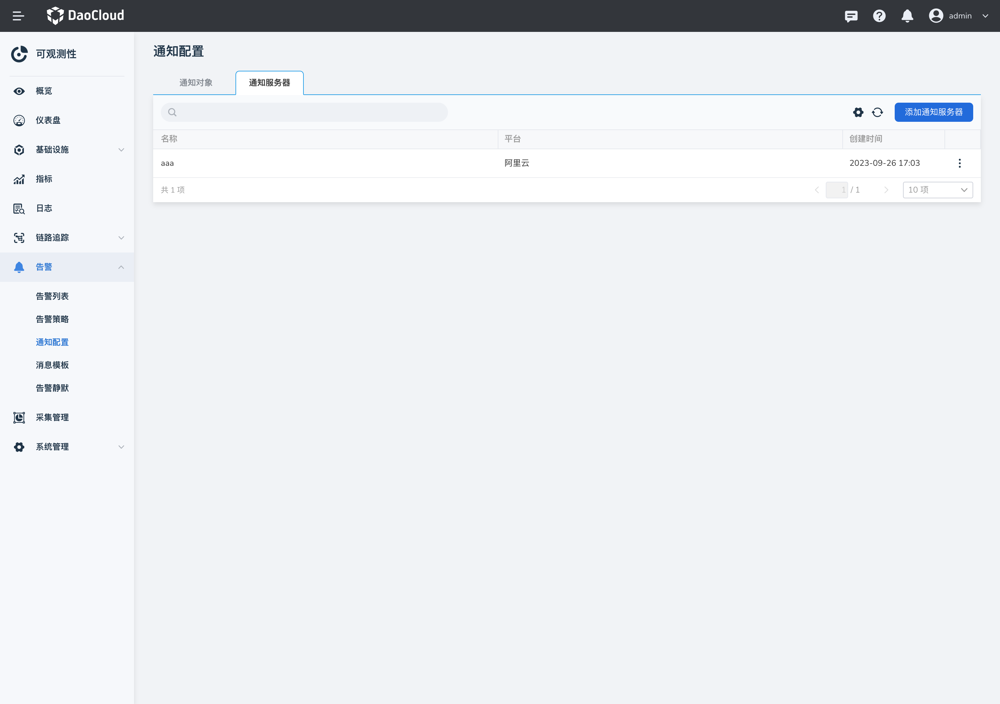

# 配置通知服务器

可观测性 Insight 支持短信通知，目前通过集成阿里云、腾讯云的短信服务发送告警消息。本文介绍了如何在 insight 中配置短信通知的服务器。短信签名中支持的变量为消息模板中的默认变量，同时由于短信字数有限，建议选择较为明确的变量。

> 如何配置短信接收人可参考文档：[配置短信通知组](../../user-guide/alert-center/message.md)。

## 操作步骤

1. 进入 `告警中心` -> `通知配置` -> `通知服务器`。

    

2. 点击`添加通知服务器`。

    1. 配置阿里云服务器。

        > 申请阿里云短信服务，请参考[阿里云短信服务](https://help.aliyun.com/document_detail/108062.html?spm=a2c4g.57535.0.0.2cec637ffna8ye)。

        **字段说明：**

        - `AccessKey ID`：阿里云用于标识用户的参数。
        - `AccessKey Secret`：阿里云用于验证用户的密钥。AccessKey Secret 必须保密。
        - `短信签名`：短信服务支持根据用户需求创建符合要求的签名。发送短信时，短信平台会将已审核通过的短信签名添加到短信内容中，再发送给短信接收方。
        - `模板 CODE`：短信模板是发送短信的具体内容。
        - `参数模板`：短信正文模板可以包含变量，用户可通过变量实现自定义短信内容。

        请参考[阿里云变量规范](https://help.aliyun.com/document_detail/463270.html)。

        

        !!! note

            举例：在阿里云定义的模板内容为：${severity}：${alertname} 在 ${startat} 被触发。参数模板中的配置参考上图。

    2. 配置腾讯云服务器。

        > 申请腾讯云短信服务，请参考[腾讯云短信](https://cloud.tencent.com/document/product/382/37794)。

        字段说明：

        - `Secret ID`：腾讯云用于标识 API 调用者身份参数。
        - `SecretKey`：腾讯云用于验证 API 调用者的身份的参数。
        - `短信模板 ID`：短信模板 ID，由腾讯云系统自动生成。
        - `签名内容`：短信签名内容，即在腾讯云短信签名中定义的实际网站名的全称或简称。
        - `SdkAppId`：短信 SdkAppId，在腾讯云短信控制台添加应用后生成的实际 SdkAppId。
        - `参数模板`：短信正文模板可以包含变量，用户可通过变量实现自定义短信内容。请参考：[腾讯云变量规范](https://cloud.tencent.com/document/product/382/39023#.E5.8F.98.E9.87.8F.E8.A7.84.E8.8C.83.3Ca-id.3D.22variable.22.3E.3C.2Fa.3E)。

        

        !!! note

            举例：在腾讯云定义的模板内容为：{1}：{2} 在 {3} 被触发。参数模板中的配置参考上图。
