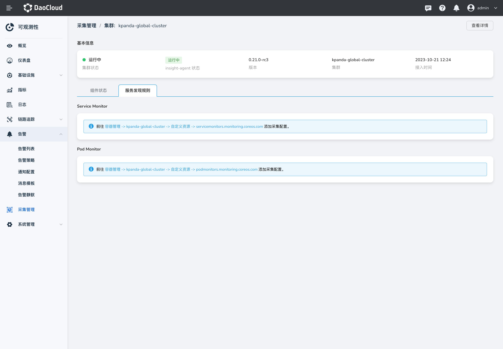

---
hide:
  - toc
---

# 采集管理

 __采集管理__ 主要是集中管理、展示集群安装采集插件 __insight-agent__ 的入口，帮助用户快速的查看集群采集插件的健康状态，并提供了快捷入口配置采集规则。

 可观测 Insight 支持通过 __容器管理__ 创建 CRD ServiceMonitor 的方式来满足您自定义服务发现的采集需求。 用户可以通过使用 ServiceMonitor 自行定义 Pod 发现的 Namespace 范围以及通过 __matchLabel__ 来选择监听的 Service。

## 前提条件

集群已安装 Helm 应用 __insight-agent__ 且处于 运行中 状态。

## 操作步骤

1. 点击左上角的，选择 __可观测性__。

    { width="1000"}

2. 选择左侧导航栏的 __采集管理__，查看全部集群采集插件的状态。

    { width="1000"}

3. 集群接入 __insight-agent__ 且处于运行中状态时，点击某个集群名称进入详情。

    { width="1000"}

4. 在集群的采集详情页，选择 __指标采集状态__ 页签，可以看到当前集群 Prometheus 采集的 Target 的详细状态以及每个 Target 的标签。

    { width="1000"}

5. 在 __服务监控__ 页签中，点击快捷链接跳转到 __容器管理__ -> __自定义资源__ 添加服务发现规则。

    { width="1000"}

## 配置说明

### ServiceMonitor vs PodMonitor 如何选择

在 DCE 的 Insight 监控体系中，每个工作集群都会安装部署 Prometheus 技术栈。__ServiceMonitor__ 和 __PodMonitor__ 是 Prometheus Operator 用来 __自动发现__ 和 __抓取监控指标__ 的自定义资源（CRD）。它们都是基于 Kubernetes Operator 模式实现的，使得我们能够以声明式的方式管理 Prometheus 的配置。

__ServiceMonitor__ 关注的是 __Service__。

- __特点__：它通过匹配 Service 来自动发现监控目标。ServiceMonitor 会查找所有标签匹配的 Service，然后通过这些 Service 暴露的端口和路径，自动生成 Prometheus 的抓取（scrape）配置。
  
- __优点__：只要你的应用是作为一个 Service 部署的，Prometheus 就可以自动发现并监控它，即使背后的 Pods 动态变化，也不需要手动更新配置。
  
- __场景__：应用通过 Service 暴露指标接口。
  
__PodMonitor__ 关注的是 __Pod__。

- __特点__：它直接通过匹配 Pod 的标签来自动发现监控目标。PodMonitor 会查找所有标签匹配的 Pod，然后根据 Pod 的 IP 和指定的端口、路径来生成 Prometheus 的抓取配置。
  
- __优点__：灵活性高，可以精细化地根据 Pod 的任意标签进行匹配监控对象
  
- __场景__：例如当你的应用没有通过 Service 暴露，或者你需要直接从 Pod 层面进行更细粒度的监控（例如监控 Sidecar 容器）。

我们推荐的策略是 __首先尝试使用 ServiceMonitor__，只有当你的监控需求无法被 ServiceMonitor 满足时，才考虑使用 __PodMonitor__。

#### ServiceMonitor
ServiceMonitor 的设计理念是 “面向服务”，它关注的是 Kubernetes 的 __Service__ 资源，而不是底层的 Pods。是一般应用监控的方案的首选。

以下是一个 ServiceMonitor 的配置示例：
```yaml
apiVersion: monitoring.coreos.com/v1
kind: ServiceMonitor
metadata:
  name: micrometer-demo # 指定 ServiceMonitor 的名称
  namespace: insight-system # 指定 ServiceMonitor 的命名空间
  labels:
    # 注意：声明后的 ServiceMonitor 才会被 insight 使用
    operator.insight.io/managed-by: insight
spec:
  endpoints: 
    - honorLabels: true
      interval: 30s
      path: /actuator/prometheus
      port: http
  namespaceSelector: 
    matchNames:
      - insight-system 
  selector: 
    matchLabels:
      micrometer-prometheus-discovery: "true"
```

通过这个 `ServiceMonitor` 配置，声明了 Prometheus 应该去 `insight-system` 命名空间下，查找所有带有 `micrometer-prometheus-discovery: "true"` 标签的 Service，然后通过这些 Service 的 `http` 端口，每 30 秒抓取一次 `/actuator/prometheus` 路径上的指标。

__endpoints__ 为一个数组， 同时可以创建多个 __endpoints__ 。每个 __endpoints__ 包含三个字段，每个字段的含义如下：

- __`port`__：必填，指定采集数据需要通过的端口，设置的端口为采集的 Service 端口所设置的 __name__ 。
  
- __`path`__：可选，指定 Prometheus 的采集路径。在本次示例中，指定为 __/actuator/prometheus__ 。默认抓取路径是 /metrics；
  
- __`interval`__：可选，指定 Prometheus 对当前 __endpoints__ 采集的周期。在本次示例中设定为 __30s__ 。默认使用 Prometheus 的全局抓取间隔；

#### PodMonitor
__PodMonitor__ 的设计理念是 “面向实例”，它直接关注 Kubernetes 的 __Pod__ 资源。

以下是一个 PodMonitor 的配置示例：
```yaml
apiVersion: monitoring.coreos.com/v1
kind: PodMonitor
metadata:
  name: insight-agent-otel-kubernetes-collector-agent
  namespace: insight-system
  labels:
    # 注意：声明后的 PodMonitor 才会被 insight 使用
    operator.insight.io/managed-by: insight
spec:
  podMetricsEndpoints:
    - port: metrics
  namespaceSelector:
    matchNames:
      - insight-system
  selector:
    matchLabels:
      app.kubernetes.io/instance: insight-agent
      app.kubernetes.io/name: opentelemetry-kubernetes-collector
      component: standalone-collector
```

通过这个 `PodMonitor` 配置，成功地声明了 Prometheus 应该在 `insight-system` 命名空间下，查找所有带有指定三个标签的 Pod，然后通过这些 Pod 的 `metrics` 端口，抓取 `/metrics` 路径（因为 path 未指定）上的指标。

Spec 字段定义了 PodMonitor 的核心行为，即如何发现和抓取监控目标：

- __`selector`__ 必填，是一个 Pod 选择器，用来筛选 Pod 资源。
  
- __`namespaceSelector`__ 选填（但建议填写），是一个 __命名空间选择器__ ，用来限制 Pod 的搜索范围。
  
- __`podMetricsEndpoints`__ __必填__，是一个 __抓取配置__ 列表，定义了 Prometheus 应该如何从选中的 Pod 中抓取指标，是配置的核心。

我们继续详细的描述 `podMetricsEndpoints` 列表中的字段详情：

- __`port`__：__必填__，指定要抓取 Pod 的哪个端口。这里的值（`metrics`）指的是 Pod `.spec.containers` 列表中 `ports` 定义中 `name` 为 `metrics` 的端口。例如，Pod 的定义可能类似这样：

```yaml
containers:
- name: otel-collector
  image: ...
  ports:
  - containerPort: 8888
    name: metrics
```

- __`path`__：选填，指定抓取指标的 HTTP 路径。默认抓取路径是 /metrics；
  
- __`interval`__：选填，抓取指标的间隔时间。默认使用 Prometheus 的全局抓取间隔；

### ScrapeConfig：采集配置的新选择

> 🔥 注意：ScrapeConfig 从 Insight Agent 的 v0.38.0 开始支持。

在 Kubernetes 监控中，ServiceMonitor 和 PodMonitor 极大地满足了 Kubernetes 环境下 __服务发现__ 的需求。然而，它们并没有完全覆盖所有 Prometheus 配置场景。为了处理更复杂、更灵活的抓取配置，Prometheus Operator 引入了 __ScrapeConfig__。

`ScrapeConfig` 的设计思想是提供一个与 Prometheus 原生 `scrape_configs` 块近乎一对一映射的 Kubernetes 资源，它作为 `ServiceMonitor` 和 `PodMonitor` 的补充，有效解决了以下关键问题：

- __完整的 Kubernetes 服务发现__：除了 Pod 和 Service 之外，Kubernetes 还支持通过 Node，Ingress 和 EndpointSlice 方式暴露指标接口。
  
- __监控非 Kubernetes 资源__：核心能力是允许用户脱离 Kubernetes 的服务发现机制。通过 `static_configs` 字段访问集群外部的静态目标（如虚拟机、物理服务器或外部 PaaS 服务）。
  
- __解锁更多的服务发现机制__：它将 Prometheus 内置的多种服务发现（Service Discovery, SD）能力引入了 Operator 框架。
  
- __统一声明式管理__: 在此之前，管理外部目标的配置通常依赖于 `additionalScrapeConfigs` Secret，`ScrapeConfig` 将所有采集配置统一为 Kubernetes API 的一部分，通过声明式管理，提升了配置的一致性。
  
#### ScrapeConfig

__示例：使用 `static_config` 监控外部虚拟机__

以下示例展示了如何监控两台运行 Node Exporter 的外部虚拟机（IP: `10.0.1.10`, `10.0.1.11`）。
  
```yaml
apiVersion: monitoring.coreos.com/v1alpha1
kind: ScrapeConfig
metadata:
  name: external-node-exporter
  namespace: monitoring
  labels:
    # 注意：声明后的 ScrapeConfig 才会被 insight 使用，从 0.38.3 开始支持
    operator.insight.io/managed-by: insight
spec:
  staticConfigs:
    - targets: ['10.0.1.10:9100', '10.0.1.11:9100']
      labels:
        job: 'external-node-exporter'
        env: 'production'
  relabelings:
    - sourceLabels: [__address__]
      targetLabel: instance
      regex: '([^:]+):.*'
      replacement: '${1}'
```

配置解析:

- __`staticConfigs`__: 此字段用于定义一组静态监控目标。
  
   - __`targets`__: 直接指定了需要采集指标的 `ip:port` 列表。
     
   - __`labels`__: 为从这组目标采集的所有时间序列数据附加了 `job` 和 `env` 标签，便于后续查询与聚合。
    
- __`relabelings`__: 此处演示了一个可选的高级用法，通过正则表达式从目标的 `address` 内部标签中提取 IP 地址，并赋值给 `instance` 标签，以实现更清晰的实例区分。
