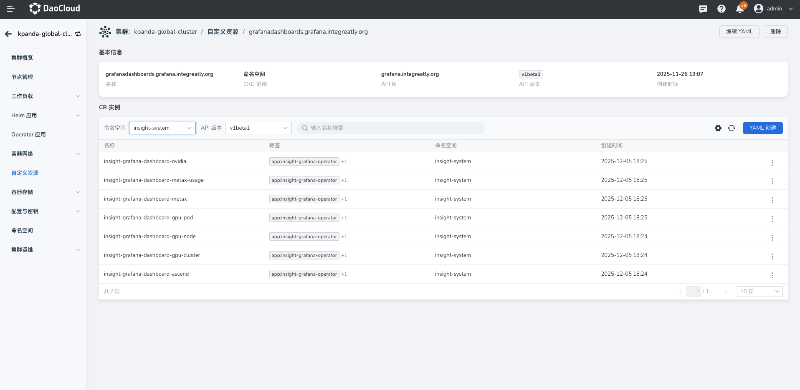

# 导入自定义仪表盘

通过使用 Grafana CRD，可以将仪表板的管理和部署纳入到 Kubernetes 的生命周期管理中，实现仪表板的版本控制、自动化部署和集群级的管理。
本页介绍如何通过 Grafana CRD, ConfigMap 导入自定义的仪表盘。

Insight v0.40.0 已经支持使用 Grafana 社区最新的 GrafanaDashboard(v1beta1) CRD 导入仪表盘。

##  使用 v1beta1 CRD 导入仪表盘

1. 登录 DCE 5.0 平台，进入 __容器管理__ ，在集群列表中选择 __kpanda-global-cluster__ 。

2. 选择左侧导航栏的 __自定义资源__ ，在列表中查找 __grafanadashboards.grafana.integreatly.org__ 文件，进入详情。

    { width="1000"}

3. 点击 __Yaml 创建__ ，使用以下模板，在 __Json__ 字段中替换仪表盘 JSON。

    - __metadata.name__ ：填写仪表盘的名称。
    - __metadata.namespace__ ：填写目标命名空间；
    - __metadata.labels__ ：必填， __operator.insight.io/managed-by: insight__ .
    - __spec.allowCrossNamespaceImport__ ：必填，值为 __true__ 。
    - __spec.instanceSelector.matchLabels__ ：必填，__operator.insight.io/managed-by: insight__ 。

    ```yaml
    apiVersion: grafana.integreatly.org/v1beta1
    kind: GrafanaDashboard
    metadata:
      labels:
        operator.insight.io/managed-by: insight
      name: sample-dashboard
      namespace: insight-system
    spec:
      allowCrossNamespaceImport: true
      instanceSelector:
        matchLabels:
          operator.insight.io/managed-by: insight
      json: >
        {
          "id": null,
          "title": "Simple Dashboard",
          "tags": [],
          "style": "dark",
          "timezone": "browser",
          "editable": true,
          "hideControls": false,
          "graphTooltip": 1,
          "panels": [],
          "time": {
            "from": "now-6h",
            "to": "now"
          },
          "timepicker": {
            "time_options": [],
            "refresh_intervals": []
          },
          "templating": {
            "list": []
          },
          "annotations": {
            "list": []
          },
          "refresh": "5s",
          "schemaVersion": 17,
          "version": 0,
          "links": []
        }
    ```

4. 点击 __确认__ 后，稍等片刻即可在 __仪表盘__ 中查看刚刚导入的仪表盘。


## 兼容 v1alpha1 CRD 导入仪表盘

现在用户仍然可以使用老版本 CRD 导入仪表盘：

- __namespace__ ：填写目标命名空间；
- __name__ ：填写仪表盘的名称。
- __label__ ：必填， __operator.insight.io/managed-by: insight__ 。

 ```yaml
 apiVersion: integreatly.org/v1alpha1
 kind: GrafanaDashboard
 metadata:
   labels:
     app: insight-grafana-operator
     operator.insight.io/managed-by: insight
   name: sample-dashboard
   namespace: insight-system
 spec:
   json: >
     {
       "id": null,
       "title": "Simple Dashboard",
       "tags": [],
       "style": "dark",
       "timezone": "browser",
       "editable": true,
       "hideControls": false,
       "graphTooltip": 1,
       "panels": [],
       "time": {
         "from": "now-6h",
         "to": "now"
       },
       "timepicker": {
         "time_options": [],
         "refresh_intervals": []
       },
       "templating": {
         "list": []
       },
       "annotations": {
         "list": []
       },
       "refresh": "5s",
       "schemaVersion": 17,
       "version": 0,
       "links": []
     }
 ```

为了兼容 v1alpha1 CRD 导入，Insight 在 grafana deployment 中添加一个 dashboard-discover sidecar 用于将现有环境中 GrafanaDashboard(v4)，
写入到 grafana dashboard provider 指定目录(/var/lib/grafana/plugins/dashboards)中并额外支持 ConfigMap 导入仪表盘。

dashboard-discover sidecar 架构图如下：


具体的 watch 规则如下：

1. GrafanaDashboard(v1alpha1)

    dashboard-discover sidecar 会 watch 集群中所用命名空间中带有：`operator.insight.io/managed-by=insight` label 的 GrafanaDashboard(v1alpha1)
    并将其 Json 内容写入到 Grafana 容器的 `/var/lib/grafana/plugins/dashboards` 中。


2. ConfigMap

    dashboard-discover sidecar 会 watch 集群中所用命名空间中带有：`operator.insight.io/managed-by=insight,operator.insight.io/dashboard=true` label 的 ConfigMap
    并将其 data 下的所有内容写入到 Grafana 容器的 `/var/lib/grafana/plugins/dashboards` 中。

    ```yaml
    apiVersion: v1
    kind: ConfigMap
    metadata:
      labels:
        operator.insight.io/managed-by: 'insight'
        operator.insight.io/dashboard: 'true'
        operator.insight.io/dashboard-folder: 'you-folder'
      name: sample-dashboard
      namespace: default
    data:
      sample-dashboard.json: >
        {
          "id": null,
          "title": "Simple Dashboard",
          "tags": [],
          "style": "dark",
          "timezone": "browser",
          "editable": true,
          "hideControls": false,
          "graphTooltip": 1,
          "panels": [],
          "time": {
            "from": "now-6h",
            "to": "now"
          },
          "timepicker": {
            "time_options": [],
            "refresh_intervals": []
          },
          "templating": {
            "list": []
          },
          "annotations": {
            "list": []
          },
          "refresh": "5s",
          "schemaVersion": 17,
          "version": 0,
          "links": []
        }
    ```

> 如果需要将 Json 文件存入特定文件夹中，可以在对应资源 label 中添加：`operator.insight.io/dashboard-folder=you-folder`


!!! info

    自定义设计仪表盘，请参考[添加仪表盘面板](https://grafana.com/docs/grafana/latest/dashboards/add-organize-panels/)。


## 注意事项

在 Insight v0.40.0 版本中， grafana 从 9.3.14 升级到 12.1.3。grafana 12.1.3 已完全移除对 AngularJS 的支持，转而优先支持 React。具体可以看[社区说明](https://grafana.com/blog/2025/04/03/angularjs-support-will-be-removed-in-grafana-12-what-you-need-to-know)。

DCE5 产品中的仪表盘已经自动迁移，开箱即用。对于客户自己维护的仪表盘，grafana 12.1.3 对部分核心预置（pre-installed）的
AngularJS 面板提供自动迁移支持。在客户首次在 Grafana 12.1.3 打开自定义仪表盘后 grafana 会自动触发迁移, 迁移完成后，务必点击仪表盘的「Save」按钮保存变更，避免每次加载时重复迁移。

若未完成 AngularJS 面板迁移，在 Grafana 12.1.3 后会出现以下问题：

1. 依赖 AngularJS 的插件无法加载，在插件目录中不会显示已安装状态。
2. 已配置的 AngularJS 数据源不会出现在数据源列表中。
3. 仪表盘中原 AngularJS 面板会显示错误提示，如 `Error loading: plugin_name` 或 `Panel plugin not found: plugin_name`； 如下图：

   

   可以手动替换类似的面板或插件。

4. 仪表盘中原 Datasource 丢失，如 `Datasource XXX was not found`, 如下图：

   

   可以手动创建一个 Datasource 变量:

   

   然后在面板中使用：

   