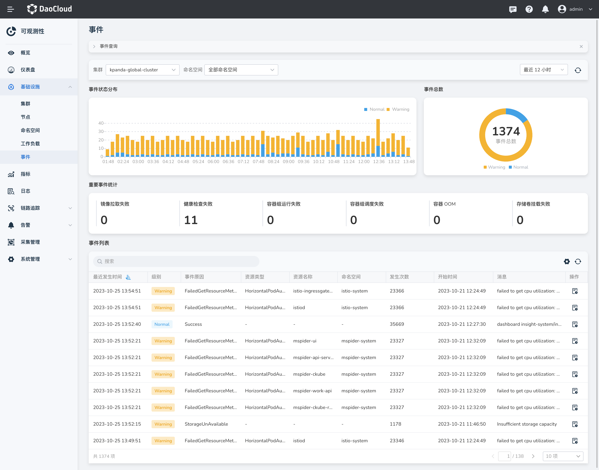
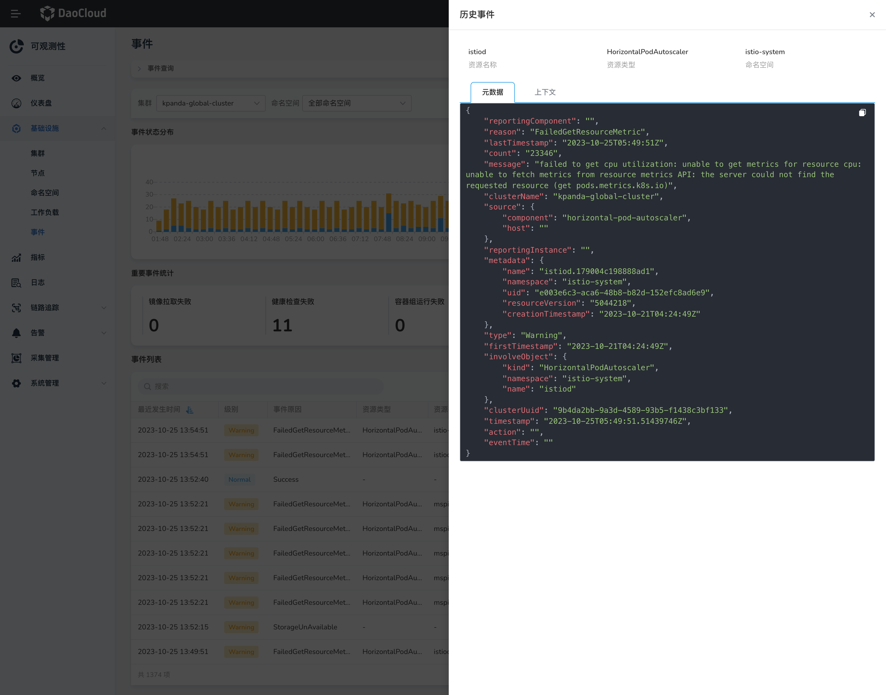
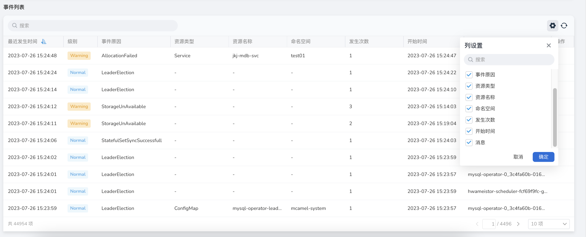

# 事件查询

DCE 5.0 Insight 支持按集群、命名空间查询事件，并提供了事件状态分布图，对重要事件进行统计。

## 操作步骤

1. 点击一级导航栏进入`可观测性`。
2. 左侧导航栏中，选择`基础设置 > 事件`。

    

### 事件状态分布

默认显示最近 12 小时内发生的事件，您可以在右上角选择不同的时间范围来查看较长或较短的时间段。
您还可以自定义采样间隔为 1 分钟至 5 小时。

通过事件状态分布图，您可以直观地了解事件的密集程度和分散情况。
这有助于对后续的集群运维进行评估，并做好准备和安排工作。
如果事件密集发生在特定时段，您可能需要调配更多的资源或采取相应措施来确保集群稳定性和高可用性。
而如果事件较为分散，在此期间您可以合理安排其他运维工作，例如系统优化、升级或处理其他任务。

通过综合考虑事件状态分布图和时间范围，您能更好地规划和管理集群的运维工作，确保系统稳定性和可靠性。

### 事件总数和统计

通过重要事件统计，您可以方便地了解镜像拉取失败次数、健康检查失败次数、容器组（Pod）运行失败次数、
Pod 调度失败次数、容器 OOM 内存耗尽次数、存储卷挂载失败次数以及所有事件的总数。这些事件通常分为「Warning」和「Normal」两类。

### 事件列表

事件列表以时间为轴，以流水的形式展示发生的事件。您可以根据「最近发生时间」和「级别」进行排序。

点击右侧的 ⚙️ 图标，您可以根据自己的喜好和需求来自定义显示的列。

在需要的时候，您还可以点击刷新图标来更新当前的事件列表。

## 其他操作

1. 在事件列表中操作列的图标，可查看某一事件的元数据信息。

    { width="1000"}

2. 点击顶部页签的 `上下文` 可查看该事件对应资源的历史事件记录。

    { width="1000"}

## 参考

有关系统自带的 Event 事件的详细含义，请参阅 [Kubenetest API 事件列表](https://kubernetes.io/zh-cn/docs/reference/kubernetes-api/cluster-resources/event-v1/)。
