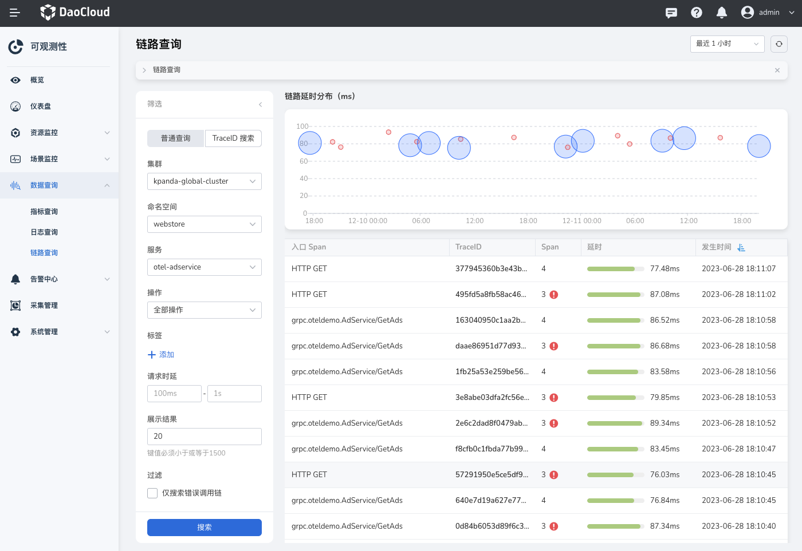
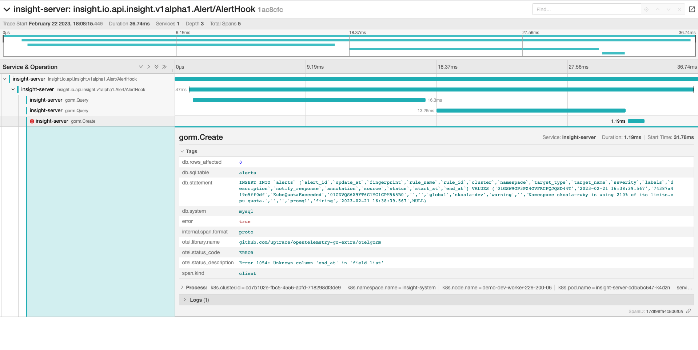

# 链路查询

在链路查询页面，您可以过 TraceID 或精确查询调用链路详细情况或结合多种条件筛选查询调用链路。

请按照以下步骤查询链路：

1. 进入`可观测性` 产品模块，
2. 在左边导航栏选择 `数据查询 -> 链路查询`。
3. 通过多种条件查询链路或通过 TraceID 精确查询链路。

    

    !!! note

        列表中对 TraceID 的显示进行了简化。
        在通过 TraceID 精确查询时，请输入完整的 TraceID 进行搜索。

4. 点击需要查询的 TraceID 名称，查看该链路的详情调用情况

    
