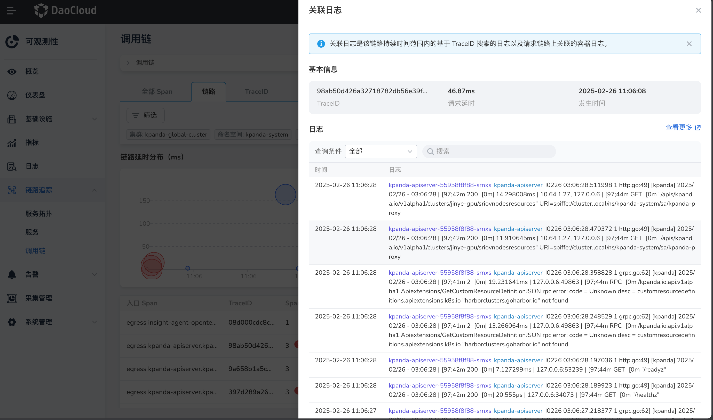

# 链路查询

在链路查询页面，您可以过 TraceID 或精确查询调用链路详细情况或结合多种条件筛选查询调用链路。

## 名词说明

- TraceID：用于标识一个完整的请求调用链路。
- 操作：描述 Span 所代表的具体操作或事件。
- 入口 Span：入口 Span 代表了整个请求的第一个请求。
- 延时：整个调用链从开始接收请求到完成响应的持续时间。
- Span：整个链路中包含的 Span 个数。
- 发生时间：当前链路开始的时间。
- Tag：一组键值对构成的 Span 标签集合，Tag 是用来对 Span 进行简单的注解和补充，每个 Span 可以有多个简直对形式的 Tag。

## 操作步骤

请按照以下步骤查询链路：

1. 进入`可观测性` 产品模块，
2. 在左边导航栏选择 `数据查询 -> 链路查询`。
3. 通过多种条件查询链路或通过 TraceID 精确查询链路。

    

    !!! note

        列表中支持对 Span 数、延时、发生时间进行排序。

4. 点击需要查询的 TraceID 名称，查看该链路的详情调用情况

    

!!! note

    使用 TraceID 搜索请输入完整的 TraceID。

### 关联日志

1. 点击链路数据右侧的图标，可查询该链路的关联日志。

    - 默认查询该链路的持续时间及其结束之后一分钟内的日志数据。
    - 查询的日志内容为日志文本中包含该链路的 TraceID 的日志和链路调用过程中相关的容器日志。
  
2. 点击 `查看更多` 后可带条件跳转到`日志查询` 的页面。
3. 支持基于 `容器组` 过滤和关键字模糊搜索。

    

    !!! note

        1. 由于链路会跨集群或跨命名空间，若用户权限不足，则无法查询该链路的关联日志。
        2. 跳转到 `日志查询` 后会根据用户权限默认搜索一次。
