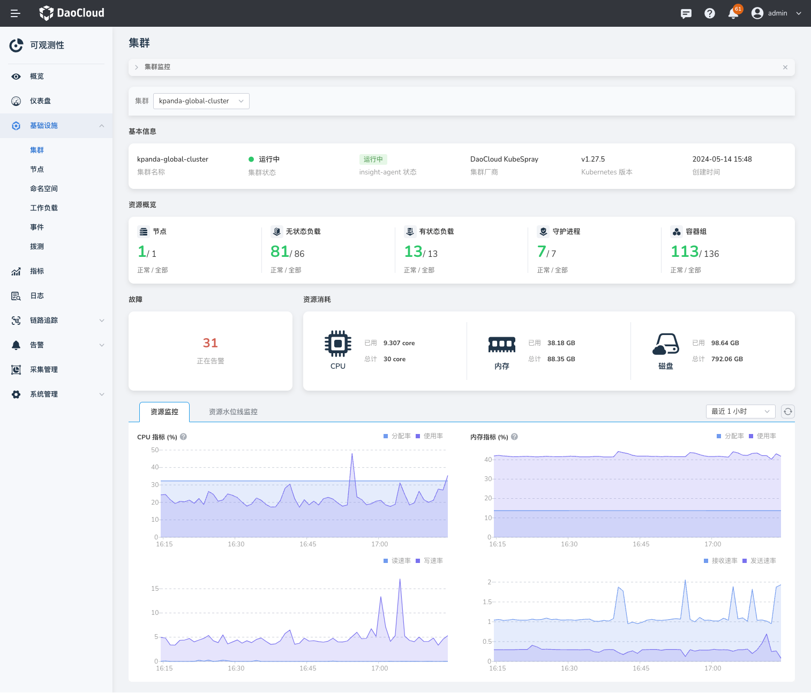
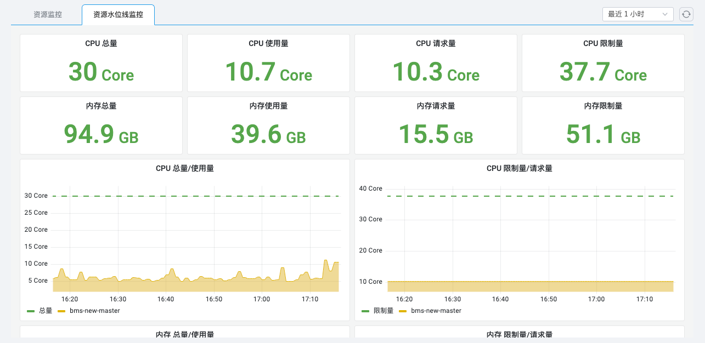

# 集群监控

通过集群监控，你可以查看集群的基本信息、该集群中的资源消耗以及一段时间的资源消耗变化趋势等。

## 前提条件

集群中已[安装 insight-agent](../../quickstart/install/install-agent.md) 且应用处于 __运行中__ 状态。

## 操作步骤

1. 进入 __可观测性__ 产品模块。
  
2. 在左边导航栏选择 __基础设施__ -> __集群__ 。在该页面可查看以下信息：

    - **资源概览** ：多选集群中的节点、工作负载的正常和全部的数量统计；
    - **故障** ：统计当前集群产生的告警数量；
    - **资源消耗** ：所选集群的 CPU、内存、磁盘的实际使用量和总量；
    - **指标说明** ：所选集群的 CPU、内存、磁盘读写、网络接收发送的变化趋势。

    { width="1000"}

3. 切换到 __资源水位线监控__ 页签，可查看当前集群的更多监控数据。

    { width="1000"}

## 参考指标说明

| 指标名 | 说明 |
| -- | -- |
| CPU 使用率 | 该指标是指集群中所有 Pod 资源的实际 CPU 用量与所有节点的 CPU 总量的比率。|
| CPU 分配率 | 该指标是指集群中所有 Pod 的 CPU 请求量的总和与所有节点的 CPU 总量的比率。|
| 内存使用率 | 该指标是指集群中所有 Pod 资源的实际内存用量与所有节点的内存总量的比率。|
| 内存分配率 | 该指标是指集群中所有 Pod 的内存请求量的总和与所有节点的内存总量的比率。|

!!! note

    使用的具体指标可参考[可观测性参考指标说明](../../reference/uesd-metric-in-insight.md)。
