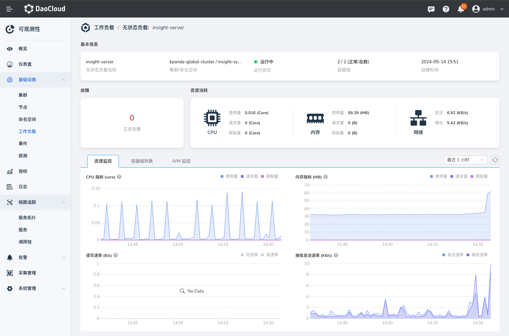
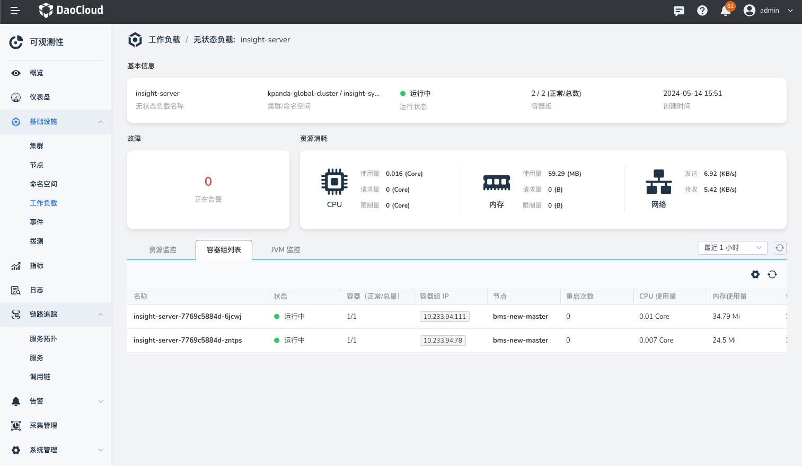
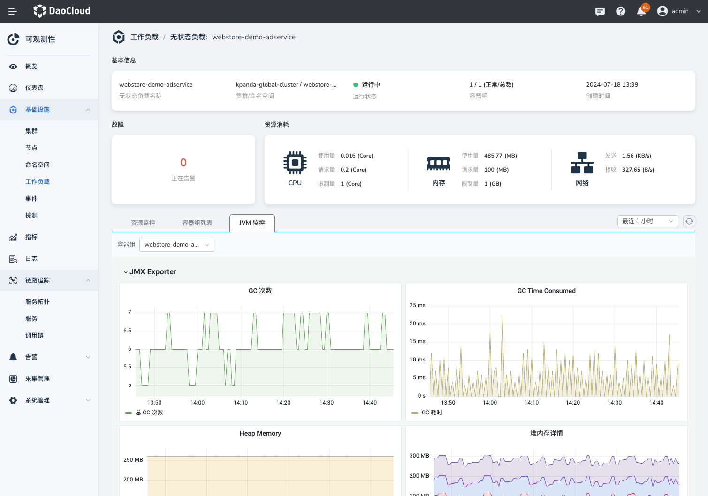
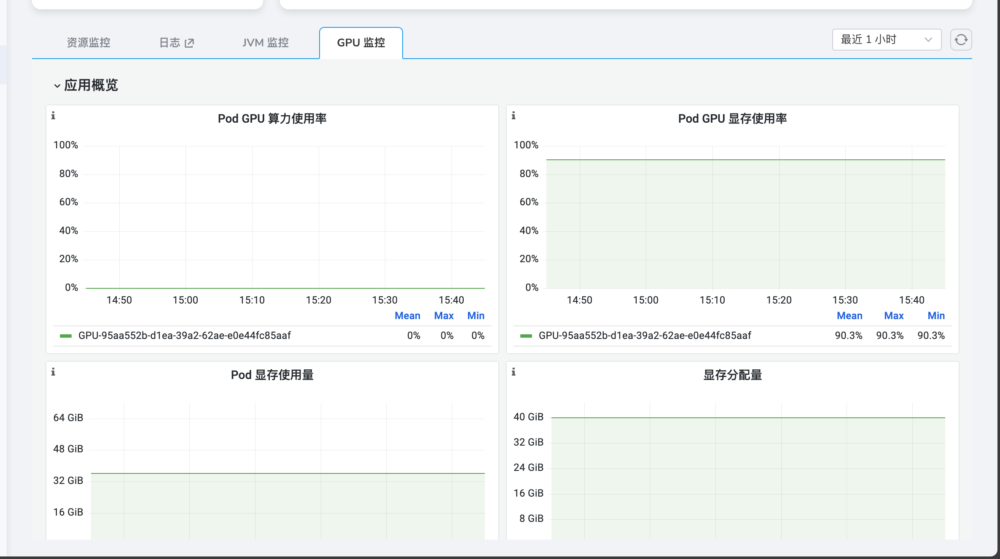

# 容器监控

容器监控是对集群管理中工作负载的监控，在列表中可查看工作负载的基本信息和状态。在工作负载详情页，可查看正在告警的数量以及 CPU、内存等资源消耗的变化趋势。

## 前提条件

集群已安装 insight-agent，且所有的容器组处于 __运行中__ 状态。

- 安装 insight-agent，请参考[在线安装 insight-agent](../../quickstart/install/install-agent.md)
  或[离线升级 insight-agent](../../quickstart/install/offline-install.md)。

## 操作步骤

请按照以下步骤查看服务监控指标：

1. 进入 __可观测性__ 产品模块。
  
2. 在左边导航栏选择 __基础设施__ -> __工作负载__。

3. 切换顶部 Tab，查看不同类型工作负载的数据。

    { width="1000"}

4. 点击目标工作负载名称查看详情。

    1. 故障：在故障卡片中统计该工作负载当前正在告警的总数。
    2. 资源消耗：在该卡片可查看工作负载的 CPU、内存、网络的使用情况。
    3. 监控指标：可查看工作负载默认 1 小时的 CPU、内存、网络和磁盘的变化趋势。

    { width="1000"}

5. 切换 Tab 到 __容器组列表__，可查看工作负载的各个容器组状态、所在节点、重启次数等信息。

    { width="1000"}

6. 切换 Tab 到 __JVM 监控__，可查看各个容器组的 JVM 指标。

    

    !!! note

        1. JVM 监控功能仅支持 Java 语言。
        2. 开启 JVM 监控功能，请参考[开始监控 Java 应用](../../quickstart/otel/java/index.md)。

7. 若选择的容器组配置 GPU 资源，在容器组详情页中即可看到 __GPU 监控__，从 __GPU 监控__ 即可对 GPU 的资源进行监控。

    

    !!! note

        当容器组配置了 GPU 资源后，该页签才会出现。

## 指标参考说明

| **指标名称** | **说明** |
| -- | -- |
| CPU 使用量 |工作负载下所有容器组的 CPU 使用量之和。|
| CPU 请求量 | 工作负载下所有容器组的 CPU 请求量之和。|
| CPU 限制量 | 工作负载下所有容器组的 CPU 限制量之和。|
| 内存使用量 | 工作负载下所有容器组的内存使用量之和。|
| 内存请求量 | 工作负载下所有容器组的内存使用量之和。|
| 内存限制量 | 工作负载下所有容器组的内存限制量之和。|
| 磁盘读写速率 | 指定时间范围内磁盘每秒连续读取和写入的总和，表示磁盘每秒读取和写入操作数的性能度量。|
| 网络发送接收速率 | 指定时间范围内，按工作负载统计的网络流量的流入、流出速率。|
