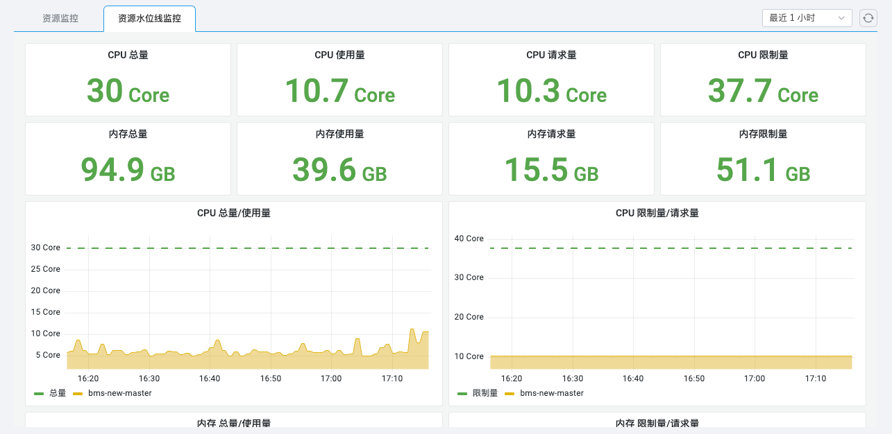

# 节点监控

通过节点监控，你可以概览所选集群下节点的当前健康状态、对应容器组的异常数量；
在当前节点详情页，你可以查看正在告警的数量以及 CPU、内存、磁盘等资源消耗的变化趋势图。

## 前提条件

集群中已[安装 insight-agent](../../quickstart/install/install-agent.md) 且应用处于 __运行中__ 状态。

## 操作步骤

1. 进入 __可观测性__ 产品模块。
  
2. 在左边导航栏选择 __基础设施__ -> __节点__ 。在该页面可查看以下信息：

    - **集群切换** ：切换顶部的下拉框可切换集群；
    - **节点列表** ：所选集群中的节点列表，单击切换节点。
    - **故障** ：统计当前集群产生的告警数量；
    - **资源消耗** ：所选节点的 CPU、内存、磁盘的实际使用量和总量；
    - **指标说明** ：所选节点的 CPU、内存、磁盘读写、网络接收发送的变化趋势。

    { width="1000"}

3. 切换到 __资源水位线监控__ 页签，可查看当前节点的更多监控数据。

    { width="1000"}
