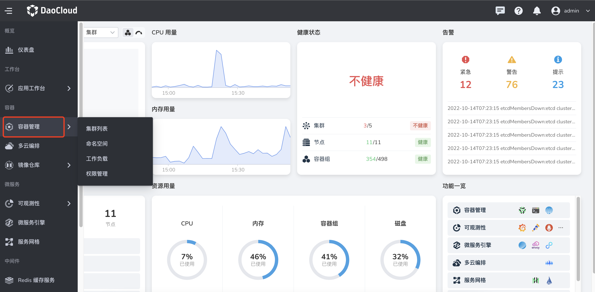
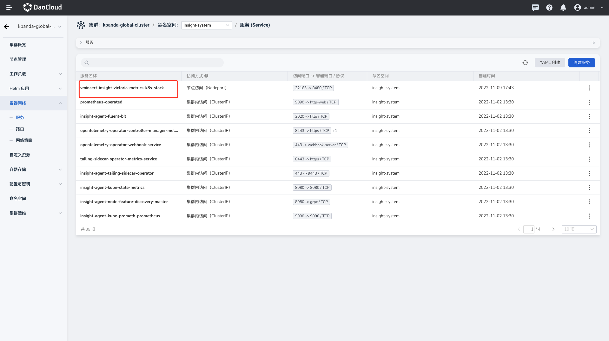

# 如何获取数据上传的地址？

在[安装 insight-agent](install-agent.md) 时需要配置服务地址上传所在集群指标、日志、链路数据至`全局服务集群`。
本文概述了如何获取数据上传的地址的步骤。

## 参数说明

| 参数                      | 说明                                                                                   |
| ------------------------- | -------------------------------------------------------------------------------------- |
| ${vminsert_host}          | 指标数据上传地址，默认为全局服务集群 vminsert 服务的对外可访问地址                     |
| ${es_host}                | 日志数据上传地址，与全局服务集群使用的 elasticsearch 服务配置保持一致                |
| ${otel_col_auditlog_port} | 审计日志数据上传地址，默认为全局服务集群 opentelemetry-collector 服务的对外可访问地址 |
| ${otel_col_host}          | 链路数据上传地址，默认为全局服务集群 opentelemetry-collector 服务的对外可访问地址    |

!!! note

    若使用外置 ElasticSearch 集群，请填写对应集群的地址、用户名和密码。

## 在`全局服务集群`安装 insight-agent

在`全局服务集群`安装时，推荐通过域名来访问集群：

```go
export vminsert_host="vminsert-insight-victoria-metrics-k8s-stack.insight-system.svc.cluster.local" // 指标
export es_host="insight-es-master.insight-system.svc.cluster.local" // 日志
export otel_col_host="insight-opentelemetry-collector.insight-system.svc.cluster.local" // 链路
```

## 在`工作集群`安装 insight-agent

`工作集群`需要上传指标、日志、链路的数据到`全局服务集群`。请保证`全局服务集群`中的 Insight 处在运行状态，并已暴露工作集群能够访问的地址 。

### 通过接口获取 insight-agent

参照以下步骤通过接口获取 insight-agent。

1. 登录到`全局服务集群`的控制台，执行以下命令：

   	```sh
   	export INSIGHT_SERVER_IP=$(kubectl get service insight-server -n insight-system --output=jsonpath={.spec.clusterIP})
   	curl --location --request POST 'http://'"${INSIGHT_SERVER_IP}"'/apis/insight.io/v1alpha1/agentinstallparam'
   	```

1. 执行完以上命令后，获得如下返回值：

    ```json
    {"values":"{\"global\":{\"exporters\":{\"logging\":{\"scheme\":\"https\",\"host\":\"mcamel-common-es-cluster-es-http.mcamel-system.svc.cluster.local\",\"port\":9200,\"user\":\"elastic\",\"password\":\"XAlJ948ZY0leE320SQ6hfv17\"},\"metric\":{\"host\":\"10.6.229.181\"},\"auditLog\":{\"host\":\"10.6.229.181\"}}}}"}
    ```

### 通过 LoadBalancer 连接 insight-agent

请确认您的集群已安装负载均衡器，参照以下步骤通过 LoadBalancer 连接 insight-agent：

1. 登录到全局管理集群的控制台，执行以下命令：

    ```sh
    kubectl get service -n insight-system | grep lb
    kubectl get service -n mcamel-system
    ```

1. 执行完获得相应服务的地址信息：

    ```sh
    $ kubectl get service -n insight-system | grep lb
    lb-insight-opentelemetry-collector                               LoadBalancer   10.233.0.48     10.6.229.181   4317:32608/TCP,8006:30039/TCP                                               46d
    lb-vminsert-insight-victoria-metrics-k8s-stack                   LoadBalancer   10.233.3.151    10.6.229.181   8480:31718/TCP                                                              46d

    $ kubectl get service -n mcamel-system | grep common-es-cluster
    mcamel-common-es-cluster-es-http                  NodePort    10.233.50.159   <none>        9200:31450/TCP                  57d
    mcamel-common-es-cluster-es-internal-http         ClusterIP   10.233.42.246   <none>        9200/TCP                        57d
    mcamel-common-es-cluster-es-transport             ClusterIP   None            <none>        9300/TCP                        57d
    mcamel-common-es-cluster-kb-http                  NodePort    10.233.62.189   <none>        5601:31424/TCP                  57d
    mcamel-common-es-cluster-prometheus-exporter      ClusterIP   10.233.20.175   <none>        9114/TCP                        57d
    ```

	其中，

	- `lb-vminsert-insight-victoria-metrics-k8s-stack`：指标数据上传地址
	- `lb-insight-opentelemetry-collector`：链路数据上传地址
	- `mcamel-es-cluster-masters-es-http`：日志数据上传地址

### 通过 NodePort 连接 insight-agent

#### 通过 UI 页面获取 NodePort 地址

1. 从左侧导航栏点击`容器管理`，进入`集群列表`。

    

2. 选择集群 `kpanda-global-cluster`，选择左侧导航栏的`容器应用` -> `服务`，选择 `insight-system` 命名空间，查看对应服务暴露的端口。

    

	- `vminsert-insight-victoria-metrics-k8s-stack`：指标数据上传地址，设置 8480 端口对应的 NodePort
	- `insight-opentelemetry-collector`：链路数据上传地址，设置 8006 端口对应的 NodePort
	- `insight-opentelemetry-collector`：审计日志数据上传地址，设置 4317 端口对应的 NodePort
	- `mcamel-es-cluster-masters-es-http`：日志数据上传地址，设置 9200 端口对应的 NodePort

#### 通过控制台获取服务地址

通过 NodePort 连接 insight-agent。

1. 登录到全局管理集群的控制台，执行以下命令：

    ```shell
    kubectl get service -n insight-system
    kubectl get service -n mcamel-system
    ```

2. 获取相应服务的地址信息：

    ```shell
    $ kubectl get service -n insight-system | grep -E "opentelemetry|vminsert"
    insight-agent-opentelemetry-collector       NodePort    10.233.9.24     <none>  6831:32621/UDP,14250:31181/TCP,14268:30523/TCP,8888:32415/TCP,4317:32106/TCP,4318:31221/TCP,8889:32558/TCP,9411:30911/TCP   42d
    vminsert-insight-victoria-metrics-k8s-stack NodePort    10.233.33.39    <none>  8480:32638/TCP     8d

    $ kubectl get service -n mcamel-system | grep common-es-cluster
    mcamel-common-es-cluster-es-http      NodePort    10.233.50.159   <none>    9200:31450/TCP  57d
    ```
