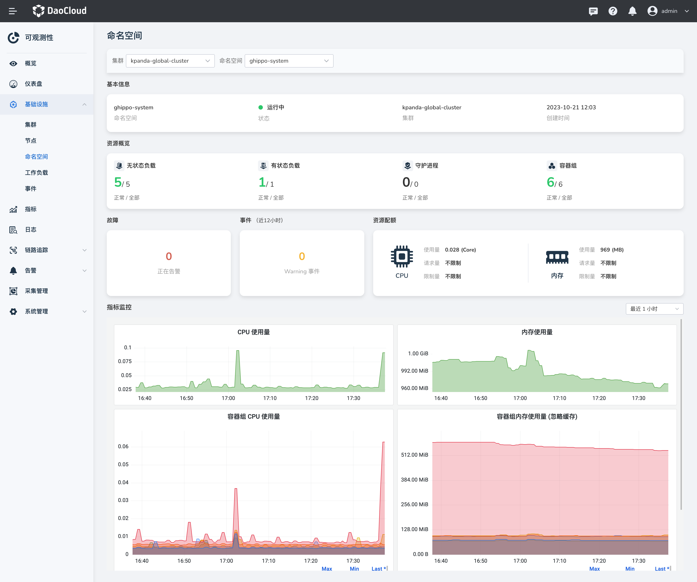

---
hide:
  - toc
---

# 容器监控

以命名空间为维度，快速查询命名空间内的资源消耗和变化趋势。

## 前提条件

集群中已[安装 insight-agent](../../quickstart/install/install-agent.md) 且应用处于`运行中`状态。

## 操作步骤

1. 进入`可观测性` 产品模块。
  
2. 在左边导航栏选择 `基础设施 > 命名空间`。在该页面可查看以下信息：

    1. **切换命名空间**：在顶部切换集群或命名空间；
    2. **资源概览**：统计所选命名空间下的正常和全部工作负载的数量；
    3. **故障**：统计所选命名空间下产生的告警数量；
    4. **事件**：统计所选命名空间下 24 小时内 Warning 级别的事件数量；
    5. **资源消耗**：统计所选命名空间下容器组的 CPU、内存使用量之和 及 CPU、内存配额情况。

    {: width="1000px"}

### 指标说明

| 指标名 | 说明 |
| -- | -- |
| CPU 使用量 | 所选命名空间中容器组的 CPU 使用量之和 |
| 内存使用量 | 所选命名空间中容器组的内存使用量之和 |
| 容器组 CPU 使用量 | 命名空间中各容器组的 CPU 使用量 |
| 容器组内存使用量 | 命名空间中各容器组的内存使用量 |
