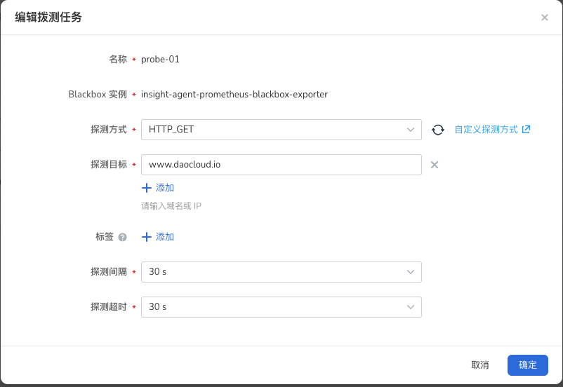

# 拨测

拨测（Probe）指的是基于黑盒监控，定期通过 HTTP、TCP 等方式对目标进行连通性测试，快速发现正在发生的故障。

Insight 基于 [Prometheus Blackbox Exporter](https://github.com/prometheus/blackbox_exporter)
工具通过 HTTP、HTTPS、DNS、TCP 和 ICMP 等协议，对网络进行探测并返回探测结果以便了解网络状态。

## 前提条件

目标集群中[已成功部署 insight-agent](../../quickstart/install/install-agent.md)，且处于 __运行中__ 状态。

## 查看拨测任务

1. 进入 __可观测性__ 产品模块；
2. 在左边导航栏选择 __基础设施__ -> __拨测__ 。

    - 点击表格中的集群或命名空间下拉框，可切换集群和命名空间
    - 你可以点击右侧的 ⚙️ 修改显示的列，默认为拨测名称、探测方式、探测目标、连通状态、创建时间
    - 连通状态有 3 种：
        - 正常：Probe 成功连接到了目标，目标返回了预期的响应
        - 异常：Probe 无法连接到目标，或目标没有返回预期的响应
        - Pending：Probe 正在尝试连接目标
    - 你可以在 🔍 搜索框中键入名称，模糊搜索某些拨测任务

    { width=1000px}

## 创建拨测任务

1. 点击 __创建拨测任务__ 。
2. 填写基本信息后点击 __下一步__ 

    - 集群：选择需要拨测的集群
    - 命名空间：拨测所在的命名空间

    { width=1000px}

3. 配置探测参数。

    - Blackbox 实例：选择负责探测的 blackbox 实例
    - 探测方式：
        - HTTP：通过发送 HTTP 或 HTTPS 请求到目标 URL，检测其连通性和响应时间，这可以用于监测网站或 Web 应用的可用性和性能
        - TCP：通过建立到目标主机和端口的 TCP 连接，检测其连通性和响应时间。这可以用于监测基于 TCP 的服务，如 Web 服务器、数据库服务器等
        - 其他：支持通过配置 ConfigMap 自定义探测方式，可参考[自定义拨测方式](probe-module.md)
    - 探测目标：探测的目标地址，支持域名或 IP 地址等
    - 标签：自定义标签，该标签会自动添加到 Prometheus 的 Label 中
    - 探测间隔：探测间隔时间
    - 探测超时：探测目标时的最长等待时间

    { width=1000px}

4. 配置完成后，点击 __确定__ 即可完成创建。

!!! warning

    拨测任务创建完成后，需要大概 3 分钟的时间来同步配置。在此期间，不会进行探测，无法查看探测结果。

## 编辑拨测任务

点击列表右侧的 __⋮__ -> __编辑__ ，完成编辑后点击 __确定__ 。

{ width=1000px}

## 查看监控面板

点击列表右侧的 __⋮__ -> __查看监控面板__ ，跳转到 Grafana 拨测任务概览页面，以图表方式显示针对网络状况的探测结果。

{ width=1000px}

| 指标名称 | 描述 |
| -- | -- |
| Current Status Response | 表示 HTTP 探测请求的响应状态码。|
| Ping Status | 表示探测请求是否成功。1 表示探测请求成功，0 表示探测请求失败。 |
| IP Protocol | 表示探测请求使用的 IP 协议版本。 |
| SSL Expiry | 表示 SSL/TLS 证书的最早到期时间。 |
| DNS Response (Latency) | 表示整个探测过程的持续时间，单位是秒。 |
| HTTP Duration | 表示从发送请求到接收到完整响应的整个过程的时间。|

## 删除拨测任务

点击列表右侧的 __⋮__ -> __删除__ ，确认无误后点击 __确定__ 。

{ width=1000px}

!!! caution

    删除操作不可恢复，请谨慎操作。
